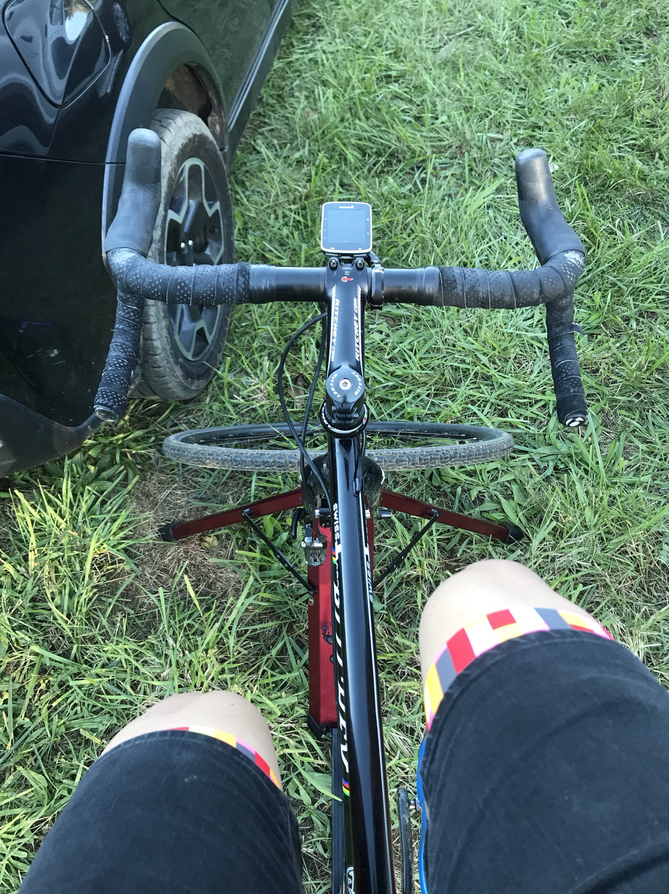

DCCX was a road-trip weekend down to a UCI race around Lincoln’s summer home… or something. Two very different days, with two very different results! A DNF Saturday and a 4th/120 on Sunday! 🤘🏼

This weekend taught me a few things, mostly that races are won or lost before they’ve begun.

# Day One

Saturday we were out too late playing darts, only slept 5 hours, got to the venue with 45 minutes to go but did everything in the wrong order. I was just being dumb and missed a chance to pre-ride, barely warmed up for 5 minutes, then got to the start line panicked and miles away from being “in the zone.”

https://www.instagram.com/p/BpJKmnphiQQ/

The men Cat 4/5 field was ~150 and I was stuck on the 8th row. I pushed through in the first lap to 40th wheel but it was haaaard work. I didn’t get far enough in the holeshot and got stuck behind squabbling Cat 5s getting pissy over elbow touching, and mountain bikers trying out their “sick blocking moves” for no reason. Yeah it’s a race, but slowing yourself down blocking for 35th place isn’t something you should waste your time doing. One guy was so proud of his bullshit he shouted something like “Boom, I shut the door on you there!” 👏🤨

Somewhere in the 2nd lap I got up to 25th then slid out taking the B line through some loose dirty and fell back to 30th. I was battling hard to stay somewhere uninteresting, and it got to the point that I could barely turn the pedals.The solitary banana I’d had for breakfast was gone, I couldn’t breath, my legs were fucked, and lying down in the grass seemed like a much better option. I hope if I’m in the same situation again I play the race out, but I can’t be too sad: Sunday was awesome!

# Day Two

Instead of crashing on a friends friends sofa and taking my chances with the dog, roommates, or any other variables, I checked into the cheapest motel in DC and chugged NyQuil at 8pm.

I woke up feeling better than the day before, but had that slight “ugh I want to sleep more” feeling. Checked the time was a beautiful surprise: it was only 2am. Bahahaha moar sleep for meeee!

After a full 9 hours sleep I got up, had the oatmeal and banana breakfast I purchased the night before, got to the venue 1.5 hours ahead of staging, pre-rode before doing anything else, grabbed my number, “took care of business”, and was on the trainer with 15 minutes to warm up. I even had some earphones in (that we found at the darts bar 🤣) listening to British punk.

*Ignore the right hood it’s fiiiiiine.*

Today instead of ~150 there was ~120, and I started 7th row instead of 8th. Once again I started off all guns blazing, 100% to get through as much of the pack as fast as possible, and avoid those slowblockers the best I could.

Yesterday I had the wrong cassette on the back. A 40t chainring and 30t on the top gear was not quite enough, but an evening upgrade to 32t really did help. Going 100% was easier today than yesterday, especially with all the extra sleep, and I just kept flying until I saw daylight. I caught the lead pack within the first lap, then just tailed along in 4th for a minute or two, very concious that I had brought a group of about 8 other riders along to the front.

Third place started to slow down a little and bobbled a few times, so I waited for a grassy straightaway to sneak past him. He’d heard me coming (fucking exercise-induced asthma!) and swung to block me, so I had to remember to pass in stealth mode. Basically I quiet my breathing for a few seconds the person ahead thinks I dropped off, then just power like fuck holding my breath and start breathing once I’ve got my bars past them. Bahaha. It works.

I did the same sneak past the other two lads until I was at the front, at which point it was just the three of us with a big gap. I controlled the speed for a bit to get my breath back and they were uninterested in getting in front due to the bastard wind. It worked out well for a while, but eventually 4th caught up and attacked like crazy at the start of the 4th lap. He came off on a rooty uphill and landed right in damn front of me, causing more problems for me than himself. The three of them fucked off down the road while I tried to get back in the race, but I lost them in the back of the lapped riders and that was that.

The better riders won, but it was awesome being up in the mix for once instead of just “another fella in the middle”! 3 upgrade points for me, but I want podium. 😎

## What Could Have Gone Better

Obviously a lot of lessons learned from day 1 and were immediately applied to day 2, so no need to list all of that.

**Using brakes too much:** Day 1 I was squeaking around a whole lot, and day 2 was using them a lot less. I started committing to ruts to get me around some corners, but I still need to get more confident at less brakes and faster turning.

**Lost track of laps:** I thought we had another lap, as I forgot to start my Garmin until somewhere in the first lap and that confused my concept of time. Gonna start them whilst I’m chatting to the folks next to me instead of waiting for the “30 second” warning — as this time I didn’t even hear that!

## What Went Well

**Sleep:** Clearly a huge difference between days from that extra 4 hours.

**Preparation:** Last season I would watch footage from last years race to get an idea for the course, which would have helped me have an *idea* of the course even if I missed the pre-ride. It also would have helped me get an idea of what cassette so shove on there. I had a 36 on for basically the whole season after I put it on for Town Hall CX (⛰) but going down to a 30 was shiiiit for me. If I’d seen that video I’d probably have put a 32 or 34 on, and doing that certainly made a difference on the day 2.

**“Move Aside!”:** Listed as a “What Could Have Gone Better” at [Hippo Cross](/wallowing-at-hippocross-2018/) this was something I was happy with. On both days, I said to folks “don’t slow yourself down blocking me!” and it worked both times. If we’re battling for 1 and 2 then block away, but if you’re letting the wheel ahead get away because you’re worrying about what’s behind you then… that’s just not a good idea!
