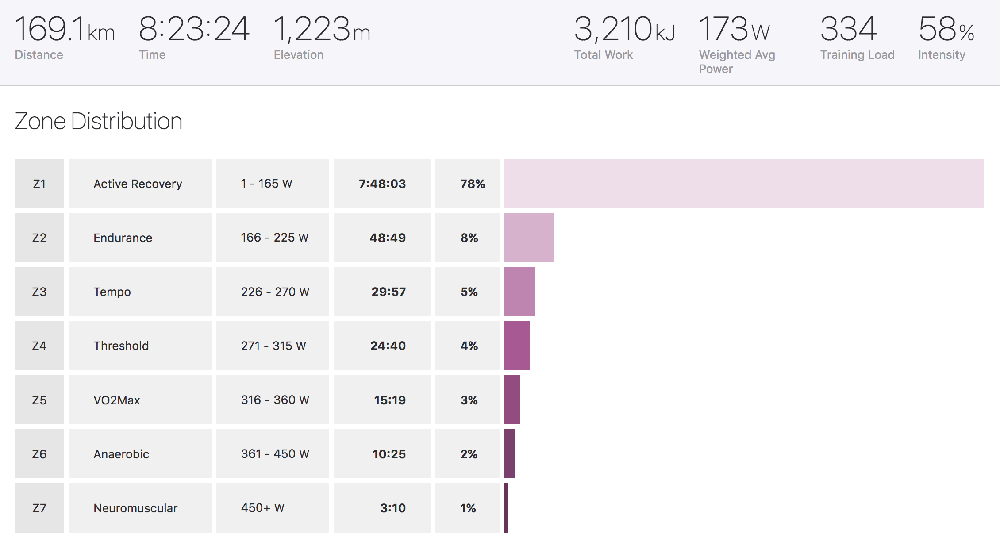
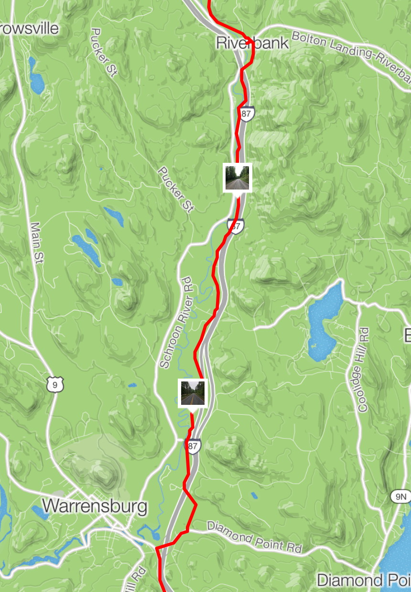
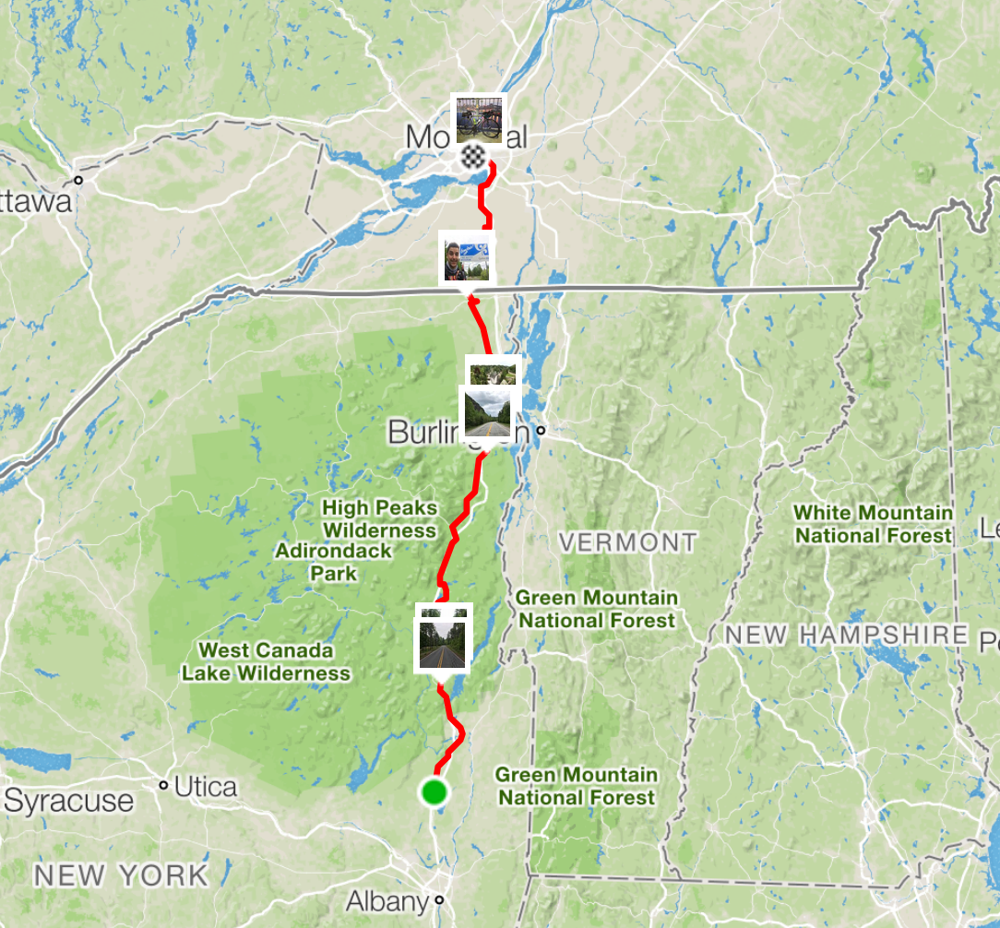
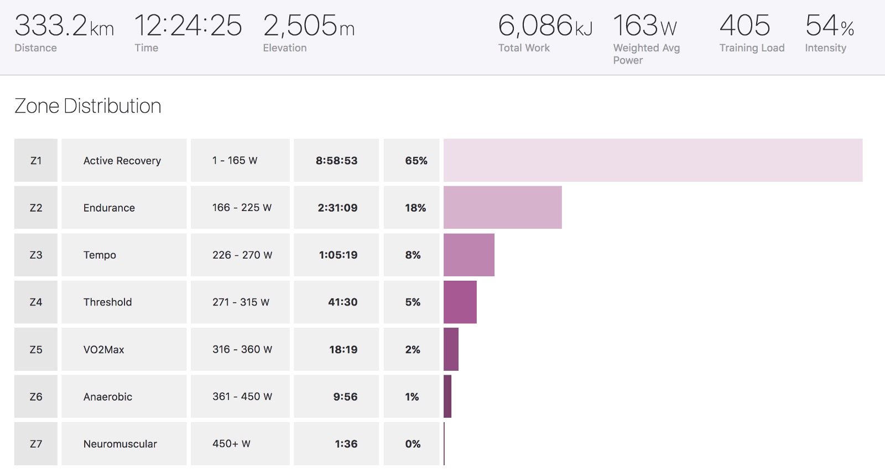

Nobody wants to hear about sweating away on TrainerRoad so I’ve been quiet since cross season was done, but now I have an adventure to write up: cycling to Montreal, 1x 100mi, followed by 1x 200mi!

A lot of people were confused about why on earth this was my plan. Two reasons. Firstly, previous distance record was London to Bristol (173mi) and I really took the piss on that ride. Stopped for a few ciders, ate a full Sunday Roast, took about 17 hours door to door. I wanted to see what a few years of training would do to that record, and hit the 200mi mark. Secondly, my balance or race to bikeventure has been way out of whack recently.

Road season kicked off for most of us here in NYC at the start of March with [Grants Tomb](https://www.tobedetermined.cc/journal/2018/3/grants-tomb-criterium-how-the-race-happened), and since then I was grinding hard for Cat 5 points. Racing every weekend at least once, and even when I hit Cat 4 I was so in the swing of things I found myself doing 6 races in two weeks, two of them on the same day! AAGUGH! As well as that, a lot of the races have been really rainy, and being at 15 months since a bone break I’ve been really terrified.

I need a break from races, and a three-day weekend presented a chance to do that. A friend mentions wanting to do a long ride. They’re thinking Adirondacks, I’m thinking further, and we decide they’ll start the trip with me and I’ll smash off after that.

# Friday

Cycled to Grand Central, nearly getting arrested for joking that the NYPD probably shouldn’t walk out into the bike lane facing the wrong way tossing things around for no reason. [Strava description has more on that.](https://www.strava.com/activities/1595889584) 😅

Taking the train to Poughkeepsie knocked the 400mi trip down to about 330mi in total, but I’ve done that ride a million times, and this was already going to be a challenge. Spun over to New Paltz to meet my friend, quick pint, crash, ready for the next day.

# Saturday

Everything from New Paltz to Kingston is utterly beautiful from the second you get out of town. Riding along a river, through farm country with the Mohonk ridge floating in the background. It was an awesome social pace, stopping for plenty of coffee and cake the whole time.

https://www.instagram.com/p/BjQZwNeFe8h/

By mid morning the temperature was up to ~100,000 degress CentiFUCK and didn’t get back down until late evening. This slowed us down a lot, especially with my friend riding their first 80mi ride the day before. Not realizing how dead they were gonna be, and rocking a rack for the first time, meant the pace was slowing all day long.

We went from 15mph, to 12mph, to 10mph… and after lunch it was about 8mph for a bit.

*Z1 aaaaall day.*

Eventually I left them to it approaching Albany, with about 30mi left to the motel in Saratoga Springs when our ETA dropped to about 2am… Luckily me leaving them to it was what they needed, and their speed increased from 8mph to 15mph, getting in only two hours after me at 10:30pm!

https://www.instagram.com/p/BjQfx-iFmFN/

Other than a broken spoke (the bike path along the river in Albany is fucking terrible), I got there early enough to eat my fill. 12 hours door to door wasn’t so bad, and it left me 6 hours to sleep.

[Strava](https://www.strava.com/activities/1598259454)

# Sunday

The profile of the day was essentially climbing for the first 100mi, and slow descent for the second half. I was aiming to keep my pace at about 15mph all day, meaning ~13 hours of moving, with 2 hours of stops giving me a 15 hour door to door day. That seemed fairly doable, so I went for it.

I had a new cup holder on my bars (#bikepacking!) and made use of it, keeping a never-ending supply of Dunkin cold brew. Sipping as I went, I flew through the first few hours.

https://www.instagram.com/p/BjR7VatF1t0/

Keeping low on the bars helped me through the headwind, and when I hit Adirondacks proper the wind wasn’t such an issue. Instead of wind, my tyre choice become the problem.

*I didn’t check this bit, and I should. Schroon River Road is probably much better, but this was a bit of a mess.*

The plan was to stick to paved roads, maybe a bit of gravel, but I got into mud and *sand *for some of it. It was really pretty, but… definitely took a hit on speed.

https://www.instagram.com/p/BjSWyjFl9IU/

How I didn’t flat on this whole trip I have no idea! :D

My friends all told me it would be miserable, and they were wrong. I wasn’t upset or suffering, but the badass tailwind made tick along at such a pace after the border that I felt like I was gonna get there any second; who needs a break or food or lol. Straight time trialing it through farmland is one thing, you don’t even notice how shot your brain is, but getting into a city and nearly going under a bus made me notice it was time to take a break, take a Kit Kat™.

I was about a month behind with podcasts, and I am entirely caught up now. That kept my mind from working too hard, but there were some thoughts rattling around in there throughout the day.

* 0–7 hours — This is fucking amazing I can ride bikes forever

* 7–8 hours — Aero bars would be nice

* 8–9 hours — More chamois cream would have been smart

* 9–10 hours — 1/2lb of ribs and potatoe salad was probably not smart

* 10–11 hours — If Roman Mars tries to sell me a fucking Casper mattress one more time I swear to god I’m hucking this phone into the swamp

* 11–13 hours — Wheeeeeeeee!

* 13–end — WHERE THE FUCK IS MY POUTINE

Cracking ride, 14.5 hours on the clock with 12.5 moving. Ended up so sick I sat around in the hotel for 90% of the next day watching French Simpsons, but still genuinely worth the whole thing.

[Strava](https://www.strava.com/activities/1600736524)

## Kit

I used the Salsa EXP Series Seat Pack, which… mixed feelings. It kept rubbing on the wheel, so I’d stop, tighten the straps, get it all good, only to have to repeat the process an hour or two later. On my MTB it might have better clearance, so I’ll give that a try.

Other than that I only had a Roadrunner Burrito Supreme bag on the bars, and a credit card covered the cost of shitty motels and unlimited bags of nuts and maple syrup cookies!

Let me know if you ride this one, it’s a fucking blast and way more doable than you might think! Buuut don’t blame if you die. 👍🏼
