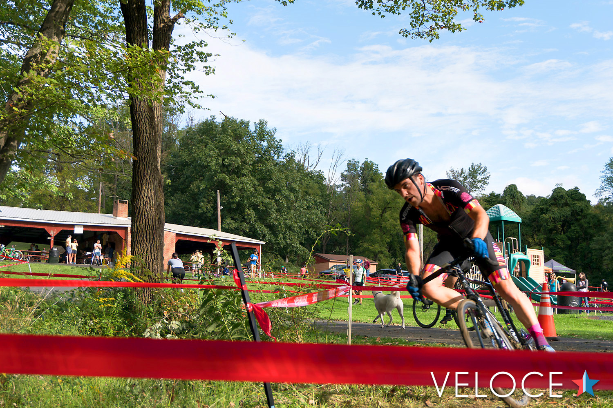

Some of the big takeaways from last year were about breathing. My last race [Elm City](https://phil.bike/elm-city-cx-2017-one-whole-season-intact-95cb746bbde7) was a mess once my nose turbine (a little plastic doohickey that helps me breathe) fell out. Sick of putting it off, and tired of spending $40 for three little things that I can lose or forget, I dropped the $1,000 and got some nose surgery to correct my deviated septum. Sucked a lot at the time, but after two weeks of agony, everything was awesome.

## Granogue

Excited to get into the season, I signed up for the very first race possible: Granogue CX Cat 4/5. Came in [8th place](https://www.crossresults.com/race/8143), my first top 10 in Cat 4 since upgrading towards the end of last season. Full on mud bath, two major climbs, DJ was on point, but it was really fucking hard.

https://www.instagram.com/p/BnZWEwTlYix/

Great day, and clearly my summer of training my *arse *off had paid off, and the nose surgery certainly helped. Still not as strong as some of these guys, but a lot of it is just shoddy technique. I can fix that too.

## Nittany Lion Cross

Next was Nittany Cat 4/5. I was really dehydrated and struggled throughout the whole race, dropping from 5th wheel for the first two laps, back to [18th by the end](https://www.crossresults.com/race/8201). A crash shook me up a little, and on top of the dehydration I was just a mess, handling like a drunk ferret. Sorry Ian!

The second day I drank a liter of water on the way to the race, felt a bunch better, [coming in 12th](https://www.crossresults.com/race/8212). A few friends podiumed and upgraded that day, so that clears the way for me in the upcoming races! 🤣

The two-day race was a good chance for me to test out another key takeaway from the end of last season:
> There’s a happy medium to passing a slow rider, somewhere between full cracked out squirrel and overly zen

Day One I went 100% on the hole-shot and whole first lap, and cooked myself pretty quick. I couldn’t maintain that pace and dropped off throughout the race. Yes the dehydration was a factor there, but going insane off the line is probably not my best move.

Day Two I went 80% from the fourth row, and got stuck behind some dude who just wanted to block to maintain 16th for… no reason. I lost a lap and a half, even crashed out, trying to get past that guy, so maybe 80% is not my move if I’m that far back.

Maybe I can get away with 80% effort if I’m in the front two rows, and any further back I’ll just have to suck it up and go for 90–100% just until I’m with the front group at least, then find a solid wheel to follow.

https://www.instagram.com/p/Bn3_gPLgI3W/

## Town Hall CX #9

The day before Town Hall the doctor told me I have Exercise-Induced Asthma, and gave me an inhaler to use in the mornings to help out. Apparently a bunch of athletes have it, I just never really noticed because of the existing nose-related breathing problems. First race with an inhaler, lets see if it works!

Starting in the third row I felt good that I wouldn’t have to smash it too much on the hole-shot, and sprint training at cross camp meant that I managed to get through a lot of gaps efficiently. There was some bar bumping 90 seconds in while everyone was frantically trying to get through a tight turn into a descent. That freaked me out a little and caused me to wobble long enough to lose a few wheels, and I settled in around 10th wheel for the first lap.

Town Hall is up, then down. Gravel climb, a twisty climb, then 20m of slight descent into the third and final climb of the lap - tough even on 40/36 ratio. A lot of folks get off and walk, but I had my shiny new 36 cassette and wanted to get my money’s worth! It didn’t seem to make much difference in timing, but I think it saved a bit of energy.

Slowly climbing up and doing a little blocking to cheekily stave off faster climbers, then pouncing folks on the off camber descents taking outside lines while they wobbled through the muddy inside line, seemed to be maintainable.

Methodically getting by folks one at a time was a nice progression, and I found a few spots where I could easily overtake. For example, between the 2nd and 3rd climb, a lot of folks were taking two seconds to rest before the big climb. Keeping up the power there meant 1.) sneak, and 2.) more speed going into the climb. Rest on the descent after!

I settled in to a reasonable pace on my teammate Sjoert’s wheel, but I couldn’t seem to find the power to get around him. Eventually he got away and passed a few riders, and when I tried to follow I went too hard and crashed out, dropping back two spots in the process. Coming in 10th was great, and awesome result for Sjoert coming in 6th! Dunno if I’ll go back to Town Hall, it really is a brutal course.There’s nothing technical, it’s just hill climb reps and a heart attack.

*Photo by [Jake Possinger](https://velocelogic.com/author/jakepossinger/)*

Then I tried racing the 3/4 as well, which was fucking stupid. I burnt all my matches in the first lap, hung onto a pack 2/3rds back, crashed out in the second lap, then went off to find a beer. ‍ 🙇🏻

## Key Takeaways

* Hydrate!! If I don’t need three emergency pees in the 30 minutes before a race, I’m probably going to die, especially if its a million degrees.

* Get around that teammate. I could have got around him a few times and just didn’t attack. He would have got me back, but that trading places would have motivated us both.

* Turning up an hour before the race is rarely enough time, as 15 minutes of that is standing around waiting for call up. I’m gonna try to be there 1:15 before a race, so I can spend *at least* 15 minutes on the trainer warming up. Town Hall was my first race to get on the Omnium rollers, and it felt amazing.

_Cover photo credit also to [Jake Possinger](https://velocelogic.com/author/jakepossinger/), see more photos from this race at [Veloce Logic.com](https://velocelogic.com/town-hall-2018/)_