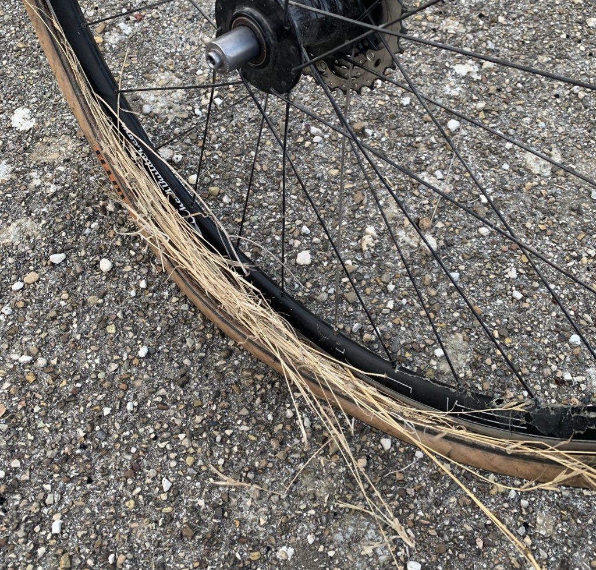

Various questionable decisions had lead to me being in the Balkans in July. It had been hot as hell in June, and the first half of July wasn't better. Multiple heatwaves came through, my sealant kept drying out, and I was getting heat exhaustion every day. By the last week of July I was popping spokes, down to tubes, and feeling ready for a change of plans.

https://www.instagram.com/p/B0Wb6vslqn6/

I jumped on a boat from Durres, Albania to Bari, Italy, then tried to rode north a bit until more trouble hit. Four bloody flats in a day, the ex-tubeless tyres were just swiss cheese and no amount of "shove a euro in it" was protecting the tubes. Mountain biker angels appeared with offers of a ride to town, but I thought I had a patch working so said no thanks, then it blew off. I got another mile on a knot, then got ANOTHER GOD DAMN FLAT IN THE SAME TUBE AGGHH. Impotent rage followed by dizziness as a feeling of overwhelming fuckedness set in. 

Of course this all happened in the middle of nowhere. Faced with a 20km walk I started shoving grass in it and moaning to a mate on the phone. They started calling places for me, and somehow we managed to find a hotel owner / wedding organizer called Antonio who drove 30 minutes to find me based on coordinates alone... **mid wedding**. He sorted me out a room at his venue, gave me a five course meal and a bottle of wine, There was even an offer of wedding cake! 

https://www.instagram.com/p/B0b-WaDFmDl/

In the morning Antonio had his 90 year-old employee drive me at death defying 180km on some shoddy roads to the nearest train, and after a scrabble around Foggia to find a bike bag, I got to Rome. This gave me a really unexpected chance to hang out with my US faux-family at a waterpark(!!), then wound my way north on a few trains to Amsterdam, getting there just in time for Pride.

https://www.instagram.com/p/B0tcshOl4QQ/

In Albania I had lost faith in my bike so much I didn't want to ride it 300km to Greece, but now I'd lost faith in my bike so much I didn't want to ride it to the pub. A good friend of mine was letting me stay with her, and had been talking to the folks over at [De Vakantiefietser](https://www.vakantiefietser.nl/). Don't let that website fool you, this is the best bike shop in town if you're touring. 

Not only did they advise me on specifics for a custom wheelset based on what I was doing, they forcibly replaced my smashed and "bent" carbon handlebars, which had confused everyone by staying solid despite a 30 degree bend, which is _not how carbon works_. Now I have amazing new 32/36 spoke wheels, with a re-enforced braking surface, a fully working SON 28 dyno on the front, a cheapy DT Swiss 350 on the back, a 2nd-gen [Cinq Plug5 Plus](https://cinq.de/en/power-supplies/433/plug5-plus?c=135) battery/USB-C interface, and a sweet SON Edelux II dyno light. 

https://www.instagram.com/p/B09ZTXSlW36/

It was everything I need to get back on the road with full confidence. The wheels were tubed which I was fighting against, but they made a solid point: there are not too many tubeless rims which also have a re-enforced braking surface. They were toying with the idea of ordering some in from the States when I was being pushy, but in the end they sold me on tubes with [Schwalbe Marathon Almotion V-Guard](https://www.wiggle.co.uk/schwalbe-marathon-almotion-v-guard-tyre/). These things will pretty much survive a direct attack from a tactical nuke.

The electronics mean I can just ride to my fitness and nothing else, without the fear of "at some point your lights will die and then you're fucked mate." looming over me. Here's a quick look at the cool new bits.

<iframe width="1120" height="630" src="https://www.youtube.com/embed/4Lgpi0o0c1Y" frameborder="0" allow="accelerometer; autoplay; encrypted-media; gyroscope; picture-in-picture" allowfullscreen></iframe>

This stuff got me to Sweden via Denmark and Norway and its absolutely smashed my expectations.  More on all this fancy-pants touring kit and Scandinavia soon. Smash subscribe! 👇
