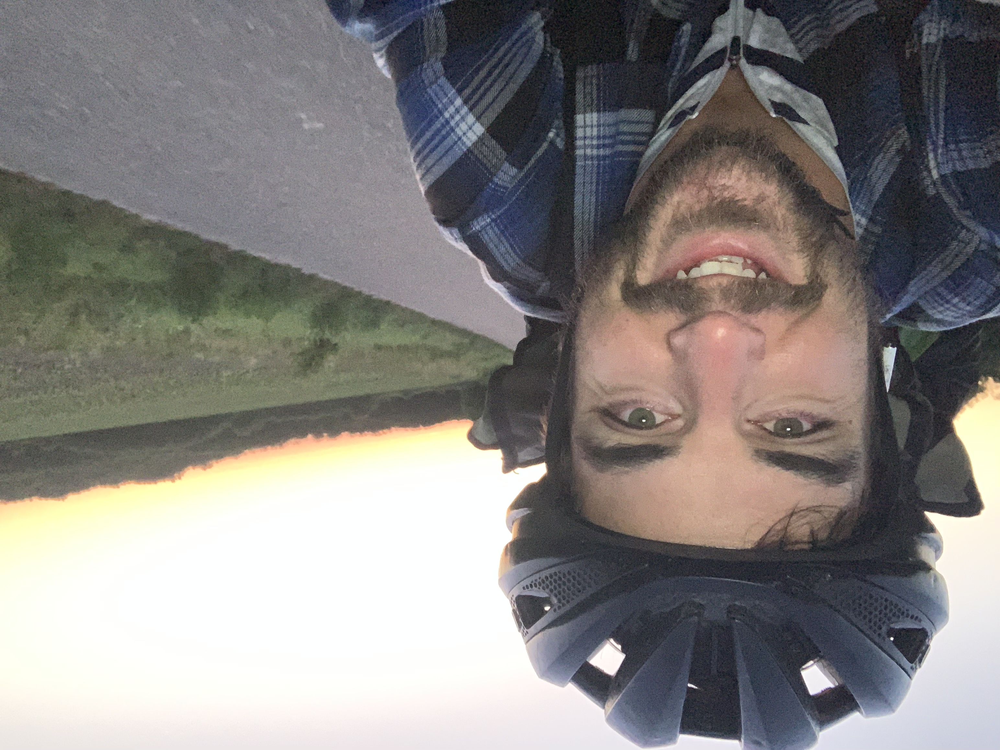
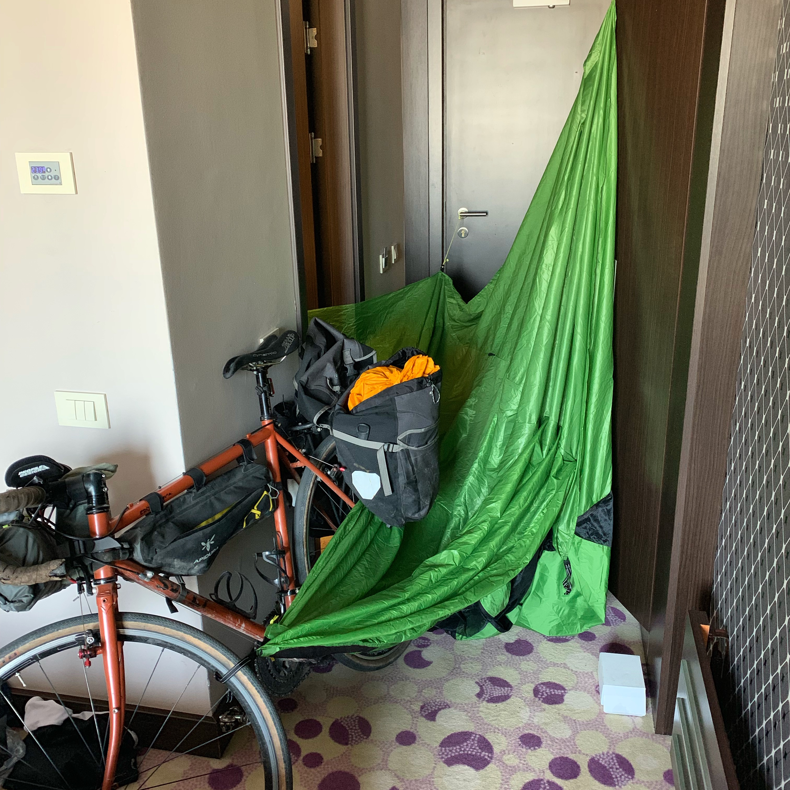
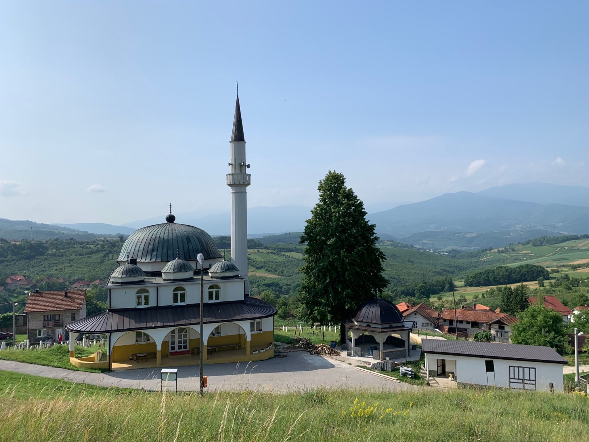

Bosnia was wild. It was first wild camp since the Slovakian mosquito/bivy failure, and it was the most remote, spidery, beautiful, broken, and ridiculous part of the trip so far.

I entered the north east of Bosnia, coming from [Novi Sad, Serbia](/serbia). The first stop was Bijeljina for a bit of dinner, while I figure out the next move. It was a Saturday night so I had a Somersby cider (shit is everywhere in the Balkans) and started checking out maps. 

I'd already done 110km with 1km of elevation so didn't fancy going too much further, but there were loads of mountains 20km away, and loads of farmland and woodland before that. Finding a camping spot seemed like an easy choice there. The hotels in that town were only about €20 but I'd picked up that tent in Hungary the previous Sunday and it'd been in my bag way too long. Time to go for it! 

The plan was to try and hit the mountains, but I got gassed pretty badly by a mosquito truck. Feeling pretty light headed I figured it was time to camp! I looked for most remote road possible then rode off the end of it, down a lane, down a trail, around a field, and found the perfect spot surrounded by trees on two sides but with wind coming through to keep the temperature under control, and give the mozzys a hard time chasing me in or out of the tent. It felt amazing being safe from the biters, and by midnight I was asleep with a book on my face. 

[**June 29th, 2019:** Novi Sad, Serbia to some Bosnian field](https://www.strava.com/activities/2491350922)

At about 4:00am I was woken up by _something_ sniffing around my camp site. Looking back I'm sure it was just a local dog gagging for a cuddle, but at 4am it was definitely a bear, wolf, murder, or some fever-dream combination. 

Didn't know what to do other than make as much noise as possible, pack up, and flee the scene sharpish. I hope to hell it was an animal of some sort, otherwise there's a video online of a screaming bike nerd flapping his way out of a tiny little tent and running away shouting nonsense to himself. 

The path deteriorated really quickly, from lane, to dirt and gravel, to shale and rock. The hills were steep, and I was bloody glad the Serbian bike shop fixed my shifter cable. I rode as much as possible, but my 50/34-11/30 was struggling with the rock/shale 10-15% climbs.

A farmer out fetching water from the well had a good laugh at me as I "caught up with him" for about 5 minutes, and we smiled and swapped quips in the wrong languages. He said something to me which was probably the equivalent of "Probably just get off and push mate", and I did, much to the joy of the bloodsuckers.

Crossing the first mountain was about 600m of effort over an hour an a half, and that was done by 7am. I'd pushed a fair bit (thank you new SPD shoes!), jumped on and off about 20 times, and got so hungry and thirsty I was picking berries and cherries along the way. The promise of coffee and breakfast had got me this far, thinking it would be an easy sail to the bottom, buuuuuuut not quite so lucky. Despite a few cars and houses on this side, the way down was just as bad as the up: scree and boulders, potholes, trenches, madness.

It would normally be a lot of fun, but I was running low on brake-pads and already on my spares (forgot to grab Shimano pads in Novi Sad). I had the choice of ride gentle to keep the bike mostly intact but maybe screw up the braking surface, or just fucking go for it and maybe smash the rims anyway...

Weeelll I fucking went for it, cackling like a sleep deprived idiot, taking cobwebs to the face, bouncing off rocks, not caring about any of it. I topped up the sealant at one point, re-ziptied the broken pannier back onto the rack _and_ together again, then eventually got into town!

There was a little cafe in this tiny town, and I ordered some breakfast. As I was starting to take my bag off I noticed something moving over my shoulder, and it was a giant brown bulgy pregnant spider. It was on my back, moving towards my arm, and probably about an inch long. Being an arachnophobe this went about as well as you could expect: absolute panic, screaming fit, flap attack, and weird noises, all in the middle of this cafe whilst a group were trying to have breakfast.

I danced around trying to stamp on this thing, but the ridges on the MTB shoes made that a challenge, and it survived the first 4 or 5 attempts... Everyone thought I was mad, and I sat there shaking and feeling sick for about an hour. 

Once logical brain was back I researched if there were any poisonous spiders in Bosnia and nope, this was just a big, ugly, harmless one inch spider that had been hanging out on my back for at least two hours.... ugh this is not helping. Let's move on I'm getting itchy.

Riding from Lopare to Tuzla was great, it looked like a main road on the map, but it was a decent dirt/gravel trail with sporadic stretches of concrete. Not a problem at all, I was taking it easy, dodging the occasional pothole, enjoying the view.

I stopped at a petrol station cafe in Tuzla for second breakfast and a battery re-charge, then realized I'd lost my super fancy [Nomad "USB-C Universal Cable"](https://hellonomad.com/collections/cables-universal/products/universal-usb-c-kevlar-cable), meaning I could not charge my battery pack, or my Garmin Edge. Not a huuuge deal I just charged my phone and computer up so I at least had mobile navigation, and there was 5% on the battery pack which got my Edge up to 100%. The cable escaped whilst I fled the camp site, and that got me worried about what else I might have lost. Nevermind. _Onwards!_ 

Leaving Tuzla, GPS kept trying to get me onto the M 112, which on the map looked just like the dirt road I'd come in on, but was a bit different. As much as I'd been hoping for proper road to appear on the earlier scree-slopes, I did not want this. 

This reminded me a lot of [cycling on the Pan-American Highway](/panama-day2-panamerican-highway/): everyone is doing whatever the hell speed they feel like, mostly at least 70kph, and there is nowhere for you to go. It's either get in the mix of it and push as hard as you can, or turn around and go home. I found a few service roads to escape a few miles at a time, but then there were other 1-2 mile stretches I had no choice about. Luckily it was two lanes so the drivers at least had a bit of space. 

Every third car, van, bus, truck, whatever was honking their horn. A lot of them were cheering me on as I pushed 40kph on the aero bars, but I'm sure a few of them were telling me to get the fuck off the road. Like I wanted to be there. If there was _literally_ any other road, I'd be on it guy! 

The road narrowed to single lane, and after 15km of that madness I escaped off to a town which had cafes and some beautiful alternative roads. 

I asked the server "Engleski?"  
Server: "No, sprechen sie deutsch?"  
Me: "Ya! Ich haber hunger!"  
Server "Pizza or hamburger"   
Me: "Ya pizza unt hamburger!"  

Sorted. 

While I was eating two men walked in, I think father and son. The father spoke English and started off doing a little translation work for the server, but eventually he came and sat with me (totally ignoring his teenage son 😂) to ask all sorts of questions about the bike, my trip, England in general, etc. He'd been driving trucks over to Dover and back for a bit, which is how he picked up English. He wandered back after 10-15 minutes and shortly after a lemonade popped up. A gift! 🤗

The last 35km were plain sailing, nice rolling hills, trees to hide under for shade now and then (fuck you 35C), and loads of awesome rusted out old Yugoslavian trains. I made it to the hotel at 1pm, and despite the heat exhaustion I managed to convince the hotel folks to let the bike come up. "I'm not sure there will be enough room?" 

The end of a 700km week, and time to catch up on all the sleep.

[**June 30th, 2019:** Bosnian field to Doboj](https://www.strava.com/activities/2493079443)

Resting/work day.

Back to it the next day, heading south to Zenica. This was another day of extreme ends of the spectrum with the roads: scree lanes and highways. The trucks were being pretty chill, they'd honk a few hundred meters back to let me know they were coming, and everyone was giving me space. Some people were even waving (their whole hand!) at me, which riding in USA is not something I'm used to. 

Some trouble with the tubeless setup happened because I was trying to be nice and give people space, riding on the side-gravel which was in retrospect probably mostly glass. 

> ... my rear tyre kept getting low, and I figured the sealant was due for some replacing anyway. I flipped the bike over in the first bit of shade I found, and a minute after the air had all escaped, the bead just jumped off with a terrifying POP. Luckily I still had some CO2, so I shoved that in and the bead reseated, then shoved in the sealant as quick as possible hoping it wouldn’t happen again.

> It did not immediately work out, there was a slow leak even with all the new sealant in. Spinning the wheel around sometimes gets the hole plugged, but not this time. I pumped, rode a few minutes, pumped, rode a few minutes, pumped again, rode. Giving up and throwing a tube in felt like a smart idea after an hour of cocking about, but then a petrol station appeared and it had an air compressor. Using my Presta to Schrader adapter I got it up to 80 PSI, cycled for another 10 minutes, then it got squishy again. Another petrol station air compressor up to 60 PSI, rode for 30 minutes, then hand pumped and it was fixed. It’s been 4 days now no problems. This was the craziest save I’ve made so far. I think sometimes it just needs to spin for long enough that enough sealant can get there, so “walking it off” did the trick. 

_More on [touring tubeless over here](/touring-tubeless/)._

I stopped a few times along the way because the heat was winning. The north of Bosnia is really mountainous much like the Alps, they've got the one road along the valley floor then just dirt off the side. Seeing as things are this concentrated, there are a _lot_ of petrol stations and most of them have cafes. This meant I could stop for coffee and cake every 10km, do a bit of work, then get on trucking again. Then I tackled a giant awesome dirt road 400m climb for my lunch break.

[**July 2nd, 2019:** Doboj to Zenica](https://www.strava.com/activities/2499910225)

I set off early trying to beat the heat, but by 9:30am it was 37C... Luckily today was just a short 45km ride into the mountains. I had been rushing to finish up the month strong, and get as close to Croatia as I could, because my friends were meeting me there for a bit of sailing (ooooo!) After the 700km week I was on target, so this planned "easy pedal" was a reward for that. 

It ended up not being quite so easy, after Komoot got a bit creative keeping me off the main roads.

Another bag spider situation happened, similar size, but I was ready for it: "Get the fuck outta heeeere!" (like a true New Yorker). It was all bad, I met a guard cow. 

https://www.instagram.com/p/BzdOMzrFmXd/

It was a day of beautiful mosques, churches, stunning views, and another 1,000m climb.

Rostovo itself is amazing too. I bet the skiing is great, but there's a dirt bike track there too, so... go whenever.

[**July 3rd, 2019:** Zenica to Čardaci](https://www.strava.com/activities/2500248438)

The day started at the top of a huge descent, and it was wild doing that first. My coffee hadn't quite kicked in when I started, making it feel like I was watching movie of a rollercoaster, but it gave breakfast a chance to digest a bit. I just sailed down through beautiful mountains, grinning like an idiot. 

The big climb was great, I filtered some water, took a bunch of photos, and enjoyed being in the mountains for my morning commute. 

Coming through the Koprivnica tunnel spat me out in Kupres, and damn have I ever seen anything so pretty. The whole valley was visible, with golden morning light spread through the fields, with a giant church in the middle giving the whole place a real Legend of Zelda feel.

I would have got a photo higher up the valley but it was about this point I realized my front brake pads were completely gone. Stopping was a hand I could only play a few more times, so I decided not to waste that special power and just kept rolling.

After a 60km headwindy push through the valley south, I popped over the last little climb into the most beautiful lake I've ever seen. There was a bit of comedy gold as the apartment coordinates were wrong on Booking.com (they're always wrong) and I ended up wandering around the woods, just wanting to sit down and get some work done, but forced to spin around in circles. After a lot of confusing texting the owner said she was coming to meet me at the hotel I was stood outside (the only landmark around).

Somebody drove into the gravel carpark, flashed their lights, threw the back end out, and burned rubber. I had no idea if that was them or not, but gave chase just to play it safe. She was doing 50kph and I was holding 40kph for the first 1km, but then we hit a hit and they vanished out of sight. 

I suggested they came back and we try again, and this time she fucked off at 40kph instead. Lost her on the hill again but she waited at the turning, and job done. Beer in the fridge, with a pretty good view. 

If you are ever in Bosnia, head to the big lake by Tomislavgrad, called Buško Blato. It's a huge reservoir that gives Croatia hyroelectric power, and there's pretty much nobody there. It's absofuckinglutely beautiful. If it was in the USA it would be covered in boatwankers just being the worst, but it's perfect. I really liked the little channel off to the east near where I was staying.

While I was there I Went out for dinner and found a pub. I only had the money for one beer, but got talking to a chap who kept offering me beers, and offered me a place to stay. Turns out he was the landlord, motorbiker, ex-cyclist, and we talked for ages about touring, life, the universe, and everything. This guy was awesome, he even offered me the use of his garage and tools! He's talking about getting on booking.com so give it a look see if you are nearby, it's called [The Joker](https://www.google.com/maps/place/Joker/@43.6895342,17.0848862,16.62z/).

[**July 4th, 2019:** Čardaci to Prisoje](https://www.strava.com/activities/2500248438)

Another morning commute, but this time over the border to Split, Croatia. Prisoje is only 18km so it was an easy pedal, but tearing myself away was tough. I took 3250945 photographs and was almost crying when I turned my back on the lake (don't worry I went back later in the car with boatfriends!)

https://www.instagram.com/p/Bz50sXQFqpU/

Border patrol was fine, then there was a long twisty cliff-edged descent with no breaks, then just never ending rollers and climbs. Looking at the elevation of the route before, and even looking at it after, neither feel like what I actually did. Strava says 888m. It might have been the heat, or general ongoing effects of getting heat exhaustion every day for two weeks, but this was murder. The plan was to get to Split by 1pm but I got there at 4pm, then stood in a cold shower for about 30 minutes and totally ignored the city. Dinner was a 2 minute walk to the first sandwich I saw, then back to my converted garden shed for more AC and work. 

[**July 5th, 2019:** Prisoje to Split, Croatia](https://www.strava.com/activities/2506701707)

And that was that! BIRTHDAY BOAT WEEK! 🙌

_We're on a [tree planting spree](/trees). July we were aiming for 10,000, I bumped it up to 20,000, at time of writing we're at 29,522. Let's get to 40,000!_

