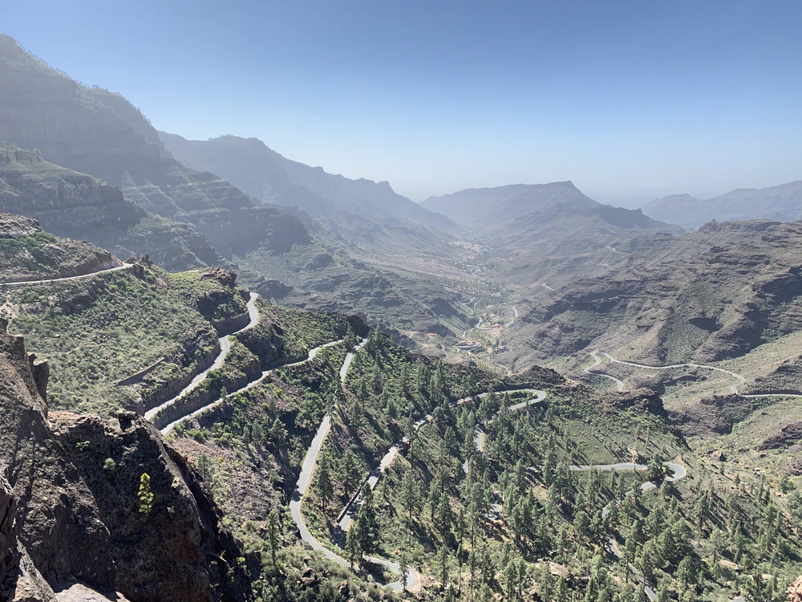

After quitting my job and [leaving the States in a rush](/escape-new-york/), and with Brexit not making going home to the UK too appealing. It was February and NYC had been damn cold, so I figured unwinding on an island for a month might be a good move. The Canary Islands are right off the coast of Africa and are pretty warm all year round, and Tenerife especially seems to be popular with pro's like Chris Froome swinging by for winter training camps.

Getting from New York to Tenerife was going to be a 32 hour flight via Russia for $400, and that sounded not great. Luckily there was a $200 flight with a grand totoal 23 hour flight time, from New York, via Porto and Lisbon in Portugal, then off to Gran Canaria - another volcanic island next to Tenerife. There's ferry`s going between the islands and I wanted to check out a few so why not.

The plan was to carboard box my Surly Crosscheck there, then ditch the box and ferry to the mainland of Spain when I was done. So I got to Gran Canaria, built the bike up, cycled off, and was immediately met with a brutal climb.

<blockquote class="instagram-media" data-instgrm-captioned data-instgrm-permalink="https://www.instagram.com/p/BtWkya8lRe5/?utm_source=ig_embed&amp;utm_campaign=loading" data-instgrm-version="13" style=" background:#FFF; border:0; border-radius:3px; box-shadow:0 0 1px 0 rgba(0,0,0,0.5),0 1px 10px 0 rgba(0,0,0,0.15); margin: 1px; max-width:540px; min-width:326px; padding:0; width:99.375%; width:-webkit-calc(100% - 2px); width:calc(100% - 2px);">
 <a href="https://www.instagram.com/p/BtWkya8lRe5/?utm_source=ig_embed&amp;utm_campaign=loading" style=" background:#FFFFFF; line-height:0; padding:0 0; text-align:center; text-decoration:none; width:100%;" target="_blank"> 
 

 
 

 

 
<svg width="50px" height="50px" viewBox="0 0 60 60" version="1.1" xmlns="https://www.w3.org/2000/svg" xmlns:xlink="https://www.w3.org/1999/xlink"><g stroke="none" stroke-width="1" fill="none" fill-rule="evenodd"><g transform="translate(-511.000000, -20.000000)" fill="#000000"><g><path d="M556.869,30.41 C554.814,30.41 553.148,32.076 553.148,34.131 C553.148,36.186 554.814,37.852 556.869,37.852 C558.924,37.852 560.59,36.186 560.59,34.131 C560.59,32.076 558.924,30.41 556.869,30.41 M541,60.657 C535.114,60.657 530.342,55.887 530.342,50 C530.342,44.114 535.114,39.342 541,39.342 C546.887,39.342 551.658,44.114 551.658,50 C551.658,55.887 546.887,60.657 541,60.657 M541,33.886 C532.1,33.886 524.886,41.1 524.886,50 C524.886,58.899 532.1,66.113 541,66.113 C549.9,66.113 557.115,58.899 557.115,50 C557.115,41.1 549.9,33.886 541,33.886 M565.378,62.101 C565.244,65.022 564.756,66.606 564.346,67.663 C563.803,69.06 563.154,70.057 562.106,71.106 C561.058,72.155 560.06,72.803 558.662,73.347 C557.607,73.757 556.021,74.244 553.102,74.378 C549.944,74.521 548.997,74.552 541,74.552 C533.003,74.552 532.056,74.521 528.898,74.378 C525.979,74.244 524.393,73.757 523.338,73.347 C521.94,72.803 520.942,72.155 519.894,71.106 C518.846,70.057 518.197,69.06 517.654,67.663 C517.244,66.606 516.755,65.022 516.623,62.101 C516.479,58.943 516.448,57.996 516.448,50 C516.448,42.003 516.479,41.056 516.623,37.899 C516.755,34.978 517.244,33.391 517.654,32.338 C518.197,30.938 518.846,29.942 519.894,28.894 C520.942,27.846 521.94,27.196 523.338,26.654 C524.393,26.244 525.979,25.756 528.898,25.623 C532.057,25.479 533.004,25.448 541,25.448 C548.997,25.448 549.943,25.479 553.102,25.623 C556.021,25.756 557.607,26.244 558.662,26.654 C560.06,27.196 561.058,27.846 562.106,28.894 C563.154,29.942 563.803,30.938 564.346,32.338 C564.756,33.391 565.244,34.978 565.378,37.899 C565.522,41.056 565.552,42.003 565.552,50 C565.552,57.996 565.522,58.943 565.378,62.101 M570.82,37.631 C570.674,34.438 570.167,32.258 569.425,30.349 C568.659,28.377 567.633,26.702 565.965,25.035 C564.297,23.368 562.623,22.342 560.652,21.575 C558.743,20.834 556.562,20.326 553.369,20.18 C550.169,20.033 549.148,20 541,20 C532.853,20 531.831,20.033 528.631,20.18 C525.438,20.326 523.257,20.834 521.349,21.575 C519.376,22.342 517.703,23.368 516.035,25.035 C514.368,26.702 513.342,28.377 512.574,30.349 C511.834,32.258 511.326,34.438 511.181,37.631 C511.035,40.831 511,41.851 511,50 C511,58.147 511.035,59.17 511.181,62.369 C511.326,65.562 511.834,67.743 512.574,69.651 C513.342,71.625 514.368,73.296 516.035,74.965 C517.703,76.634 519.376,77.658 521.349,78.425 C523.257,79.167 525.438,79.673 528.631,79.82 C531.831,79.965 532.853,80.001 541,80.001 C549.148,80.001 550.169,79.965 553.369,79.82 C556.562,79.673 558.743,79.167 560.652,78.425 C562.623,77.658 564.297,76.634 565.965,74.965 C567.633,73.296 568.659,71.625 569.425,69.651 C570.167,67.743 570.674,65.562 570.82,62.369 C570.966,59.17 571,58.147 571,50 C571,41.851 570.966,40.831 570.82,37.631"></path></g></g></g></svg>

 
 View this post on Instagram

 

 

 

 

 

 

 

 

 

 
 

 

</a>
<a href="https://www.instagram.com/p/BtWkya8lRe5/?utm_source=ig_embed&amp;utm_campaign=loading" style=" color:#c9c8cd; font-family:Arial,sans-serif; font-size:14px; font-style:normal; font-weight:normal; line-height:17px; text-decoration:none;" target="_blank">A post shared by Phil Sturgeon (@philsturgeon)</a>

</blockquote>

Gran Canaria is one big huge steep volcanic cone. A lot of the touristy resorts are on the south side, and the north is more local folks.

I was glad I had my Surly Crosscheck and not my Ritchey Swisscross, as having a 1x drivetrain would have been _the worst!_ The Surly 50/34-11/30 was awful for commuting around NYC (I was chewing cassettes staying on the middle cogs and only swapping between the stupidly big and stupidly small chainrings!) but for the Canary Islands it was pretty good.

That said, climbing for this long and in this heat was new to me, so there were some struggles initially.
Sometimes I think I'm an ok climber. Definitely not as good as my jocky-sized friends for sure, but in road/cross races I seem to gain a few wheels on the climby bits. Those hills are pretty short though, and the number of climbs I've done over 1000m could probably be counted on one hand!

My biggest continuous climb according to Strava was 1200m. I beat that on my first ride here, then added a few hundred meters to it every day after that! Even popping down to the grocery store and back was a 700m climb.

<blockquote class="instagram-media" data-instgrm-permalink="https://www.instagram.com/p/Btf2fklF_30/?utm_source=ig_embed&amp;utm_campaign=loading" data-instgrm-version="13" style=" background:#FFF; border:0; border-radius:3px; box-shadow:0 0 1px 0 rgba(0,0,0,0.5),0 1px 10px 0 rgba(0,0,0,0.15); margin: 1px; max-width:540px; min-width:326px; padding:0; width:99.375%; width:-webkit-calc(100% - 2px); width:calc(100% - 2px);">
 <a href="https://www.instagram.com/p/Btf2fklF_30/?utm_source=ig_embed&amp;utm_campaign=loading" style=" background:#FFFFFF; line-height:0; padding:0 0; text-align:center; text-decoration:none; width:100%;" target="_blank"> 
 

 
 

 

 
<svg width="50px" height="50px" viewBox="0 0 60 60" version="1.1" xmlns="https://www.w3.org/2000/svg" xmlns:xlink="https://www.w3.org/1999/xlink"><g stroke="none" stroke-width="1" fill="none" fill-rule="evenodd"><g transform="translate(-511.000000, -20.000000)" fill="#000000"><g><path d="M556.869,30.41 C554.814,30.41 553.148,32.076 553.148,34.131 C553.148,36.186 554.814,37.852 556.869,37.852 C558.924,37.852 560.59,36.186 560.59,34.131 C560.59,32.076 558.924,30.41 556.869,30.41 M541,60.657 C535.114,60.657 530.342,55.887 530.342,50 C530.342,44.114 535.114,39.342 541,39.342 C546.887,39.342 551.658,44.114 551.658,50 C551.658,55.887 546.887,60.657 541,60.657 M541,33.886 C532.1,33.886 524.886,41.1 524.886,50 C524.886,58.899 532.1,66.113 541,66.113 C549.9,66.113 557.115,58.899 557.115,50 C557.115,41.1 549.9,33.886 541,33.886 M565.378,62.101 C565.244,65.022 564.756,66.606 564.346,67.663 C563.803,69.06 563.154,70.057 562.106,71.106 C561.058,72.155 560.06,72.803 558.662,73.347 C557.607,73.757 556.021,74.244 553.102,74.378 C549.944,74.521 548.997,74.552 541,74.552 C533.003,74.552 532.056,74.521 528.898,74.378 C525.979,74.244 524.393,73.757 523.338,73.347 C521.94,72.803 520.942,72.155 519.894,71.106 C518.846,70.057 518.197,69.06 517.654,67.663 C517.244,66.606 516.755,65.022 516.623,62.101 C516.479,58.943 516.448,57.996 516.448,50 C516.448,42.003 516.479,41.056 516.623,37.899 C516.755,34.978 517.244,33.391 517.654,32.338 C518.197,30.938 518.846,29.942 519.894,28.894 C520.942,27.846 521.94,27.196 523.338,26.654 C524.393,26.244 525.979,25.756 528.898,25.623 C532.057,25.479 533.004,25.448 541,25.448 C548.997,25.448 549.943,25.479 553.102,25.623 C556.021,25.756 557.607,26.244 558.662,26.654 C560.06,27.196 561.058,27.846 562.106,28.894 C563.154,29.942 563.803,30.938 564.346,32.338 C564.756,33.391 565.244,34.978 565.378,37.899 C565.522,41.056 565.552,42.003 565.552,50 C565.552,57.996 565.522,58.943 565.378,62.101 M570.82,37.631 C570.674,34.438 570.167,32.258 569.425,30.349 C568.659,28.377 567.633,26.702 565.965,25.035 C564.297,23.368 562.623,22.342 560.652,21.575 C558.743,20.834 556.562,20.326 553.369,20.18 C550.169,20.033 549.148,20 541,20 C532.853,20 531.831,20.033 528.631,20.18 C525.438,20.326 523.257,20.834 521.349,21.575 C519.376,22.342 517.703,23.368 516.035,25.035 C514.368,26.702 513.342,28.377 512.574,30.349 C511.834,32.258 511.326,34.438 511.181,37.631 C511.035,40.831 511,41.851 511,50 C511,58.147 511.035,59.17 511.181,62.369 C511.326,65.562 511.834,67.743 512.574,69.651 C513.342,71.625 514.368,73.296 516.035,74.965 C517.703,76.634 519.376,77.658 521.349,78.425 C523.257,79.167 525.438,79.673 528.631,79.82 C531.831,79.965 532.853,80.001 541,80.001 C549.148,80.001 550.169,79.965 553.369,79.82 C556.562,79.673 558.743,79.167 560.652,78.425 C562.623,77.658 564.297,76.634 565.965,74.965 C567.633,73.296 568.659,71.625 569.425,69.651 C570.167,67.743 570.674,65.562 570.82,62.369 C570.966,59.17 571,58.147 571,50 C571,41.851 570.966,40.831 570.82,37.631"></path></g></g></g></svg>

 
 View this post on Instagram

 

 

 

 

 

 

 

 

 

 
 

 

</a>
<a href="https://www.instagram.com/p/Btf2fklF_30/?utm_source=ig_embed&amp;utm_campaign=loading" style=" color:#c9c8cd; font-family:Arial,sans-serif; font-size:14px; font-style:normal; font-weight:normal; line-height:17px; text-decoration:none;" target="_blank">A post shared by Phil Sturgeon (@philsturgeon)</a>

</blockquote> 

As well as learning how to climb for hours, I also learned how to descend. Sure I can bomb down Bear Mountain at a decent rate, but I have practiced that and I know the turns, they're pretty forgiving. Plus it's only a few minutes long. Some of these descents were as long as 45 minutes, with crazy turns, that would look like they were going to be a wide turn then cut back on themselves unexpectedly. My brakes would start to smell funny, and my arms would hurt from the descent. Learning to use the brakes less and lean through the turns was really helpful at improving this situation.

The TrainerRoad podcast actually helped me here. Half way down a 2km descent, I was freaking out and laughing maniacally as I wrestled the bike around corners poorly, and a pro lady (sorry I forget who!) came on the podcast. She started explaining you need to get the outside foot down, plant the weight there, and turn your _shoulders_ where you want to go. This was awesome because three seconds later I gave it a try and it worked!!

My mistake in Gran Canaria was only giving it 6 days, and not checking out the south side until the last day of riding. The north is nice, pretty, away from shouty "Brits Abroad", but the center and the south is amazing when you're away from the resorts. Every few miles looks like a totally different country or continent, with an Alpine area, a bit that looked like Utah desert, and another chunk which felt like the Rockies in British Colombia

Jumping on a ferry was fun. They don't let you on the humans entrance unless you take your bike apart and put it in a box, so I just got in line with the cars and drove on the big ramp!

<blockquote class="instagram-media" data-instgrm-permalink="https://www.instagram.com/p/BtiyncTA7WU/?utm_source=ig_embed&amp;utm_campaign=loading" data-instgrm-version="13" style=" background:#FFF; border:0; border-radius:3px; box-shadow:0 0 1px 0 rgba(0,0,0,0.5),0 1px 10px 0 rgba(0,0,0,0.15); margin: 1px; max-width:540px; min-width:326px; padding:0; width:99.375%; width:-webkit-calc(100% - 2px); width:calc(100% - 2px);">
 <a href="https://www.instagram.com/p/BtiyncTA7WU/?utm_source=ig_embed&amp;utm_campaign=loading" style=" background:#FFFFFF; line-height:0; padding:0 0; text-align:center; text-decoration:none; width:100%;" target="_blank"> 
 

 
 

 

 
<svg width="50px" height="50px" viewBox="0 0 60 60" version="1.1" xmlns="https://www.w3.org/2000/svg" xmlns:xlink="https://www.w3.org/1999/xlink"><g stroke="none" stroke-width="1" fill="none" fill-rule="evenodd"><g transform="translate(-511.000000, -20.000000)" fill="#000000"><g><path d="M556.869,30.41 C554.814,30.41 553.148,32.076 553.148,34.131 C553.148,36.186 554.814,37.852 556.869,37.852 C558.924,37.852 560.59,36.186 560.59,34.131 C560.59,32.076 558.924,30.41 556.869,30.41 M541,60.657 C535.114,60.657 530.342,55.887 530.342,50 C530.342,44.114 535.114,39.342 541,39.342 C546.887,39.342 551.658,44.114 551.658,50 C551.658,55.887 546.887,60.657 541,60.657 M541,33.886 C532.1,33.886 524.886,41.1 524.886,50 C524.886,58.899 532.1,66.113 541,66.113 C549.9,66.113 557.115,58.899 557.115,50 C557.115,41.1 549.9,33.886 541,33.886 M565.378,62.101 C565.244,65.022 564.756,66.606 564.346,67.663 C563.803,69.06 563.154,70.057 562.106,71.106 C561.058,72.155 560.06,72.803 558.662,73.347 C557.607,73.757 556.021,74.244 553.102,74.378 C549.944,74.521 548.997,74.552 541,74.552 C533.003,74.552 532.056,74.521 528.898,74.378 C525.979,74.244 524.393,73.757 523.338,73.347 C521.94,72.803 520.942,72.155 519.894,71.106 C518.846,70.057 518.197,69.06 517.654,67.663 C517.244,66.606 516.755,65.022 516.623,62.101 C516.479,58.943 516.448,57.996 516.448,50 C516.448,42.003 516.479,41.056 516.623,37.899 C516.755,34.978 517.244,33.391 517.654,32.338 C518.197,30.938 518.846,29.942 519.894,28.894 C520.942,27.846 521.94,27.196 523.338,26.654 C524.393,26.244 525.979,25.756 528.898,25.623 C532.057,25.479 533.004,25.448 541,25.448 C548.997,25.448 549.943,25.479 553.102,25.623 C556.021,25.756 557.607,26.244 558.662,26.654 C560.06,27.196 561.058,27.846 562.106,28.894 C563.154,29.942 563.803,30.938 564.346,32.338 C564.756,33.391 565.244,34.978 565.378,37.899 C565.522,41.056 565.552,42.003 565.552,50 C565.552,57.996 565.522,58.943 565.378,62.101 M570.82,37.631 C570.674,34.438 570.167,32.258 569.425,30.349 C568.659,28.377 567.633,26.702 565.965,25.035 C564.297,23.368 562.623,22.342 560.652,21.575 C558.743,20.834 556.562,20.326 553.369,20.18 C550.169,20.033 549.148,20 541,20 C532.853,20 531.831,20.033 528.631,20.18 C525.438,20.326 523.257,20.834 521.349,21.575 C519.376,22.342 517.703,23.368 516.035,25.035 C514.368,26.702 513.342,28.377 512.574,30.349 C511.834,32.258 511.326,34.438 511.181,37.631 C511.035,40.831 511,41.851 511,50 C511,58.147 511.035,59.17 511.181,62.369 C511.326,65.562 511.834,67.743 512.574,69.651 C513.342,71.625 514.368,73.296 516.035,74.965 C517.703,76.634 519.376,77.658 521.349,78.425 C523.257,79.167 525.438,79.673 528.631,79.82 C531.831,79.965 532.853,80.001 541,80.001 C549.148,80.001 550.169,79.965 553.369,79.82 C556.562,79.673 558.743,79.167 560.652,78.425 C562.623,77.658 564.297,76.634 565.965,74.965 C567.633,73.296 568.659,71.625 569.425,69.651 C570.167,67.743 570.674,65.562 570.82,62.369 C570.966,59.17 571,58.147 571,50 C571,41.851 570.966,40.831 570.82,37.631"></path></g></g></g></svg>

 
 View this post on Instagram

 

 

 

 

 

 

 

 

 

 
 

 

</a>
<a href="https://www.instagram.com/p/BtiyncTA7WU/?utm_source=ig_embed&amp;utm_campaign=loading" style=" color:#c9c8cd; font-family:Arial,sans-serif; font-size:14px; font-style:normal; font-weight:normal; line-height:17px; text-decoration:none;" target="_blank">A post shared by Phil Sturgeon (@philsturgeon)</a>

</blockquote> 

Tenerife is a much bigger island, and the choice for rides is endless. Whatever you do there is a huge climb, and some days as much as 4km! You get on your bike, point it up a 8-10 degree incline, and don't stop for at least an hour. Then you turn around and WHEEEEEEEEEEEEE, all the way back down. I did a few of these at night, after spending the day writing, swimming, touristing, or entertaining friends and family who swung by over the five weeks.

Wherever you go, whatever you do, you are going to climb a lot. The only flat part of the island is a few kilometers of "sediment lake" in the center of the island, and to get in there you need to complete the longest continuous climb in Europe.

> In just 35km you can ride from zero to 2,100m and it really is continuous, not a flat section or banked hairpin alleviates the strain on your legs. -- [Cycling Weekly](https://www.cyclingweekly.com/routes/tenerife-cycling-34955)

Something I am not used to is how much the weather can change at different heights. Sure, going up mountains the air usually gets colder, but not here. It can be raining at sea level then you climb through the rain clouds and you are sweating in direct sunlight, or vice versa. You can start of melting lower down then get caught in what the local folks call "upwards rain".

https://twitter.com/philsturgeon/status/1096851337546006528

Another cool name for an effect I've never seen, is the "Sea of Clouds". I got to see it a few times after climbing up to Teide National Park, and it really tricks your brain, it looks like the sea! You can see other islands poking out through the clouds, and it's really mystical.

I really really loved it in Tenerife, and wish I could have stayed even longer. I did end up getting that wish come true a bit after getting heat stroke, I extended the stay a few days and hung out in Puerto de la Cruz, probably the prettiest of all the cities.

Can't play forever though, about time to start the new job, and for that I needed to get on the ferry to Spain.

