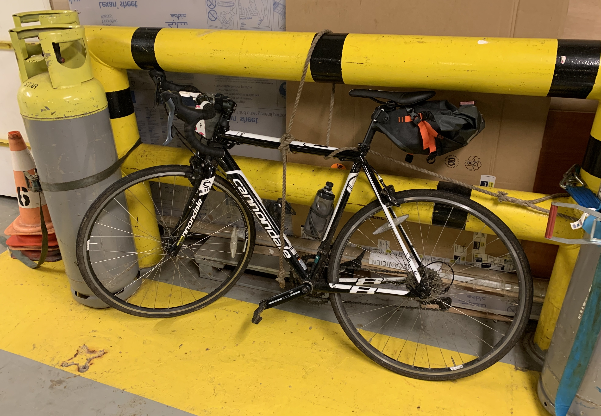
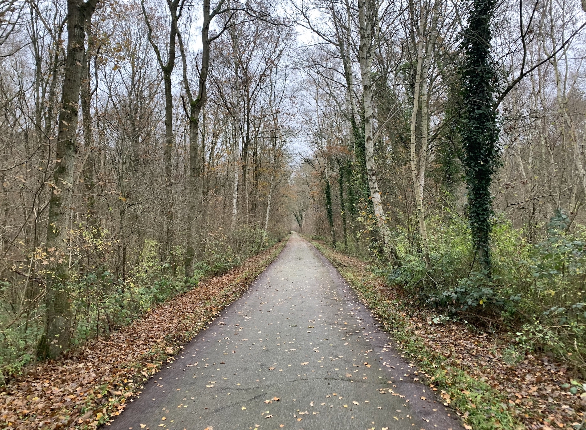

Going from [fundraising 70,000 trees](https://phil.bike/trees/) in summer, to [being injured](https://phil.bike/stupid-achilles-injury/) and unable to do shit, meant I had to think outside the box in order to keep the reforestation going. 

Meet my Cannondale CAAD8. Back in 2015 I was back in the UK, between jobs, and between US visas. I grabbed this bike to mush out a little west country tour, putting ~1000 miles on the clock before it sat in the parents shed for four years. 

I decided it was time to put it to good use. 

https://twitter.com/philsturgeon/status/1196850021888643072

Bidding started at 3,000 trees (about £300 as it's roughly 10p a tree), and soon after we got it up to 5,000.

https://twitter.com/pieroginomicon/status/1197059237886734336

A friend of mine living in Barcelona wanted the bike, but that was a bit far to deliver. Luckily we were both speaking at the same conference in Paris, so once I was done looping around Ireland and Wales, I headed for the Portsmouth overnight ferry, got of at Le Harve, and set off south east for Paris! 

This was a win win for everyone. 

## Footprint

Other than eating, breathing, and hotels, the only carbon footprint for me to get to the conference was the ferry, which according to [Flight Free 2020](https://twitter.com/FlightFree2020/status/1213165841753214977) is the way to go. 

> Emissions data from DfT: 
> Ferry foot passenger, 0.02kg CO2e per passenger km, (car passenger 0.13kg CO2e)
> Flights, domestic = 0.3kg CO2e, short haul
> Every journey is different, but ferry about ten times less polluting if travelling by bike.

Getting a [ferry with a bike](/ferries/) is pretty simple most of the time, and this one was completely trouble-free. 

### Money

This was a cheap trip. The ferry was £78, and that included a cabin. Seeing as I live on the bike, I need somewhere to sleep every night, and combining travel and accommodation is the best way to do this. Any overnight ferry, overnight train, overnight anything, can save me the £50-80 I have to pay for a hotel/inn/B&B, so this ferry might as well have been free. 

What about the bike? Is N-1 bikes really worth swapping for trees? Well... I initially bought the bike for £500, but with general depreciation plus laying it down at 25mph, it was probably worth about £300. 

With my current level of sheer and unadulterated panic about impending climate oblivion, any spare money I come across goes on reforestation. If somebody gave me £300 I would have immediately bought 3,000 trees. Instead somebody felt motivated to pay for 5,000 trees, and I got to ride that speedy little fella through some beautiful French countryside on one last big adventure before we parted ways. 

If you own anything you can spare, shed it all, and put it towards [saving the planet](https://ecologi.com/philsturgeon?gift=true). If I learned anything this summer, it's that [riding bikes in 42C is bullshit](https://offset.earth/articles/climate-emergency/climate-change-by-bike), and the world isn't getting any cooler.
