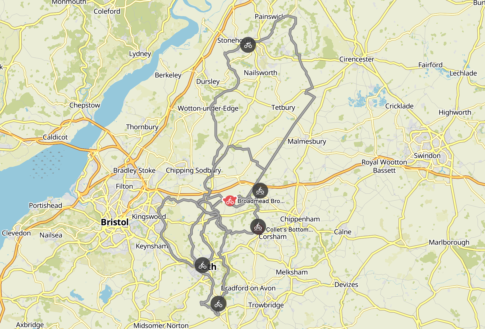

Bristol and Bath are two amazing cities that I'm lucky to have called home most of my life. I lived between the two cities, riding in and out of them and all over the in-between, which is mostly country lanes, dirt tracks, fields, streams, fords, and opportunities for adventure.

After my winter jaunt down to Morocco and back up through France I got off the ferry just in time for COVID-19 lock-down on home turf. This was obviously a tough time for everyone, but this was lightened a tad by having all the gravel and rolling hills of the Cotswolds on my doorstep once more, hunkering down for 3 months lock-down on a farm in Dyrham.

Here are some of the people-avoidance loops I liked the most in this time.

<iframe src="https://www.komoot.com/collection/957712/embed" width="780" height="680" frameborder="0" scrolling="no">
  
</iframe>

## Routes

Let's take a look at some of these so you can decide which to try first.

<iframe src="https://www.komoot.com/tour/202354278/embed?profile=1" width="100%" height="580" frameborder="0" scrolling="no"></iframe>

Start with a climb through a cow field around the north side of Dyrham park, with gates you can ride through without putting your foot down. Turn around when you get to the top of the hill, it's a stunning view over the whole valley to the east of Bristol's sprawl.

Cross the A46 in one piece and you're done with busy roads for the day. A country lane takes you to West Littleton, where a hidden gravel road takes you through some farm fields and wood plantations. Sometimes the gate at the end is locked, but a farmer waved at me quite happily one time so permission seems fine, just be ready to lift your bike over the gate if it's locked.

The farm after the gate is some of the cutest scenery around, with a bunch of sheep running about through a stream and trying to hide form your bike. The farm ends at Shire Hill, and another gate which may or may not be openable will let you into another cute AF sheep field.

The dirt road along the brook doesn't require suspension but you might get a bit shaken up without well padded gloves or low pressure tyres. There's plenty of excuse to have a little break and muck about.

https://www.instagram.com/p/B_F50QQFojr/

Once you're in Ford go past The White Hart (or stop in for a pint and a bite if they're open) and get ready for a challenge. Everything through Colerne Park is punishing climbs or concentration requiring descents, with wild garlic, greenery and curious cows as far as the eye can see to distract you from the ruts.

https://www.instagram.com/p/CAf_TKnFP18/

**[View this tour on Komoot](https://www.komoot.com/tour/202354278)**

<iframe src="https://www.komoot.com/tour/202367872/embed?profile=1" width="100%" height="580" frameborder="0" scrolling="no"></iframe>

Starting off in Hinton this loop immediately veers offroad into a field margin, past the giant windmill, and the motorway roundabout before we vanish into a different century for the day.

Doddington provides some tricky climbs immediately, then you get a chance to stretch your legs properly heading north towards Badminton. Get lost in the trees for a while, then take some quiet roads down to a stretch on the Fosse Way.

Then, pop into Castle Coombe. It's cute as fuck when its not in lockdown, but when it was closed there were some honesty boxes with snacks. Flapjacks ftw.

https://www.instagram.com/p/B_547BHAP5n/

This clockwise loop starts with a whole lot of road. Shove on a playlist that fires you up and get you head down, with amazing climbs and big view descents. It'll take some time to get up north and there's not much in the way of food, but there were some food trucks and petrol stations for emergencies.

That giant straight line on the right is the Fosse Way, which is an old Roman Road. Romans liked straight roads which is why it looks so funny on the map. It's a good ride, with scenery, potholes, and fords to play around in.

**[View this tour on Komoot](https://www.komoot.com/tour/202367872)**

<iframe src="https://www.komoot.com/tour/202362004/embed?profile=1" width="100%" height="580" frameborder="0" scrolling="no"></iframe>

That Bristol and Bath cycletrack can get ridiculously busy so if you're trying to avoid people avoid times and weathers where it'll be rammed (Tuesday evening as it's getting dark are good, sunny Sundays are awful).

**[View this tour on Komoot](https://www.komoot.com/tour/202362004)**

<iframe src="https://www.komoot.com/tour/202478848/embed?profile=1" width="100%" height="580" frameborder="0" scrolling="no"></iframe>

Take some simple bike paths out the north east expanse of Bristol then get a bit silly. Dodging around Yate this tour gets you into the cute market town of Chipping Sodbury, out over some grassy commons, and into a really fun windy lane that is going to claim the lives of many inner tubes. Have tough tyres for the stretch between Wapley and Hinton, tubeless even better.

After that this tour heads along some relatively quiet country lanes, up through Dyrham to a great view. Stop at the Tollgate if it's open and say hi to Luka and the staff. 👋 

Then, power along Gorse Lane and you're spat out at the top of Tog Hill. Check out the views but don't hang around here after dark (unless you're into dogging.) The descent is long and fast so enjoy! 

**[View this tour on Komoot](https://www.komoot.com/tour/202478848)**

<iframe src="https://www.komoot.com/tour/202503152/embed?profile=1" width="100%" height="580" frameborder="0" scrolling="no"></iframe>

Growing up in east Bristol had me saying "I remember when this was all fields" at the age of about 12. There's still some little slips of the wildlife and country that preceeded all the housing estates, and this route slip through them all, getting to Bath along the river, then up and over Kelston Roundhill and down through Upton Cheney on some rather bonkers rocky bridleways. 

**[View this tour on Komoot](https://www.komoot.com/tour/202503152)**

<iframe src="https://www.komoot.com/tour/202344581/embed?profile=1" width="100%" height="580" frameborder="0" scrolling="no"></iframe>

Avoiding the cycle track we head from Hinton to Bath over Lansdown. Check your brakes, then enjoy! Sneaking through the south west of Bath we jump on the Sustrans "Two Tunnels" bike path, and enjoy the weird feeling of riding in almost pitch black in cold tunnel air on even the hottest of days. 

After the tunnels you'll get to a town called Midford. It's impossible to miss because there's an old train platform, giant old arched bridge, and signs for the Hope and Anchor pub. Get in that pub and have a cheeky cider or two, because the next bit is easy and mostly flat.

Then a compact gravel rail trail heads out to Wellow, a quant village with a few pubs and a little Ford to play in. I am trying to grab some land in to reforest and make cyclocross course, so if you're interested reach out to @philsturgeon on Twitter/Instagram and let's chat! 

**[View this tour on Komoot](https://www.komoot.com/tour/202344581)**

_Support reforestation and keep these articles coming by [donating to my reforestation campaign on Ecologi](https://ecologi.com/philsturgeon)._
