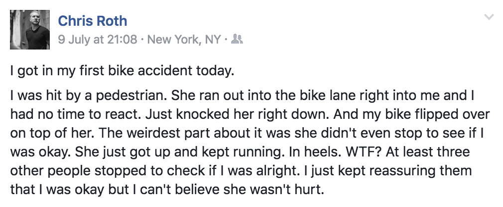

Previously I wrote a guide to getting started cycling far, and one of the things I mentioned was a loudspeaker. Now I want to talk a little bit more about that.

Have you ever heard anyone say something like this?
> Why do these bloody cyclists have to blast music on loudspeakers? You can hear them coming a block away!

Well, that’s the point isn’t it.

I carry a [BoomBotix Rex](https://store.boombotix.com/#rex) whenever I ride. Living in NYC, I play my loudspeaker on the commute, running deliveries, heading upstate, whenever. Some folks hate the use of loudspeakers, and suggest getting a pair of earphones. Random people shout that at me, or at least mutter passive aggressive shit along those same lines.

Earphones are probably fine if you’ve only got the one in, and it’s on a reasonable volume. This is especially useful if you’re running deliveries, at which point directions are pretty important. Commuters forget about that sort of thing when making judgements on other riders, so don’t do that. Regardless of what you’re doing on your bike, having two ears in almost certainly makes you an asshole.

Even on a remote rail-trail in the middle of nowhere upstate, I scared the living shit out of some kid, because he was blasting both ears, and didn’t hear me politely mentioning - or later shouting - my position. This is even less fun in the city. If you can’t hear a rider shout “on your left/right” you could cause a serious crash.

So loudspeakers. Some guy grumbled “I’m super excited I get to listen to your music too.” at me at a crosswalk.

My reply was something along the lines of…
> Oh, I understand that it can be annoying to hear music going by, but I have reasons. Yesterday an old lady stepped out into the road to hail a cab, not looking before she went.
> I managed to get my speed down before I hit her, but it was close. One or both of us could have died. I’d rather people knew there was a bike coming, wouldn’t you?

That seemed to satisfy the guy. After giving me some random stranger approval, he waved, and wandered off.

This is not just a one-off thing for me. The very first time I put on my loudspeaker and set off down Bushwick Ave, a van popped open their door a few meters from me without looking. As soon as the van driver heard Lemmy shouting about the Ace of Spades, he shut his door real quick. Five minutes into owning a loudspeaker and my beautiful face has been preserved.

“Well Phil, maybe if you were to pay more attention” I can hear somebody shout. Welp, I’m a bloody alert cyclist, but nobody is able to pre-empt the entirely erratic behaviour of the bajillion people in a busy city. Just the other day, this shit:

It would be ridiculous and wrong to victim blame Chris for anything here, especially trying to say the crash is his fault for not carrying a speaker. It is not our fault as cyclists if people run out into the fucking road. *It’s a road.* Now, I don’t want to “other” pedestrians too much, because we’re all just people. Sometimes we’re in a rush, distracted, tired, fighting through a hangover from hell. Whatever it is, people aren’t always alert, and hearing some music coming at you will certainly help. Cars can be heard a long way off, and with a loudspeaker, bikes can too.

I strongly recommended Chris picks himself up a loudspeaker, and hopefully it’ll help keep a few people out of his path on his commute.

Beyond that, I’d recommend a loudspeaker to anyone who cycles enough to be happy spending $80. I know people might think “Well Phil, I don’t live in NYC, this suggestion doesn’t apply to me.” Oh absolutely, I personally hate it when people suppose niche advice applies to everyone, e.g: spouting off shit like “Nobody should eat gluten ever!” Groan.

I’ve had music save me from some close calls in Paris and London, but they’re all big cities. Same rules apply. The other day my speaker saved my ass in extreme-rural North Wales. Farmer Jones was out “tending to his flock” in some rainy, shit-covered, mountain pass. He was just about to rev his ATV buggy right into me, looking the other way as he reached for the throttle, until his ears picked up on a bit of Tiesto. He jumped, not expecting anyone to be up there no doubt, and yay no crash.

If you can honestly say that where you ride doesn’t fit on a scale somewhere between “Insanely Busy Bustling Metropolis” and “Shit Covered Rural Mountain Pass” then give me a call, I want to ride there. For those inside that scale, it seems like a loudspeaker is going to help.

One last note, a wonderful moment of humanity from the rural country of Shropshire. As I [panted my way through the Shropshire hills](https://www.strava.com/activities/634391136), I went through Westhope: population five people and a cow. A couple were stood out on their drive, both late fifties. As my music came blasting through, the fella gave me dagger eyes, whilst his wife reacted by throwing her hands in the air, and shaking her hips all over the place. As she shouted “Whoooo, yeah!” the guy stopped glaring at me, and immediately burst into laughter. I assume he realised how ridiculous it was for him to be angry about a surprise injection of music on an otherwise wet and dreary afternoon.

Lighten up, blast some music, and save lives. Go make a playlist to enjoy while you ride. I have a fairly aggressive [City Cycling](https://open.spotify.com/user/philsturgeon/playlist/3uCAiz0YsXbdw1zKqbPL2h) playlist I default to, but I listen to cheerier stuff when I’m out of the city. Remember when creating your playlist, metal seems to work the best. If you start playing Echosmith in the city, nobody will notice you, and you’ll be shopping for a new bike soon enough.
