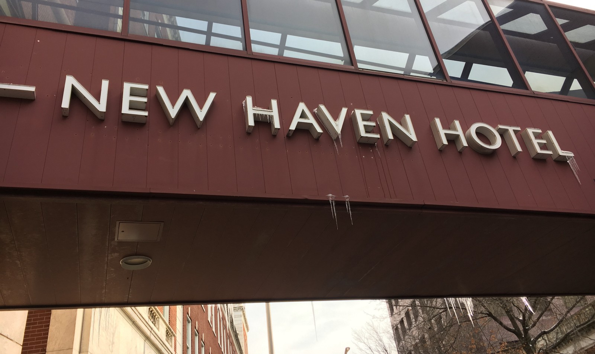
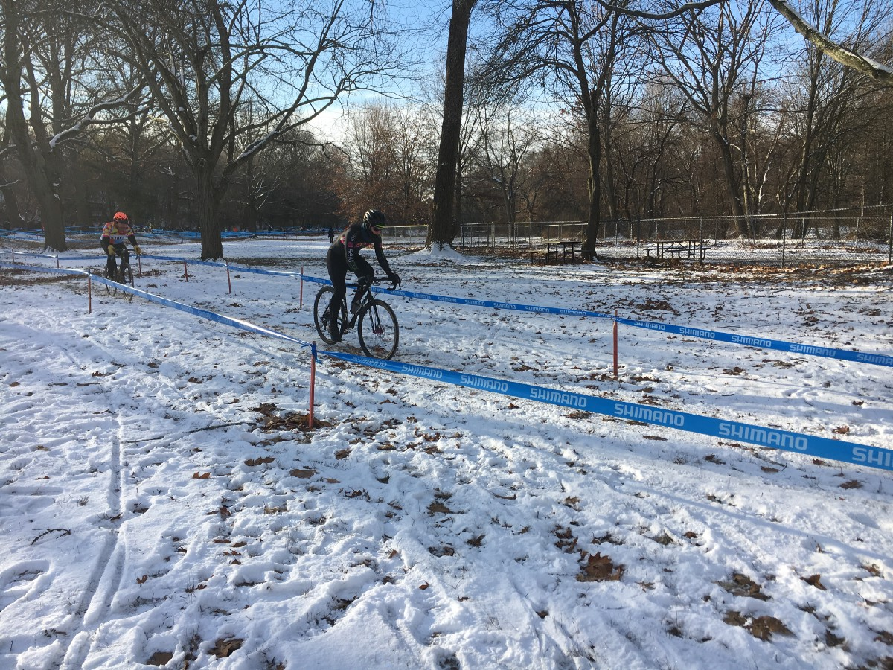

Last year, Elm City was my first cross race. It was the last of the season, and that was no coincidence. I was desperately waiting for my [broken ankle](/nyc-protected-bike-lanes/) to heal up, and by mid December it was close enough for me to give cross a try.

[**Elm City CX 2016: Amateur on Ice**](/elm-city-2016/)

Honestly I had so much fun, despite having literally no idea what to do. This year I was a bit more ready, and had bigger sights than last years goals of “Don’t finish last” and “Don’t knock anyone over”.

Although not having any broken bones in the last few months, I’d still not had much luck with fitness since mid-November. The flu I’d been suffering at [Supercross](/supercross-2017/) had evolved at some point into full-blown pneumonia, which I’d mostly ignored and continued to off-road ice trails with the gang as usual. This caused me to miss [Westwood Velo](https://www.bikereg.com/westwood-velo-cross-for-a-cure-for-kids-cross-race) *and* [Rainey Park](https://www.bikereg.com/raineyparkcross).

Pumped full of antibiotics I felt like registering, and the BikeReg was done late enough to get me starting spot in the fourth row, in the mid 20s.

*Actual icicles at the hotel, morning of the race.*

There’s a concrete straight from the starting line, and I knew I wanted to get as far up it as possible. The ground was ice and snow, and being the first race of the day, and -7°C, I knew it was going to be tough to gain after that.

I got to about 15th before we got onto the snow, then got stuck behind a very wobbly fella. He was surging, darting left and right, hitting the tape, knocking into people and trees, and generally being a bit of a mess.

At first I thought he was being a dick, but then it became clear that he was struggling to get past the fella in front of him. Guy 1 got passed Guy 2 half way through lap 1, then Guy 2 was my problem.

At Town Hall CX (forgot to blog it oops!) my biggest failure was crashing out trying to get around a slower rider at the start, knocking myself dizzy and suffering a wonky cockpit for the rest of the ride. I told myself if I was stuck in that same situation I’d keep on their wheel, bide my time, then jump at the first reasonable opportunity.

Almost a full lap later I was free of that hell, but the riders ahead were completely out of sight. This was a mixed blessing. There was no B line for most of the race, so at least I had the A line all to myself, but I also didn’t have anyone to chase or any motivation.

Thankfully I was caught up by “John”, who had also been struggling to pass the moving chicane. I don’t know the guy, but he had 4 or 5 mates spread around the course cheering him on.

*The unrelenting “John” hot on my back wheel.*

We were swapping places for a while, and it sped us both up a lot. He’d catch me on the corners (I was nervous and unstable taking icy corners at speed), and I’d get him back on the climb and straights. The motivation had us catching a few other riders, and that was most of the race.

End of the fourth lap I hammered on the road section to get past John, sailing past him on the finish line, but I honestly thought we were done. The two lads ahead just looked like they were cooling down, so I slowed down too, and John and some other chap flew by. I never saw them again, as during my realization of “oh shit we’re not done” I pushed too hard, slid out, and knocked myself silly with a helmet retiring impact.

The whole fifth lap was just me riding about solo, and eventually flopping over the line [15th](https://www.crossresults.com/race/7991#r155116) / 52, up on 29th / 32 last year.

[Strava](https://www.strava.com/activities/1321308318)

## Things to Improve

**Bunny Hops: **Everyone else was hopping the barriers, and folks were yelling at me for dismounting, but honestly that ice rink wasn’t the place to start trying that shit out.

**Tyre Choice:** [WTB Cross Boss](https://www.amazon.com/gp/product/B00MXSNO0U/ref=as_li_tl?ie=UTF8&camp=1789&creative=9325&creativeASIN=B00MXSNO0U&linkCode=as2&tag=philbikes-20&linkId=1b16698c288f80a8add38f36aa97b5d1) might have been a good choice if they were newer, but these things have been on my cross bike since October and honestly I need to stop procrastinating, and mess about changing tyres. I need a selection of them, and I need to take the two most likely tyres to each race, one on my backup wheels ready to go.

**Breathing Aids:** Normally I ride with a wind turbine, but in sub-zero temperatures my nose was a runny mess. Wiping my nose as I spotted a photographer perched at the top of a climb, I lost my turbine to the snow, and suffered for the last two laps unable to breath. [Eye Black Performance Strips](https://www.amazon.com/gp/product/B01EVXIPLM/ref=as_li_tl?ie=UTF8&camp=1789&creative=9325&creativeASIN=B01EVXIPLM&linkCode=as2&tag=philbikes-20&linkId=544a40b6a99a426447099119d87a0687) seem to take care of business just as well, if not better.

## Better Than Last Time

I crashed way less than last year, mostly thanks to the lower PSI permitted with tubeless tyres. Generally having a better feel for the bike, and commuting through the ice and snow last year has helped too no doubt.

https://www.instagram.com/p/BcwGCUJnY1q/

## Key Takeaways

* There is a happy medium to passing a slow rider, somewhere between full cracked out squirrel and overly zen

* Learn to differentiate some random dude near the finish line with a cow bell, from the officials with a dinky little “where is my butler” bell calling last lap

* Breathing is important, so if you’ve got a broken nose like me, make sure whatever you’re using to help isn’t going to vanish

* Re-run old races now and then, it’s a great chance to see how you’re progressing
