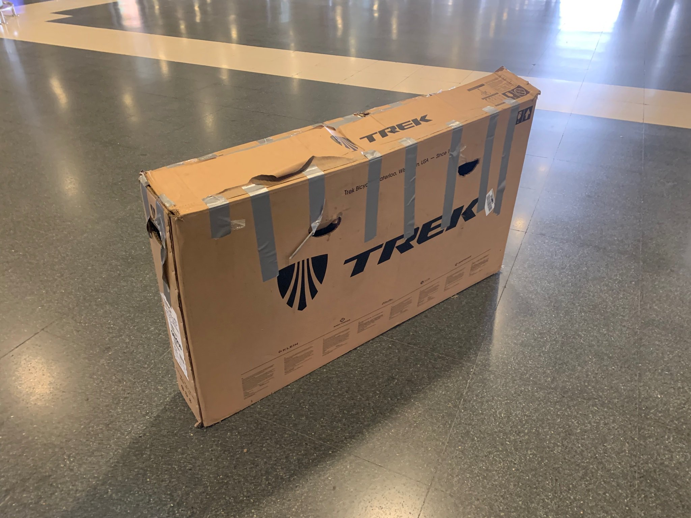

2018 was a blast, in a bunch of unexpected and ridiculous ways. It had come to my attention sometime around June that I hated by job. Lots of new folks coming in, trying to make their mark by cocking up projects I'd spent months putting together, and trying to force me onto projects I had no idea how to do and didn't care to learn.

I figured I could just focus on cyclocross training, and cross my fingers that things would get better, or quit. Quitting a job in the USA when on a visa is scary, because you have to either rush into another job taking whatever is around (that was half the problem here), or sell everything you own and try to get out of your apartment lease.

Keeping those options in mind, when my lease ran out in July I figured: no more anchors, don't sign anything, and let's see what happens. This turned out to be amazing, as a lot of Airbnb hosts offer a month long discount, meaning you can get a fully furnished apartment somewhere awesome for roughly the same amount as ridiculously expensive NYC rent. Had a firesale of stuff, kept my 4 bikes, put most other things out on the street. Folks in the neighborhood were well excited with getting toasters, a blender, plates, cutlery, everything.

The first stop was Cold Spring for all of July, which is a cute tiny historic village in the township of Phillipsburg on the Hudson, about 1.5 hours north of NYC on the train. The town is popular with hikers and usually an end point for cyclists who then jump on the train home. I turned 30 there and it was the best way to avoid having a giant crisis about the whole thing, especially with life in such a mess.

https://www.instagram.com/p/BkwJNKNFa6W/

A friend joined me which cut down on the cost. It meant I could work remotely 2 or 3 days out of the week, cycling up Bear Mountain on my lunch break, and mountain biking Blue Mountain after work. The days I did cycle to work were awesome. Seeing as its a 60 mi ride, it means I could bomb in, and take the train back, or do it the other way around.

Cheeky Storm King runs on the weekends.

https://www.instagram.com/p/BluIsZUFeny/

Then ws some traveling for work, then I moved my car full of stuff to Nyack for September. It's a slightly larger town on the west side of the Hudson, and it's a regular donut stop for the NY bike folks. Smash up the 9W, stop at Boxer Donuts, then head home. It is pretty close to a lot of the north New Jersey and New York State cyclocross races, so it was awesome to have folks crash in the spare room then go race bikes in the morning without having to fuck around in the city.

That and the commute training was still fantastic. 30mi from the city with pretty much uninterupted road meant I could mush it for my training plan. A little scary coming home though, we had a few storms.

https://www.instagram.com/p/BoNHm6RlIR5/

The guy who owned the house asked "You got a lot of bikes with you, are a professional bike racer?".

"No I just love riding bikes, and being up here is handy for races and helps with my training!"

"Sounds like an amazing life."

All I could think to say was "Well, my whole life is currently falling apart but I plan on having as much fun as possible while it happens!" 😂

https://www.instagram.com/p/BoXG9emFJbc/

Next stop: Colts Neck, New Jersey. It's October and we're really into Cross Season. A lot of New Yorkers make fun of New Jersey, and those people have never to south Jersey. It has the reputation of being meathead bodybuilders and all the other Jersey Shore noise, but it's a lot of beautiful, hilly, farm country. Staying with some friends down there was great, free, and meant I could take lunch rides places like this:

https://www.instagram.com/p/Bl9ktrglXpJ/

I stayed another month in another town nearby called Red Bank. This place is awesome. It has a few breweries, every type of restaurant, and there is a ferry which gets you to the city in 45 minutes if you need to be there, with a bike too!

https://www.instagram.com/p/Bl-p8Gnl4Z3/

Not only that but there are two mountain biking parks right next to each other.

First there is Huber Woods, which is a perfect cyclocross course made out of nature. It switches from twisty single track to long sand pits, to steps made out of tree roots, to log overs, back to sand, a few jumps, all sorts of shit. No need for a mountain bike here, just have a laugh. You can run it at night if you're feeling brave!

https://www.instagram.com/p/BqftCbHl-Qw/

Then there's Hartshawn Woods, which is Hubers big brother. I went there on my mountain bike at first and got my ass _kicked_. Learning from my mistakes, I went back with the Yeti ASR, and I ended up making a friend who showed me around the place.

https://www.instagram.com/p/BpiiCZ4l3Hj/

> Let’s take a picture to show your hipster mates back in Brooklyn, let them know New Jersey is beautiful. -- Mitch

Miss you Mitch!

Cross season was winding to the end by early December, and it was time to confront the fact that my job was still balls. I'd been passed over for a promotion which was two years overdue, so I moved into a friends room who was traveling for two months, and got to work selling everything from storage. The room was MAD when it turned up.

I stewed in this mess for most of December, slowly selling bits here and there. After a lovely Christmas with friends, I came back to work and immediately hated everything, rage quit, and ramped up the selling of all the things.

https://twitter.com/philsturgeon/status/1068710762787586050

Now all my belongings are spread around my friends, [KruisCX](https://www.kruiscx.com/) and the greater NYC bike community, "like horcruxes." The folks at the local bike shop were loving it, one of them got an easily fixed SRAM Force 1x, a few of them got new winter tyres, there's a barely used carbon tube saw up on the wall, and all sorts of other stuff which will make its way to those who need it.

And that's it! Got the car sold the day before I had to jump on a plane, and... fuck I have to pack.

Interesting fact: did you know a one-way flight from New York City to Gran Canaria booked three weeks in advanced is only $180?!

