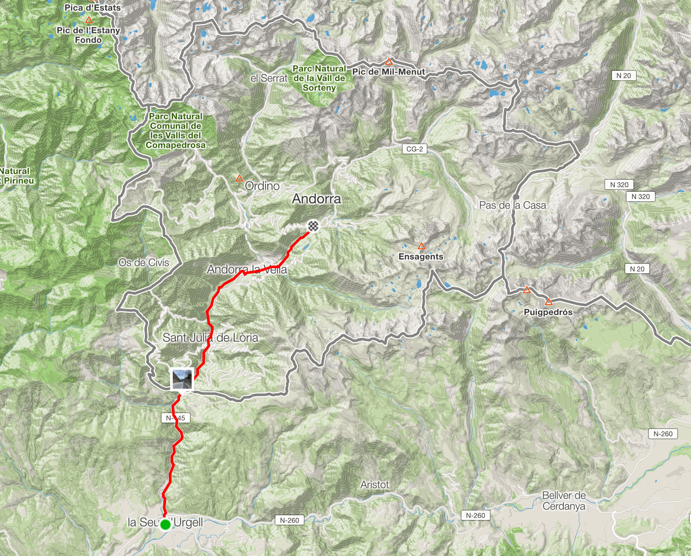

The pace in Spain had been a bit funny. I got drafted to speak at API Meetup Barcelona, which was about a week after I had originally planned to be in Barcelona. So I'd been distracting myself with mountains and treating myself to an extra rest day to get the timing right. Then afterwards I had to go ham to get [through the Pre-Pyranees](/euro-trip-spain/) Friday-Sunday. The plan was to head in the wrong direction a bunch via Girona because who likes riding next to the motorway, and into Andorra before work on Monday.

- [April 12th: Barcelona to Blanes](https://www.strava.com/activities/2284819724) - 101km, 1,504 m
- [April 13th: Blanes via Girona to Ripoll](https://www.strava.com/activities/2287111153) - 125km, 1,812 m
- [April 14th: Ripoll to la Sue d'Urgell](https://www.strava.com/activities/2290268533) - 101km, 1,504m

By getting the majority of the work out the way on the weekend, it meant getting into Andorra was just a nice morning commute.

- [April 15th: Ripoll to la Sue d'Urgell to Encamp](https://www.strava.com/activities/2291454138)

Getting into Andorra was easy, just hopped on the road and headed north.

To nerd out about georaphy a little bit, here's some stuff of Wikipedia:

> Andorra is the sixth-smallest nation in Europe, having an area of 468 square kilometers (181 sq mi) and a population of approximately 77,281. The Andorran people are a Romance ethnic group of originally Catalan descent. Andorra is the 16th-smallest country in the world by land and the 11th-smallest by population. Its capital, Andorra la Vella, is the highest capital city in Europe, at an elevation of 1,023 metres (3,356 feet) above sea level. The official language is Catalan; Spanish, Portuguese, and French are also commonly spoken.

Also, it's all mountains:

> All of Andorra is mountainous, and in total, there are 65 mountain peaks. The highest mountain is Coma Pedrosa, which rises to 2,942 m (9,652 ft) in the northwest of Andorra near the French and Spanish borders.

I was not entirely sure what to expect cycling into there, which is why I'd been so cautious. Sleeping at the bottom just to the south and leaving myself only a little ride in the morning, with time left to work, seemed like the move. It's great though, I was worrying unnecessarily.

It was all uphill but nothing too bad, and the cars seemed used to it. There was some sort of border control building which was waving over trucks for a check, but they didn't seem to give a shit about the cars much less a chap on a bike. Pretty sure the booth guy on Tinder.

Once you're past that it's straight into the main road, which is one big "strip mall" (for the Americans). Basically it's department stores and shopping centers all along a really narrow valley, with these huge amazing mountains on either side, following the upper course of a fast flowing river.

The huge buildings and busy road was a bit of a shame, but that's just the one road between the border and Andorra la Vella. After that the road splits off to the ski resorts to the west and north, and Encamp in the middle, which is where I was heading.

On main that road I spotted an amazing bike shop: [Jorma Bike](https://jormabike.com/), with a shitload of flashy bikes, and every arbitrary piece of kit you could imagine. They had a huge range of tubeless tires which I had been wanting for a long time - especially after getting three flats on the front that weekend. I grabbed a tyre to upgrade the front, spoke just enough Spanish to get them to install it, and 30 minutes later I was riding off really happy to finally have both wheels tubeless.

Then I thought "Crap, I didnt get the tube that was in there back, I need a backup!" Then noticed... I did have my tube. He's set the tubeless tyre up with a tube in it. Fuck my Spanish. 🤦

Anyway, got to my place, sat the hell down for 48 hours. Resting, working, enjoying the view around town. Popped out one day to another bike shop to get the front tyre actually aetup tubeless, but that was just a 45 minute noodle around.

Encamp is really beautiful, with a real mixture of old and new. Lots of hotels and fancy apartment buildings, next to tiny old stone buildings.

## Poor Planning, Badly Executed

After two days of solid keyboard hammering I decided it was time for an adventure. It was 5pm, it didn't get dark until 8pm, and I had a gap in meetings until about 10pm. Three hours is all I need for a two hour ride, this will be easy!

[April 17th: Dark Mountain Ice Death](https://www.strava.com/activities/2297607053)

I'm an idiot. I didn't bother putting the lights on because "2 is less than 3". The route was basically "head up a bunch of the local ski roads getting as high as you can before you see ice on the road, then head back down, and on the way back hit this one last mountain road and you're home.

Absolutely beautiful ride.

You might have spotted the problem from the last photo: too much time fucking around taking pictures and not enoug time pushing the pedals. It was _so fucking pretty_, and I was "almost done with the climb" so it didn't seem like that much of an issue.

Theeen came trouble. I hadn't zoomed in close enough on the route to see there were two different roads with a 1mi traverse between them, and that 1mi path was totally snowed out... It was freezing, I was in road shoes with no covers, and the snow was about a meter deep. No getting through it. I was already struggling with the summer bib shorts and short sleeved jacket combo, that was fine when the sun was up but progressively sucking more.

Going back down to the base of the climb at Ordino but then I was on the wrong side of the mountain, with an hour ride home, no lights on a busy road. Not great. So I decided to keep climbing, and descend into Canillo. Seeing as that was pretty close to Encamp it seemed like I could roll down a sidewalk, or river path, or hitchhike, or something.

https://www.instagram.com/p/BwX8AEvlD6a/

The descent was amazing, but terrifying. The sun was already down and the light was fading fast what with all the mountains. There was snow and ice all over the ground and I couldn't afford to take it easy, so I just smashed ahead hoping for the best. A few times my wheels started to go but I was heading fast enough they got back to gripping concrete before I went arse over tit.

It was pitch black by the time I got into Canillo, but that was a good feeling. I was no longer worried about freezing to death or breaking bones on a closed and lonely mountain road, now I just had to get home without being smushed by skiier who'd had one too many at the ski lodge.

In town it was ok, lots of street lamps, but within 1km the lights vanished. There was a 2-3m wide hatching area so I rode that, thinking "ha, easy, got this!" Of course that vanished too, and its just me in the pitch black, wearing all black, in a busy main road... balls.

Luckily, a hero appeared.

## The Minivan Hero

As I realized the hatchings were not coming back, I started slowing and moving over, to backtrack for a hitchhike or something. Then a minivan started flashing his lights, and my first thought was "oh fuck off".

I looked over my shoulder and he was still moving forward and flashing his lights, and I realized he had a plan. He put his lights on full beam, and started following. This road was only one lane so he could block traffic, and it was -10% so I had plenty of speed. I mushed as hard as I could down this thing, hitting 64k/ph and I don't think I touched the breaks once. Bahahaha.

Other than that one time I had a 25mph two-car Police escort through Bridgeport, CT, I've never experienced anything like it! It was an amazing feeling to have help like that, without needing to exchange any words.

I got to the bar at the end of the road, sliding across the floor in my road cleats, shivering from nerves and cold with my knees and arms out, and ordered: necesito un whisky grande por favor, which made a bunch of the many-layer-wearing locals laugh.

## Pas de la Casa

That was my last day in Andorra, and the next morning I had to load up the bike and head off to France.

[April 18th: Encamp to Ax-Les Thermes](https://www.strava.com/activities/2299203313)

Pretty much all climbing going north, certainly not as simple as getting in. Encamp to Pas de la Casa is all climbing, about 1500m in total. Again im in shorts and sleeveless jacket, riding past folks walking down the road in full ski gear, beanies, the whole works. 😂

I stopped at the ski lodge at the top of the climb, got some food and coffee, wrapped up warm for the descent, then floated down to into France for an hour or so. Switchbacks, couple of idiot drivers, but mostly good easy times.

https://www.instagram.com/p/BwbXsHnlwmp/

I'm sad to have left Spanish speaking Europe. Many folks seem to speak a bit around the French border there, but the further you go the less that happens. I enjoyed getting reasonable at speaking a bit of Spanish, but it's time to learn some French!