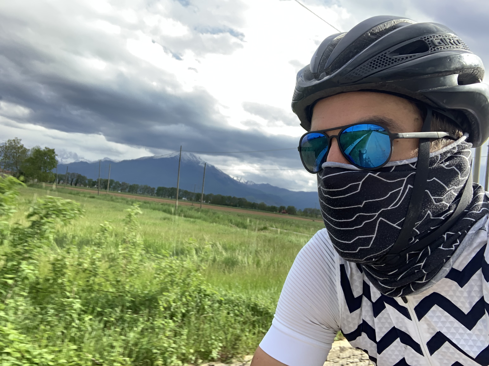

After taking a week long break in Nice to relax on a beach, get my back wheel re-spoked, and get a bit of work done, I [popped over to Monaco for a day](https://www.strava.com/activities/2335771545) and [pretended to be a F1 car](https://www.strava.com/activities/2299203313). Then after heading back to Nice to visit some clients, it was time to go north.

Strava had a good route along the river for a bit, had a coffee in L'Escarène, then up through Blausasc doing some crazy wobbling around on switchback climbs.

After the big climb was a big descent into Sospel, where I filled up all the water and all the food, and offf I goooo! In my head the plan was to make it all the way to the Italian border over Colle Di Tende on day 1, but it started pissing it down climbing out of Sospel.

Foolishly I had hoped it would stop, or whatever I'd be fine anyway. It had been really hot all morning and I thought it would be hot and wet, but it got really cold too. Even after stopping and rummaging around for extra layers, I vibrated the whole descent and felt really dizzy. Where the fuck were my long finger gloves? Did I lose them in Monaco?!

When the descent was done I was a few miles from Breil-sur-Roya, so I hid in the warm corner of a cafe with a coffee and noticed there was a hotel upstairs, so I got in bed and didn't stop shivering for another hour. Dummy.

[May 3rd: Nice to Breil-sur-Roya](https://www.strava.com/activities/2341879639)

Following the river again, it's a really weird route. You're on the side of a fairly busy road, but everyone is patient. It mostly feels like you're in the middle of nowhere, then now and then you see a bright red electronic train pop out of a mountain over a little bridge then back into another mountain.

I was worried about food after some of the mishaps in southern Spain, but there are loads of little pattiseries along the way. Fat and happy on cake I got to the bottom of Colle di Tende.

The bottom of this climb is where the road meets a 3km car-only tunnel, and clearly there is a whole bunch of construction work going on. It looks pretty whack here, and there was a 25 minute timer counting down on the traffic light, but luckily those don't apply to cyclists. 😋

As soon as you split from the main road you're on gravel, and you immediately forget about all the traffic and construction.

It is mostly gravel and what seems like it would normally be hard-pack dirt, but after yesterdays storm is was boggy silt. That was mostly ok on my road 25/28c tyres, but if you can take something bigger or with a few more knobs you'll have a better time.

The climb is mostly 6-8% with a few 9-11% bits thrown in for giggles. I made the mistake of stopping to take a photo once or twice and had a hell of a time getting going again. Trying to get enough momentum to clip back in after a stop was impossible in a few places, so I either walked it, or pedalled clipped out awkwardly until the switchback leveled things out enough to get in.

Some of the sections are pretty rough, and this is where you really wanna have better tyres than the bullshit I was riding.

Even hit a bit of snow once I was closer to the top (this is early May so still not warmed up too much).

The view the whole way up is stunning, and it's crazy to look back on the road and see where you've been.

https://www.instagram.com/p/BxC0Qu2FxDo/

For motivation, I listened to Frank Carter & The Rattlesnakes new album: [End of Suffering](https://open.spotify.com/album/1KS8HJ4sPoHFnryujTqXIf?si=OfrrsbqBRWGqBNS72atEZA). It was not a quiet peaceful ride in the Alps, and that is fine with me. Being alone with my thoughts and having Frank egging me on is exactly what I needed to slog it up this 1,800m climb.

Once I was done cocking about taking the perfect picture of my bike at "the top" of this thing, and after I was done making sure nothing broke after it fell over while I was cocking about taking photos, I noticed there was a bit more climb. For a minute it looked like the route was totally snowed out, but luckily it was only a few hundred meters of snow, so I just pushed the bike through it and into Italy!

There is some interesting history in the area too. Lots of old forts and barracks from when Italy and France weren't getting along so good.

The snow was slowing my descent into Italy quite a bit, and I noticed I had some squishy tyres. [Touring tubeless](/touring-tubeless/) had not been going great so far, but this time was fine, I got some more sealant in there, pumped them up, and got down to the valley floor where there was coffee and cake and a giant chocolate outlet store.

Also yay a rainbow!

After that was just a nice flat mush north towards Milan, through farm country and old castle towns. Beautiful stuff!

[May 4th: Colle di Tende and Italy!](https://www.strava.com/activities/2341879639)

I learned some good lessons on this trip.

1. Put shoe covers on that are in your bag, you might as well, they don't make much difference if its hot, and if water appears they're already on and you wont get wet feet. Wet feet are the pits.

2. Have a "go bag" for sudden cold situations, with a whole bunch of layers in there, gloves, leg warmers, etc, without needing to rummage around in the paniers. An Alp Kit handlebar bag was waiting for me in Milan, so that's what that will be.

3. You can't do 200km and climb over mountains and carry a shitload of stuff, pick one, or maybe two, but not all three. Cocky git.