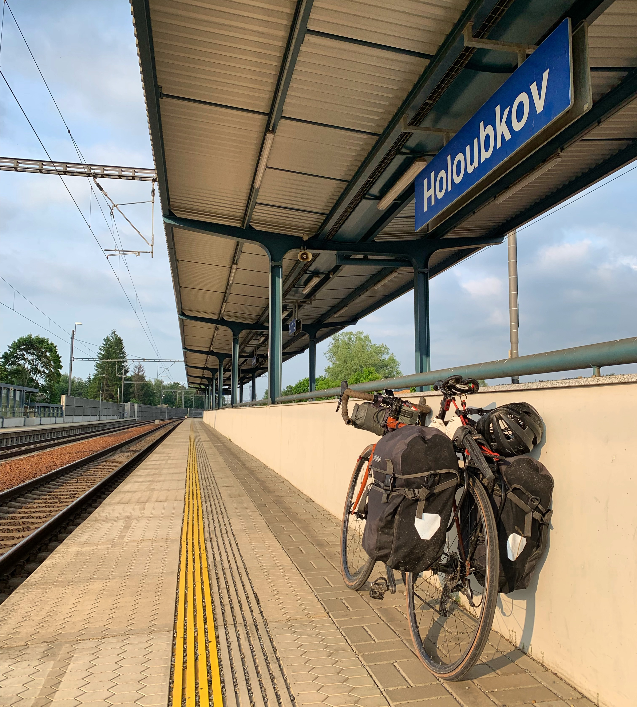
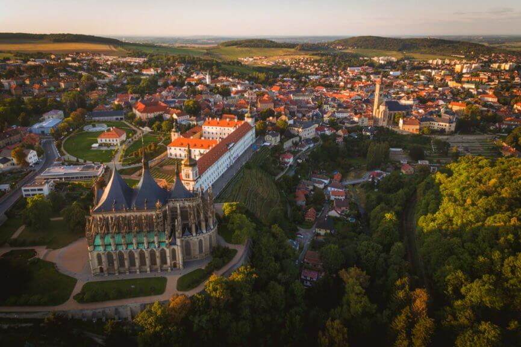

I've not felt this at home in any country. Czech Republic, to me, feels just
like being in the west country (South West, UK). Hello is "ahoy", cider is
"cider" (and it's popular), and there are tractors everywhere, parked in peoples
driveways and on all the roads. The whole way across the country, west to south
east, I had to remind myself I wasn't doing laps of the Cotswalds.

It was a pretty peaceful start, [popping over the Germany border from
Waldmunchen](https://www.strava.com/activities/2419730256). The climb was
consistent but reasonable, topping off at 765m - much more friendly than the
1,050m crossing further south. It was hot as balls, but the woods and timber
plantations helped out a bunch.

Once I was over the border it was a bonkers descent through potholes, then a
more chill descent through farmland. The roads were all lined with trees, which
really helped against the heat.

It was a crazy weekend of getting tested in the heat, fighting with tyre plugs
and failing, so getting to my 36 hour rest stop was very welcome. The cute
little village Horšovský Týn had everything I could want, a little coffee shop,
[a beautiful apartment](https://www.airbnb.com/rooms/20599516), a really nice
Czech host lady who spoke enough German for us to muddle through, a castle, and
some amazing grounds to wander about.

https://www.instagram.com/p/ByTeV6rFs45/

# Rough Roads to Pilsen

After resting up I jumped on the bike and [headed up to Pilsen
(Plzeń)](https://www.strava.com/activities/2425245842). I switched from Strava
to [Komoot](http://komoot.com/) for my route planning, and damn I had no idea
what I'd been missing out on. It seems like every European on two wheels knows
about Komoot, but all the yanks are still daftly trying to plan rides on Strava,
which is two different shades of useless.

With Strava you can enable "Use Popularity" and it'll send you down some very
popular singletrack, or you can turn that off and it'll send you down the
motorway. With Komoot you can chose between Road, Touring, or Mountain Biking,
and they're all on point. I chose touring, and I saw a lot of quiet lanes,
gravel, double track, didn't lose any teeth, and my utterly fucked back
wheel didn't get (noticeably) any more fucked.

It did however send me through an active building site, which made for a funny video.

https://www.instagram.com/p/ByXVgoyF3DG/

Pilsen to Prague didn't go so well.

## Double Tube Failure

The tyre plug fight near the Czech border forced me to put a tube in. Two
attempts at plugging didn't work, adding more sealant didn't help either. I got
bit by a bunch of ants, some of them got in my brownie and I ate them, it was a
heat exhaustion-infused whole mess. I ended up throwing a tube in, so [half way
to Prague](https://www.strava.com/activities/2428542827) when I got another flat
I went to put in my other spare tube.

Slight problem, the spare had a hole in it. I don't know if that hole happened
in the bag, or if I just somehow forgot one of my flats. I've been at this a
while but I feel like I'd remember a flat and patch it that evening... I think?!

My attempts to patch once again failed due to all the damn rain messing with the
glue. I tried tying trick, but both the tubes had a hole so close to the valve
it was not gonna work.

At one point I thought I had it covered, which is of course when lovely Martin
turns up. This chap asks if im ok, and even though I asked if he had a spare
tube, he thought I said "tyre lever" and then literally put my tyre on for me. He
was so friendly I didn't want to say "No I don't need any help I just want to
buy a tube off you!" 🤣

We got talking and he was super excited about my trip. He offered me a sofa to
sleep on and and a shower, but I politely thanked him and reassured him I was
fine. We pumped the wheel, and when I had convinced him enough that I was fine,
he cycled off. Of course as soon as I got on the bike and blew the patch and he was
out of earshot. Back to being stranded. 🤦🏻‍♂️

It could have been really bad, but luckily I was a 15 minute walk from a train
station. 1.5 hours later I was on a train heading to some place, which happened
to have a train to Prague. Power, wifi, got some work done, barely spent
anything, beautiful!

## Rest/Chores in Prague!

If rural Czech = Cotswalds, Prague for sure is Bristol. It was all cobbled
hills, cider, bikes, tattoos, and anarchy. I met some friends for drinks at a
bike bar called Biker Jesus, which had a downstairs bike dungeon. They went home
and I went full reprobate with the locals after. Hilarious night, and got to
catch up on some Netflix and groggily handle chores for the next 48 hours.

Sorted out [some logistics](/touring-logistics/), and got new bike parts, including
my fancy new Phil Wood hub wheel!!

Why wheels were shot before I even started this trip and I'd been failing to get
new ones sorted out, but finally I had both of them! So fucking happy. No more constantly breaking spokes, no more
bucking broncho, no more wobbly hub.

I found a place that took forever to set it up tubeless, found a better place to
get my [Cinq Plug5](https://cinq.de/en/power-supplies/433/plug5-plus?c=135) set
up at an e-bike store, shipped some stuff home, all sorts.

It hurt to leave Prague. It was my first time getting an electric scooter up to
35km, on a steep downhill tunnel no less. My eyes were literally vibrating
hitting the cobbles at the bottom. Everywhere was beautiful and everyone was a
shitload of fun, I want to go back. But after a long 4-day weekend I had to get
on the bike, to get to Brno and meet friends of friends.

## Kutna Hora

Heading south out of Prague you forget about being in a major city real fast. It
almost immediately turned into fields and tractors, and I was back to
cyclocrossing through suburban roadworks and country lanes. After two hours or
so I stopped under a tree outside a house, and a very old chap wandering out to
talk to me.

The whole embarrassed "sorry for bothering you!" Brit thing immediately came to
mind and I didn't even think before saying "No thank you sorry bye!" I ran away
before it registered that this lovely 85-90 year old man was offering me a
beer! It was hot as fuck, I would have loved that beer, and maybe some fresh
water, and definitely shade. He didn't speak a word of English but we joked
about how hot it was and I ran away like an *idiot*. I'm sad I fucked that up.

[Getting into Kutna Hora](https://www.strava.com/activities/2442454599) was
amazing. It was all farmland nothingness then suddenly amazing buildings with
huge spires start popping up through the fields. It was a stunning medival town
that I took no photos of, because I was really tired and had spent the whole day
stopping on and off to work. I just wanted to fill my face with meat and beer,
which I did extremely successfully.

## Jihlava

I still hadn't really got around to learning and Czech, I meant to on the way to
Prague and then drama, meant to in Prague but everyone was fluent, and by the
time I was [back in the country](https://www.strava.com/activities/2444887543) I
didn't know shit.

People in this town were pissed off with me. I was just trying to give away a
few spare bike bits at a local bike shop and two different places were just
shouting at me. Very bizarre. My local mates tell me the older generation have a
lot of trust issues with foreigners, a layover from communist times. Fair
enough.

You can get in trouble either way. In the cities when you say "Mluvíte
anglicky?" and they say "Of course!" almost annoyed that you would think they
might not, but out in some of the smaller towns you ask the same question in the
same way and they are pissed off that you think they would. 🤷‍♂️

## Hiking Trail to Trebic

It was [the most fun of all the Czech
rides](https://www.strava.com/activities/2448736135), I went through a few
streams, over some little bridges, along a hiking trail, and spent a _lot_ of
time on logging roads.

https://www.instagram.com/p/Byqd0UOFYmR/

On the way I saw a women in a hard hat working on a building site. First time
I've ever seen that anywhere. Score for equal opportunity!

I stayed in an awesome restaurant/hotel called [Hotel
Kocour](https://www.orbitz.com/Trebic-Hotels-Hotel-Kocour.h20030490.Hotel-Information?langid=1033),
and they let me put my bike in with the beer kegs! 🍻

## Bunker in Brno

Thanks to the more epic ride the day before, [getting into the Czech's "second
city" Brno](https://www.strava.com/activities/2451346716) was pretty easy. It was
more of a road day, and it was fuuuuuuuucking hot. Luckily the nuclear bunker I was
staying in was ice cold.

It was another instance of tree-lined roads saving the day. It's not just the
odd road - you'll find that anywhere in the world - but the *vast majority* of
the roads. Main roads, side roads, farmers lanes, not roads, bike paths through
the middle of a random field, whatever it is, there are trees.

This is not some old traditional thing either. You could image somebody making a
case that more developed countries used to have them, but they cut them down
because something something storms + trees = car crashes, but nope, Czechs are out
there actively planting trees everywhere.

If we want to avoid a future where we all have to live in a nuclear bunker and
fight each other for scraps of rat meat while the whole world burns around us,
we should all be out there planting more trees.

[So lets do that](https://ecologi.com/philsturgeon). That charity is planting
trees all over for about $0.10 a tree, so please donate at least 100 trees. I
want to get to 5,000 trees before the end of June!
