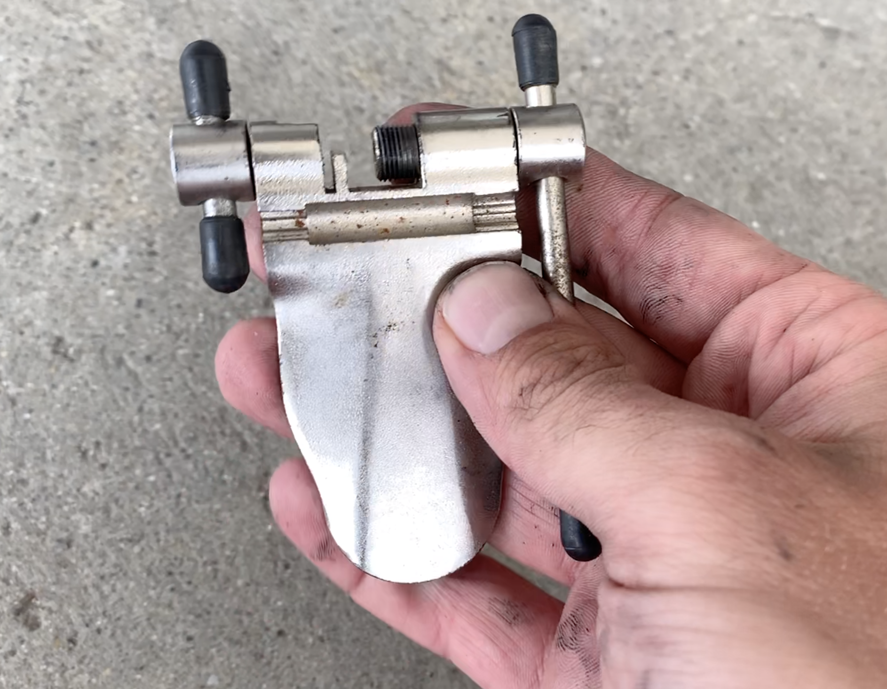

I have a reputation for haphazard bike work, and getting into stupid situations.
I crash, I forget to torque my bars up so a crash mid cross race leaves me riding sideways
for the rest of it, and at this point my touring bike is 50% zip tie.

https://twitter.com/dgeb/status/1132333817061171201

The other day I managed to completely outdo myself, and got into absolutely the
most ridiculous bike situation I can remember.

My head was a bit in the clouds after the approach into Zurich two days before
being offensively beautiful.

It was really hot, there was 1700km of climbing to be done to get from
Switzerland into Germany, and my bags were feeling heavy. There was an extra
chain I grabbed on Zurich knowing mine was close to dead, and I even had a spare
cassette I'd been lugging around since the [Canary
Islands](/canary-islands-tenerife-gran-canaria/).

It seemed like getting this on the bike and chucking the old stuff would be a
weight saver, so I stopped at the first shade: a petrol station in the middle of
damn nowhere. The chain came off easy, then I ran into first struggle: my chain
breaker pin had vanished.

Luckily I had one on my Crank Brothers multitool, and despite never getting it to work
on 3 attempts in the past, today it worked! Fuck that chain breaker, it's in the bin,
more weight saved.

Chain is sized, cassette is one, time to put this wheel back on. Chain tensioner is on,
skewer is in, now I can just... Hmm, where is the nut?

Twenty minutes later, after the teenager working the till and I had gone through the wholew fucking
courtyard on our hands and knees, and he even started going through the nasty bins before I
snatched it away and said "Please no, this is my job!" and got in there picking through fag ash...

_THE NUT IS NO LONGER OF THIS EARTH!_

No trains, no taxis, no mates nearby, and although there's plenty of cyclists flowing past it's not
like they're gonna hand off one of their nuts, nor does any sane cyclist bother carrying a spare.

Time to get creative.

This looks crazy, but I am honestly proud of this bodge.

1. Steal a nut from the front wheel and move it to the back. Surly Crosscheck
   has horizontal dropouts so the back would have been sliding about all over
   the place.
2. Shove the QR skewer back in there so I at least have an axel to ride on.
3. Tape / tie the lever on the left, so it doesn't flop out the side.

https://www.instagram.com/p/BxmhfTBBEbO/

It worked! I got 8mi to the nearest bike shop: [bike
cafe](https://www.bike-cafe.ch/), and we both laughed our assess off when I
pointed to the abomination on my front fork.

The best bit about this whole thing, was this mistake didn't cost me a single Euro-cent,
and I saved _even more_ weight. I gave him a giant pedal wrench I definitely don't need,
and he gave me the nut for free.

It's been a week since this happened, but still, every time I look down at my front wheel
and see the little plastic nut he gave me, I laugh out loud.

After all that nonsense, I ate a giant pizza, then pushed through the Black
Forrest to Frieberg im Breisgau, Germany. Some friends lived in the area so we ate all the sausages and
drank all the giant beers, and all is well!

