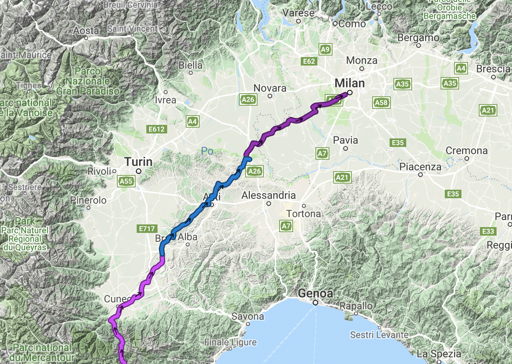
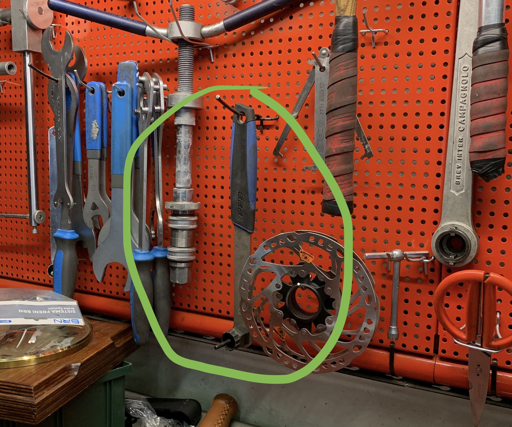
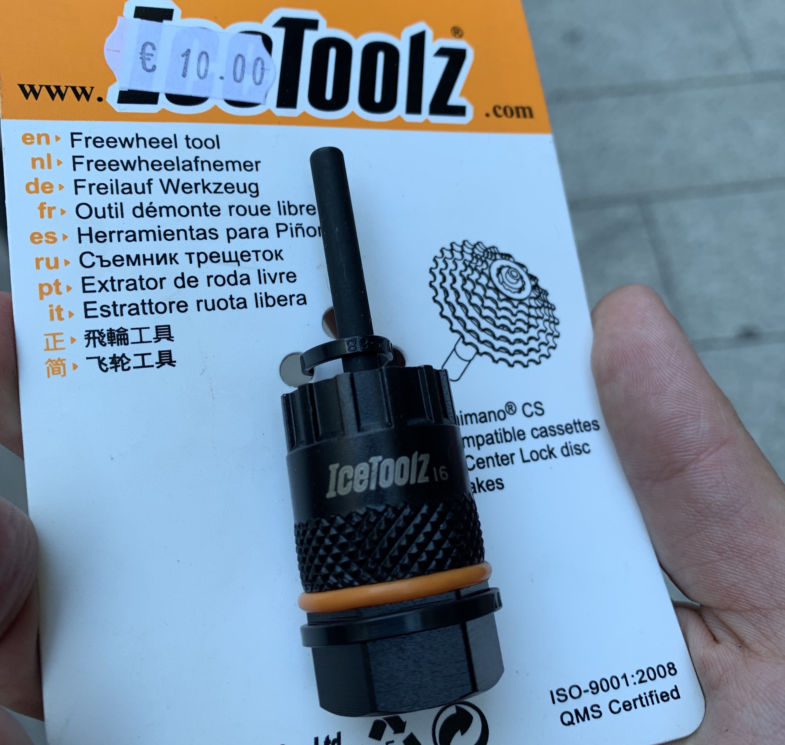

Milan was a great rest stop after a bonkers trip through the [French
Alps](/euro-trip-colle-di-tende/), and I had three days off the bike as once
again there were things to fix. The bearings had worn down and the cassette had
a noticeable wobble, and internally it was squealing so badly I had music turned
up loud and was just hoping to get to the city before seizure or total failure.
🤣

I set my route for the very nearest bike shop in the south west, and he no parla
inglesi, but he did phone a mate and send me a few blocks down the road. [Baco
Bici](http://www.bacobici.it/) took the bike and said they'd order things in, asked
how long I was in town, laughed when I said "I'm only here for the bearings."

I'm not going to write a city guide, but Milan is great. Lots of bike shops and
bike cafes, nobody cared the only Italian I know is cappuccino per favore, and there
was a lot of good food and drink.

When the bearings were installed I picked it up, and went off to find all the things that
had been shipped to my [ClevverMail](https://clevver.io/)
mailbox:

- 2x [WTB Exposure 32c Tubeless Tyres](https://www.wiggle.co.uk/wtb-exposure-tcs-road-tyre-tan-sidewall/)
- [Pedros Chain Pig II](https://pedros.com/products/clean-and-lube/clean-andlube-tools-and-kits/chain-pig-ii/)
- [cinq The Plug5 Plus Dynamo USB](https://www.bike-components.de/en/cinq5/The-Plug5-Plus-Dynamo-USB-Stromversorgung-p65300/) (comically no dynamo wheel yet due to holdups)
- A replacement credit card after I lost them all back in May 🤦🏻‍♂️

I'd been wanting to [sort out my tyres](/touring-tubeless/) for a while so
getting these through was awesome. Larger volume means they wont heavy-burp quite so easily,
and their almost file-tread profile means I should not struggle quite so with offroad turning.

The chain pig will help me get the shit out of my chain, because riding a gross
chain sucks and my previous half-assed cleaning attempts with old rags were
making it look clean but leaving plenty of gumph inside the chain - the bit that
matters.

The dynamo situation is a pain in the butt, I was hoping to have found somebody to build me
up a wheelset and get it delivered to Milan, but I got there ahead of schedule and didn't
find somebody in time. Still, having half of the solution is a good step, even if it is pointless
weight for now.

## Rossignoli Bicycles Milan = Best Bike Shop in Milan

Some of the bike shops were tiny neighborhood things which are great for their audience, but I needed
somebody who could set up some tubeless tyres and not bodge it up. Been there.

Riding around to a few places with my bag of goodies, I stopped at the Bianchi bike shop and it was full of suits eating three course meals. I searched around for the bike shop part and it seemed like there was just a few cycling hats and water bottles, and nothing else... confused I ran away, and tried a few more, but eventually settled on [Rossignoli Bicycles](http://rossignoli.it).

There are a few reasons I love this bike shop, but the first was the Cinelli Zydeco in the window.

_I am really sorry for the terrible photo here, but it was really sunny and nothing I could do to take a better one._

It's incredibly rare to find good backpacking or touring stuff in bike shops, at
least in my experience, but this bike shop had everything, with friendly,
knowledgeable staff.

They had a lot of questions and jokes about my trip, and got the tyres set up
pretty quick for a busy bike shop. I took it in at 6:30pm, they closed at
7:30pm, they had things ready by about 1pm the next day.

When I walked in at 11am hoping things would be done, there was a mechanic
covered in sealant, still working away on the first wheel, swearing a whole lot
about "tubalessi", but he eventually got it all sorted out.

There's a great coffee shop next door called the Moleskin Cafe. They have a
whole upstairs laptop friendly area and don't care how long you're there or
whats going on, the coffee is great, loads of food: perfect.

The final reason I love them, is that they did a tool swap with me. I'm always
trying to get rid of weight, and seeing as this trip was unplanned there are a
lot of silly things going on in my bag. The only lock ring remover I had was a
home mechanic style full-handle bastard, and it was adding a lot of pointless
weight to my toolkit. He did a straight swap for the little fella that needs a
wrench, which I already have.

Bartering tools at bike shops is a new thing I'm going to try more. I saved €10 and 1lb!

Riding back from the bike shop I spotted the coolest thing in Milan, "Vertical Woods".

https://www.instagram.com/p/BxP99VKljQc/

More people plant trees all over your buildings please.

That's it, Switzerland next!