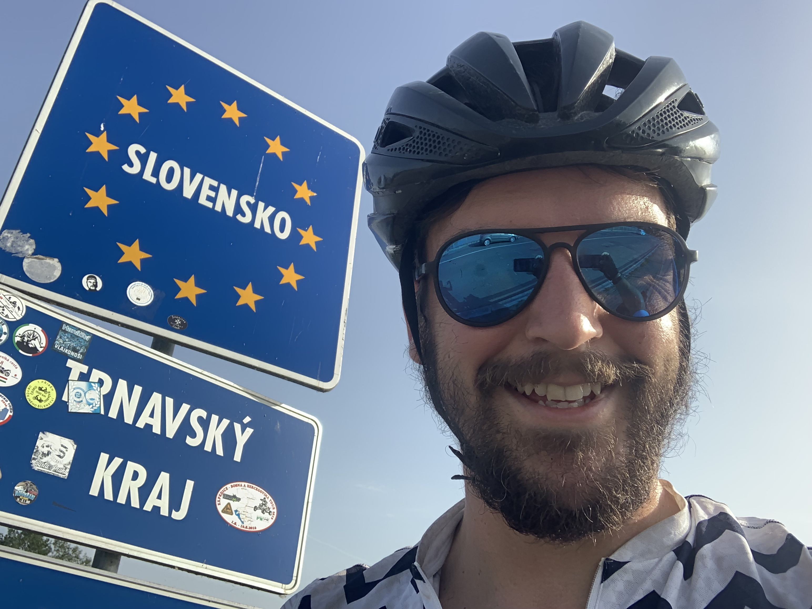
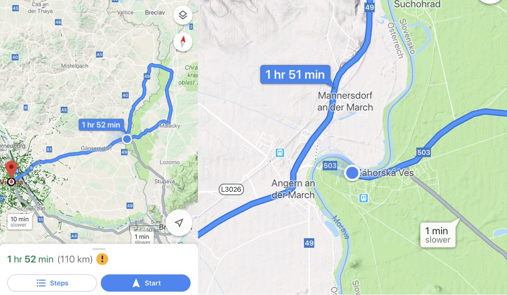

The last stop in my [Czech crossing](/euro-trip-czech-republic/) was Brno, and I struggled leaving. I wandered around all morning with the bike doing chores. The priority was to find some camping equipment after kit I ordered bounced off Prague and went back to Germany for unknown reasons. I found a great tarp and bivy, so after some lunch, and a beer with a police & soldier couple who'd just bought matching rollerskates, I finally hauled myself on the bike and headed south for Slovakia.

It was really hot, but everywhere was pretty, so I didn't mind. The camping store had life straws so for the first time in ages I've not been worried about water. Didn't even care when I ran out of road due to rally.

https://www.instagram.com/p/Byu4RSqFuD6/

First time seeing rally in real life, and it was free!

_Don't worry I have since pruned this straggly caveman beard back to just "outdoorsy" levels. People were starting to clutch their bags when I walked by._

The plan here was to get into Slovakia, head along the national park near the border, camp, then get into Vienna the next day. A quick in and out sure, there's a lot of countries in east Europe to ride through! So long as I have one drink, and sleep one night, that's the official rules (according to a man I met on a broken down train in Serbia who sells his body to medical studies so he can bribe his way into countries like Iraq...)

I got over the border at about 6:30pm and immediately started killing time.
Thirty minutes with sandwiches and surprisingly fast wifi at a petrol station,
slow rolled for an hour, considered jumping in a lake but none of them seemed
particularly appealing other than one crowded with lads I didn't really want to
try and interact with, so I rode on. Stopped at a locals only bar and got some
weird looks for another hour, then went looking a bit more seriously for a
camping spot.

At 9:30pm it was still light, and still really really hot. I was slow rolling to avoid running out of park, and I had to keep moving because *the second* I stopped a swarm of biters would appear. Eventually I attempted the worlds fastest switch from summer kit spandex to trousers and long-sleeve top, throwing my bike down the second I felt a bit of wind but still got eaten to fuck. Daftly the long sleeve top was wool and they chomped right through that.

Kept rolling a bit longer, then by 10pm it was still really damn hot! I accepted that the sun would need to be down for a while before I could camp, so I swung off to a village by the crossing to Austria and started drinking for a few beers with 50 year old angry looking chain smoking locals.

https://twitter.com/philsturgeon/status/1139983606498156546

The bartender was amazing, she was smashing the shit out of mosquitos with a fly swatter whilst serving my €1 beers, and I had €8 with me! The locals were a bit shitty, they kept laughing at me, but I absolutely deserved laughing at, sat in the corner charging my phone all by myself. At one point one of them turned the light off whilst I was at the urinal, then I heard them all laugh from outside. 😭

I did manage to get some cheers when I caught a mosquito with one hand, and smushed it. This whole scene had a soundtrack of *Jennifer Lopez - Waiting for Tonight*.

At 11pm the bar closed so I headed back out into swampland. The whole area was a breeding ground for mosquitos, it was really poor planning on my part. Thinking about it I've never picked my own wild camping spot, it's always been a mate pointing out a good place, or a designated camp ground. They did the work for me, of making sure there was a bit of elevation, not too close to standing water, not too close to dense vegetation, etc. I had aaaaalll of that, and there were thick clouds of them.

## Bivy Experiment

A bivy is pretty much an outer layer for a sleeping bag made out of thick plastic, like a super heavy duty bin bag. Some come up to your neck and leave your face poking out, some seal all the way up so the bugs can't get to you.

I started off totally zipped up, but after about 30 minutes I was struggling to breath, and I was sweating from the moment I got in. Struggling for room to move I got my trousers off and that helped a bit, but eventually I had to unzip the head to cool down and breath. The biters were already waiting for me.

Knowing mosquitos would be a threat I thought ahead and bought a headnet. The plan was to keep zipped up around the neck and at least cool a bit and breath, and this was almost a clever idea, but there was a flaw. A headnet does a great job when you're walking around, but when you are lying on your back the net rests on your face, meaning the bugs just sit on the net and bite you right though!

The next few hours were an awful cycle: Stay out for as long as I can deal with the biting, get in for as long as I can before dizzy from heat and lack of air, get out for as long as I can deal with the biting...

The worst was getting out for a piss, with sweat covered legs. Mosquitos are drawn to sweat, beer, and urine... ugh. 30 bites there alone, luckily only one of them was somewhere sensitive.

At about 2am I gave the fuck up. I painfully wiggled into my trousers, got eaten alive doing a rush pack job, left my socks in the bivy, threw everything into the panniers, checked my passport was in the framebag, and started cycling towards the Austrian border. Fuck it, I thought, Vienna is only 40km away. If I ride real slow I can get there at 5am, find an early breakfast spot, and just crash when hotels open.

NOPE!

## Ferry Bad Situation

I hadn't looked too close at the map before and the road was actually a boat. It would have been a 20s swim without a bike, a short skull with a carbon bike, but completely impossible with a loaded up steel bike, even if I'd made a few trips, I was too tired and drunk for all that. Instead, it was an extra 70km.

I'd [already done 127km](https://www.strava.com/activities/2452900743), the thought of 110km wasn't the most exciting thought, but shit at least I don't have to worry about getting to Vienna too early!

Heading north I just settled into the fact this was happening. I popped on an audiobook to try and help pass the night, and the first thing to come on was Cadel Evans, _The Art of Cycling_. The first few minutes were all about how cyclists are very particular types, who care a lot about everything being just right, their bike being tuned just so, their socks matching and pulled up to the same exact level... I'm not even waring any socks, they're in the bivy bag I bailed on, and I'm wearing hiking shoes and full length clothes with no chammy which already hurts, because I don't dare stop: the little fucks were still out in force.

I sweated my way north for about an hour until I passed a hotel with a security gate and an intercom, and thought "Might as well!"

> Sorry sir, we fully booked, there is wedding!

Fair enough! This failure did point out one thing though, hotels are open to the idea of you buzzing them at 3am looking for a room.

Another 30 minutes of riding and I found a place, knocked on the door, and he had a room!

> Him: "For the bike, you can leave with me?"
>
> Me: "Leave it anywhere you like mate, I hate it."

I was so hungry and not in a great spot, but luckily I had that backup petrol station beer, and a shower, and everything was good with the world again. A 1 hour breakfast buffet sorted me out, and it was a fun ride through the swamp back to the ferry.

See, it really wasn't far!

https://www.instagram.com/p/ByxRTFGlGTB/

[Then onwards, to Vienna](https://www.strava.com/activities/2454822090)!

Austria, Country #12.

After rinsing out the bivy and clearing out all the dead mosqutios from INSIDE
IT, I shipped it home with a few other bits and bobs I wasn't using. I'm sure
I'll appreciate it one day for cooler UK lightweight camping situations, but the
further south I go the less interest I have in a sweat sack.

For a bit I considered getting a full sized mosquito net that I could hang off
the tarp, or hook it into other stuff like a tree branch. Maybe lash up a little
tripod to keep it elevated above my legs so they couldn't chew through if the
net got close, but eventually convinced myself that I was describing a tent. So
I bought a damn tent.

Yes also hammocks are nice but I cannot rely on trees where I'm heading. Further south!

_Remember to sponsor this trip and all the dumb stories that come with it by [donating
to reforestation](/trees)!_
