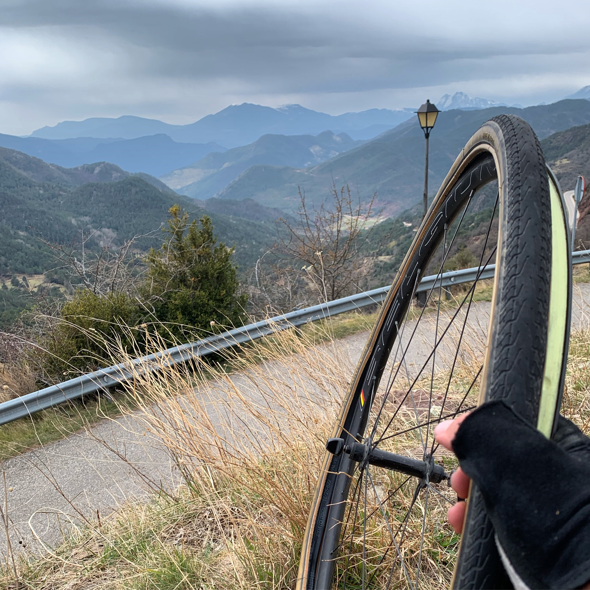
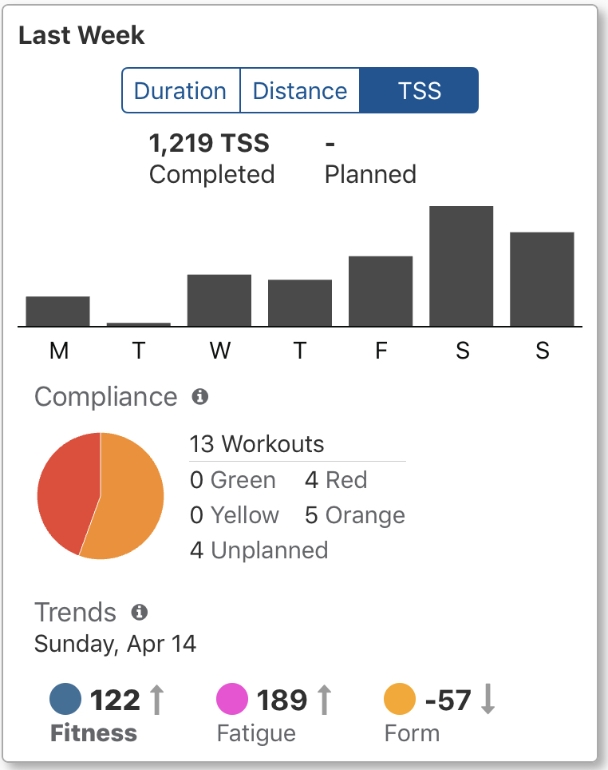

After leaving the states and spending five weeks in [the Canary Islands](/canary-islands-tenerife-gran-canaria/), it still felt too soon to rush into a new life back in the UK, so I opted for a third option. I'd left my bike in Spain while I popped to Poland for a short work trip mid March, then headed back to Spain to grab my bike and relax on the east coast with some Belgian friends having their own little winter training camp.

https://www.instagram.com/p/BvVNfvbFJSN/

Apparently Calpe is another famous spot for the pros, and the Belgians got very excited about seeing one European time trial champion or other. Another two weeks of riding a whole lot of bikes was great, and it got me thinking, why stop the bikes now. The new job is remote, I have my Surly Crosscheck and some reasonable enough bikepacking bags... let's head north and think up a plan later!

## Packing

When most people plan a multi-month cycling trip they plan, practice packing, repacking, do mini trips somewhere closer, but a big hard nope on all of that! When I [threw in the towel at my USA job](/escape-from-new-york/) I had to sell all my shit and get out of the country pretty quickly. Trying to re-home a turtle, sell a SUV, and get rid of 39327494 bike tools and spare parts took up pretty much all of my time.

The entire packing process was done 48-36 hours before the flight. The process was:

1. One box for things to go back to England
2. One rucksack for things to go to Poland
3. A pile of bike things to try and take with me

Everything else went to Sun and Air bike shop as a donation, was donated to the roommates, or went out on the street. I was even carrying a backpack of sweatshirts/layers and giving a few items to every homeless person I walked past for that week.

This system did technically work, but it aint the most efficient. If you think of only the items you need, you might underpack, but if you look at all the items you have and think "I might need this" you will almost certainly overpack. My bike was fucking heavy in Canary Islands, and my bags were pretty bad.

The Surly Straggle check bag cant really have anything in it before it starts to bulge around the bottom, meaning it was good for a laptop on the main pouch and a smattering of snacks or tools in the top bit. Anything else and I'd be rubbing against the pedals. That also meant I had to ride with a backpack full of stuff, and that was ok for a short ride but I didn't fancy crossing the Pyranees and Alps like that!

I planned to start on April 1st, but there were two days of absolute shit weather, so I used that time to source better parts:

- **TP MP 3700 MiFi:** Gotta Internets
- **Shit Rack:** Built in light that weighs about two pounds somehow)
- **Shit Panier:** 20 liters and ready to fly off at the first bump

Took a lot of effort to rustle that stuff up, but hey, the backpack is empty and bungee corded to the rack, and my back is freeeeee.

https://www.instagram.com/p/Bv1i9m-F-vY/

So that was that! April 3rd to now, riding up the Mediterranean coast, heading through Valencia and Barcelona, and up to a country between Spain and France called Andorra.

## Working

The goal was to do 80km a day in the week, and if I feel like it a bit more on the weekends. Plenty of people will say "Pfft, mate I could do A MILLION KILOMETERS a day bla bla bla" but first, shut up, second, I do have a job. I work for an amazing company building things that I love.

There are deadlines to hit, and part of my job is making technical recommendations that enable others to get their work done. If I just ride 200km a day there wont be any work getting done, especially with a fully laden bike.

Starting on the bike at 9/10ish and getting to wherever I'm heading at 1ish means I can work until 9ish and repeat. By making my rest days be mostly week-day, it means I can that morning to do a few hours of writing, or exploring an exceptionally pretty town, then on the weekends I can focus entirely on getting some distance in.

## Planning

Trying to plan out exacts multiple days ahead is a bad idea, as a strong headwind can half your distance for a day, and you dont want to have to pay for a 2nd hotel, or try and figure out a taxi, and a lot of the trains wont let you on.

I thought it would be clever to just ride a bunch, then when I felt like it was nearly time to stop I could find a hotel online, but this system had mixed results. Some places (especially if it has "Hotel Rural") in the name, is often just completely empty, especially if they look at their bookings for the day and see its empty. A few times I booked a place at 2, showed up at 4, and nobody was around until 6. Just me sat about on my laptop on somebodies entirely empty farm, nothing around for miles, sat in my spandex working away on whatever battery power is left.

## Tu Hablas Español?

You can get by in a lot of Spain without speaking Spanish, but that is mostly the areas expecting tourists, and that also requires it to be tourist season. I was trying to avoid the mega resorts, and whenever tourist season starts it's not early/mid-April. Learning how to order food is a good start, and I got by in a few bike shops with "Aye problema aqui, no es true" or a bit of miming.

I'd recommend taking food with you whenever you ride away from the coast, because I would go a long time without seeing anywhere at all, and when I did it was either closed, or there wasn't much to eat.

One day I found a place that gave me a bocadillo as long as my arm.

https://www.instagram.com/p/BvzkNu_lPzY/

Then spent an entire rest day riding around in the rain trying to find food and ended up with gas station nonsense.

https://www.instagram.com/p/Bv4KSAwl5Mu/

## Ridiculously Pretty Scenery

I'll save you all the extensive holiday slide show, but here are some highlights!

Dried out riverbeds surrounded by almost desert.

https://www.instagram.com/p/Bv4zyROFyob/

Pre-Pyranees are like mini-Alps, cowbells and all!

https://www.instagram.com/p/BwVRoGTloxj/

Ski season might be over but there's still plenty of snow and ice at 1,800m.

https://www.instagram.com/p/BwPzl5_ltDV/

Only had the time to get the back wheel set up tubeless and got through three tubes in a day. One more flat and I would have had to resort to tying tubes in the rain.

A 2km climb feels like a 5km climb with 35lb of shit on the bike.

https://www.instagram.com/p/BwPzl5_ltDV/

The next bit of the "plan" is to push through the other side of the Pyrenees into the south of France, and get through there as quickly as possible to Monacco. First, one more day of rest here in Andorra. TrainingPeaks is telling me I have gone a bit overboard this week.

