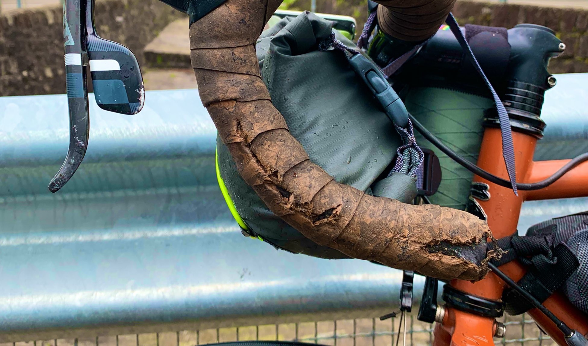
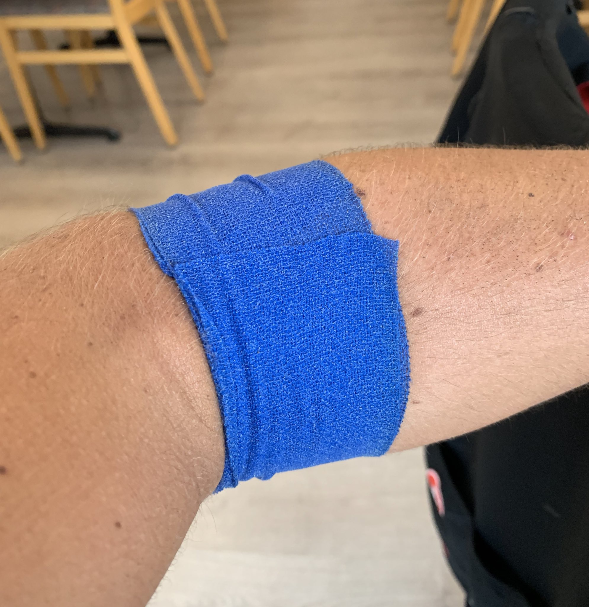
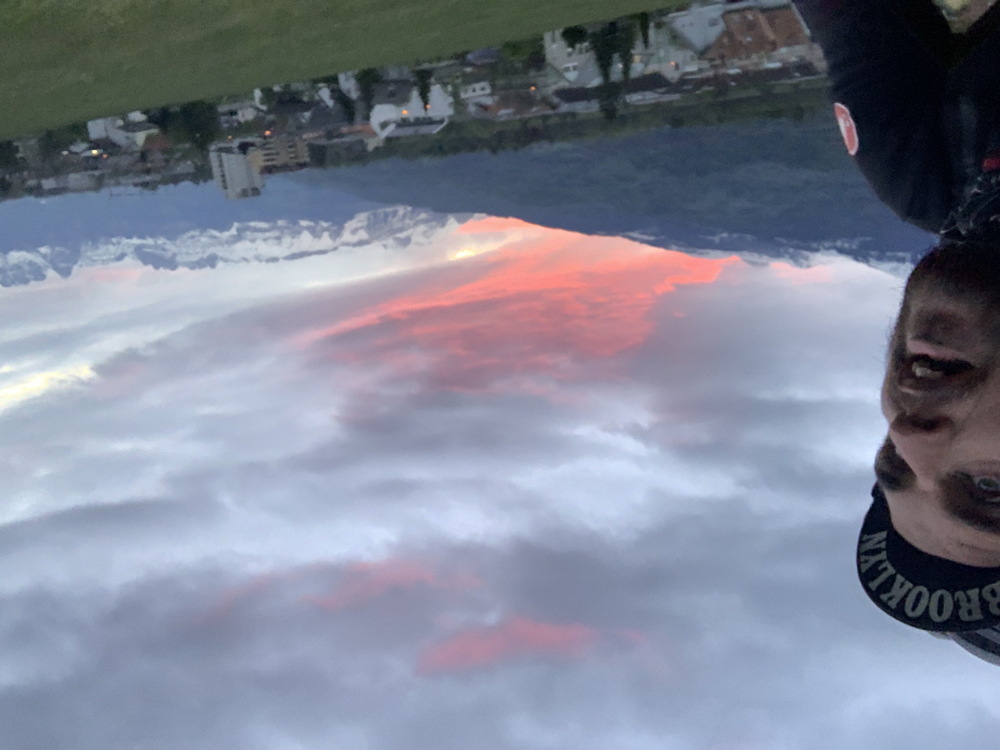

After my [brief stop in Milan](/euro-trip-milan/), I had fresh bearings, fresh
big volume tubeless tyres, and fresh legs, all in perfect timing for a venture
into the Swiss Alps. The Alps lived up to the challenge I was hoping for, with
one crash, a hitchhike, and a whole lot of zipties.

Setting off from Milan the sun was out, the new WTB Exposure 32c tyres were
rolling over cobbles and tram lines like they weren't even there (a very
different story to the 25/28c setup before), and I was taking a bottle of
Sheppy's Somerset Cider along with me to the Alps.

https://www.instagram.com/p/BxS6S7KBiVK/

The ride was mostly uphill and main road, but it was all incredibly pretty, and
I got to my hostel in Lugano without any trouble.

[May 10th: Milan to Lugano](https://www.strava.com/activities/2357044704)

Lugano is a really pretty lake-side town surrounded by mountains. All the
basic-ass hotels were $100 so I decided to get in [a hostel
dorm](https://www.hostelworld.com/hosteldetails.php/Hotel-and-Hostel-Montarina/Lugano/101792?dateFrom=2019-05-10&dateTo=2019-05-11&number_of_guests=1)
for $25. That saved me a good chunk of money, and the morning buffet and their
fancy sister hotel was amazing. I didn't get me much sleep thanks to chatty
young'uns and snoring old dudes, but... that's hostels.

https://www.instagram.com/p/BxT78VGhBwP/

It was Saturday morning and I wanted to get the hardest stuff done over the
weekend, so I'd be close to Zurich on Monday and therefore more likely to be
able to get work done.

My Swiss mate let me know the usual bike route Gothard Pass was closed. Going
for Lukmanier Pass was gonna be a big day, 140km with 2,000m of climbing, but I
had a full stomach, charged bike lights, and figured I could just slog it out,
drink lake water, go a bit ferrell until I hauled my heavy-ass bike to the hotel.
None of that worked out.

With all the [tubeless trouble](/touring-tubeless/) (leaking, burping, etc.) I
pumped my tyres up pretty hard,  and with the rain that was a bad choice. 20km
in I hit some switchbacks and leaned into the turn way too aggressively. The
front wheel lost traction and I led down at 30kph, sliding along the floor 20
meters. I scraping up my arm, leg, arse and bar tape.

As soon as I had dragged my bike out of the road and explained to three
different people in three different languages that I was ok, I wobbled off for a
drink. The lovely French-speaking lady at La Taverna took pity on me, gave me
pizza and wine, and patched me up to the amusement of the locals.

During the 2nd wine I got on Orbitz, looked for the nearest hotel, fuck the
price, I was gonna get directly in bed. No point trying to do 120km / 2,000m
when you're in pain and scared, especially when your panier is missing a
mounting hook.

https://www.instagram.com/p/BxUowSNhoFI/

[May 11th: Crashy McCiderface Strikes Again](https://www.strava.com/activities/2358905507)

## Lukmanier Pass

Pannier ziptied, I set off. Northerly winds made the approach hell. I was
fighting through winds so strong that a few trees had come down on the road. I
chose to take some gravel and single track just to get out of the wind, but that
didn't speed me up. No matter what I did, I could not improve on an average
moving speed of 10kph for the first 3 hours, and there was a fair bit of
stopping...

Seeing as the pain down my left side had stopped me jumping on the bike before
12, it was 4pm before I even started the 40km consistent 7% climb. When I got up
to 1,200m the valley took a turn to the west and mostly got me out of the wind,
but my wad was utterly spunked already.

https://www.instagram.com/p/BxX7ZCPBI_K/

There was another 10km of climbing, 600m more elevation, the temperature was
down to 2C and dropping fast. All of my clothes were on, and I was just munching
on my last Cliff bar when a hero arrived: Swiss German Peter!

He asked if I wanted a ride, then would not take no for an answer. He told me
he'd come that way earlier and it was all snow and ice. As soon as I heard ice
we were both heaving my bike into his SUV.

[May 12th: More than enough of Lukmanier Pass](https://www.strava.com/activities/2362512295)

He drove me the whole way over the pass, back down to 1200m, to my out-of-season
ski-lodge in Disentis. The fella that worked there was trying to tell me places
to go and things to do and I was all "I know its 7pm but I'm getting directly in
bed, good day sir!" 🤣

Probably don't try and cross the northern Alps in May if you are the sort of
person that has a choice in such matters. There is more nonsense to come, but
that'll have to be another post.

## Liechtenstein

Monday morning, and another giant breakfast. Being the only person in the hotel
has a lot of benefits, and this out of season ski lodge laid out a spread like
they needed to clear their pantry.

Monday was a work day and I had 100km to cover, but mostly down hill. Alps
either side I headed east from Disentis to Liechtenstein, continuing my quest
for all the little countries.

I stopped in a few little coffee shops along the way, doing an hour here, and hour
there, and all the scenery was ridiculous. Peak alps around here.

Getting towards Liechtenstein I started getting a bit creative with my routes.
I'd not been using GPS for the last few days because in the Alps because your
turn sheet for the entire morning can be "go along _the_ road, and turn left on
the other road that goes towards the gap in the giant mountains."

Orienteering is fun but getting a bit cocky is a problem, so sure,
"Liechtenstein is along the river bank to the north" might be true but not
all river paths are created equal. Paved canal path turned into gravel.

Gravel turned into mud, mud turned into hiking train up a fucking mountain.

It was a good amount of hikelocross, I had to take the non-ziptied panier off twice,
and I lost a cleat cover, but _never turn back_! 🤦🏻‍♂️

Getting into Liechtenstein was stunning, as I got there just in time to see the sun was setting
over the mountains to the north, and could still see the castles and whatnot.

A nice little 500m climb up to the hotel finished the nonsense day off, until... oh wait all the
restaurants closed at 9:30pm despite saying 10pm and ugh back down the hill to McDonalds. 40 CHF ($40) worth of poison, a vomit inducing 500m climb, and its BEDTIME, CHEERS!

