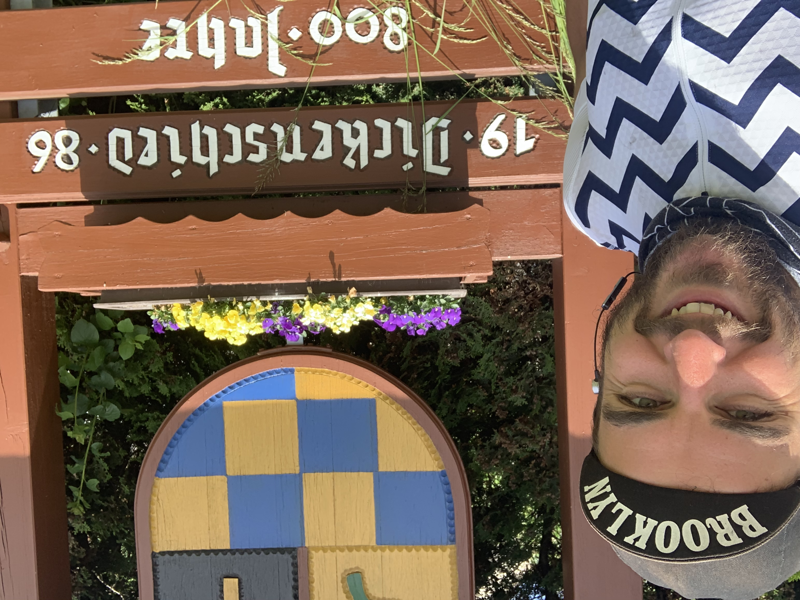

Two months ago I set off from Spain heading north, with no real goals other than
"hit as many countries as you can and do a good job at your day job", with my
shit kit, before my bike fell apart. Since then I've changed my route a few
times, lost loads of stuff, broken many things, and figured it would be fun to
put together some numbers.

- **Distance:** 4,014 km (2,494 mi)
- **Elevation:** 37,755 (23.5 mi)
- **Time:** 174 hours 30 minutes (0.14 dog years)
- **Countries:** 9
- **Crashes:** 1 ([_More_](/euro-trip-switzerland/))
- **Rest Days:** 10
- **Vacation Days:** 2
- **Personal Days:** 1
- **Max Croissants Per Day:** 7
- **Friends Sofas:** 3
- **Friend Visits:** 2
- **Police Warnings:** 2
- **Broken Spokes:** 2
- **Lost Spare Spokes:** 1
- **Not Cycled:** 100km (1 train, aaaand...)
- **Hitchhikes:** 2
- **Flat Tyres:** 7
- **Cries:** 2
- **New Tyres:** 4 ([_More_](/touring-tubeless/))
- **Tyre Plugs:** 2
- **New Chains:** 1
- **New Cleats:** 5
- **Hub Bearing Replacements:** 1
- **Tools Bartered at Bike Shops:** 3
- **Zipties:** 11
- **Bandages:** 3
- **iPhone Screen Protector Replacements:** 3
- **Flea Infestations:** 1
- **Ant Attacks:** 2
- **Ants Consumed:** 3

## Losing Shit

**My WHOLE WALLET:** A few days prior to actually getting started I lost my whole damn wallet, riding the bike back from Madrid to Calpe. It was before I got my bags setup good, and I had a water bottle in the same jersey pocket as some cards. I think they got stuck on moisture and jumped out.

Luckily had a card on Apple Pay. Tried a few hotels until they took it, and bought a train ticket online. Props to Monzo for rushing me that replacement debit card!

**Washbag:** Left my whole wash bag, with my clippers (hence the crazy beard), painkillers, asthma thing, all sorts of stuff. Very much lighter now but when I'm mushing it up a giant hill I really miss my "sports educed asthma fixer".

**Left Shoe:** After a very bad day of bike trouble, I lost my running shoe which was in a side pocket on my pannier. Got some replacement hiking shoes on the cheap (I am not going to go for a jog on a rest day but I'd love a stroll about). Now they live in my backpack which is bungee corded to the rack.

**Apple Macbook Charger:** Checking out of Monaco hotel I pulled the charger out of the wall and knocked over a coffee, rushing as I was waaaaay past checkout. I think I just left it there, but luckily the USB-C Macbooks can charge off of pretty much anything, including my "Fast Charge" (USB-PB) power thing. It's 14w instead of 60w so shit takes a while, but it works.

**My "Fast Charge" power thing:** Lost that too. Got another one, for more money than the original. 👍

**Toothpaste:** Had two furry feeling days before I found more. A lot of hotels have tiiiiiny little two-squirt packs so now one of those lives in my frame bag as a backup.

**Skewer Nut:** I changed my cassette and lost the skewer nut off the back. I traded for the front nut and [ziptied the bastard on](/euro-trip-losing-an-axel-nut/). It's the most scared I've been in years.

## Summary

It's going great folks! Currently in East Europe in Czech, and I'm about to go on a rampage ticking off as many countries as possible. Camping equipment is gonna meet me in Prague , with a tarp and bivvy from Alp Kit. Might talk about that next.
