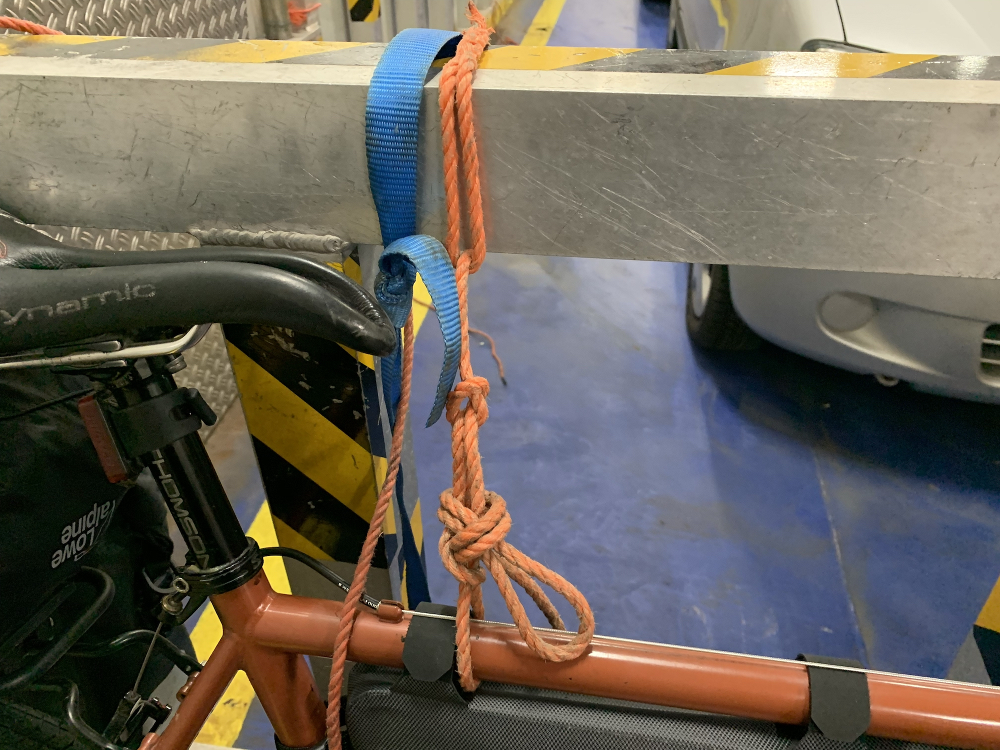
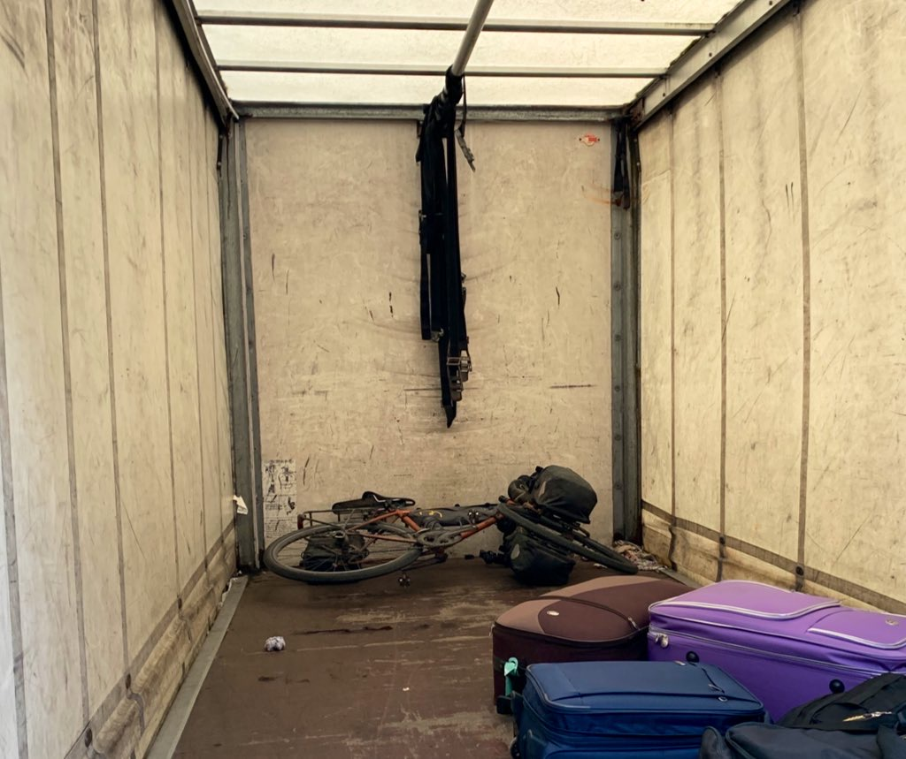
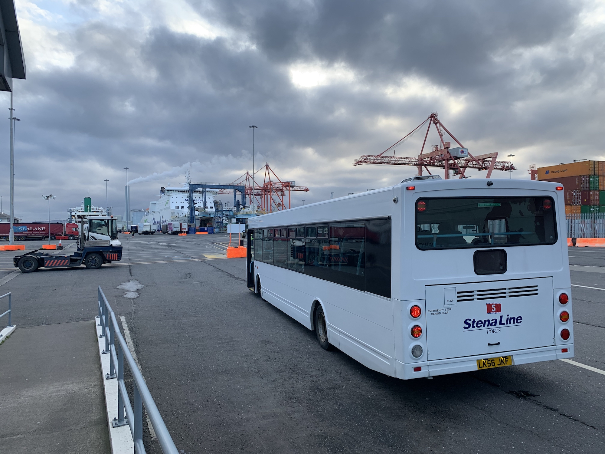
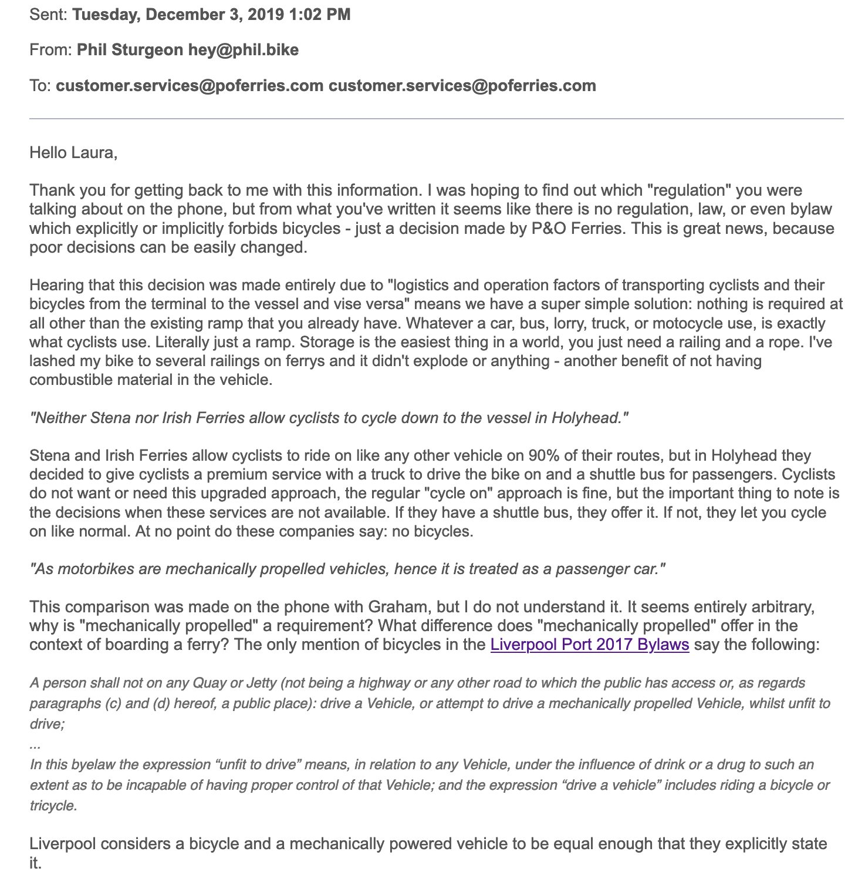
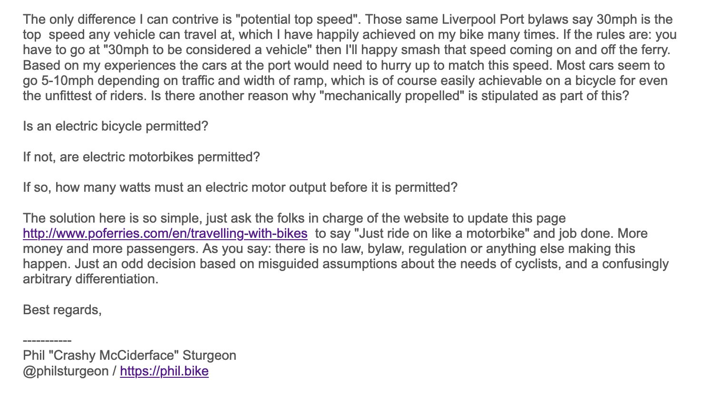
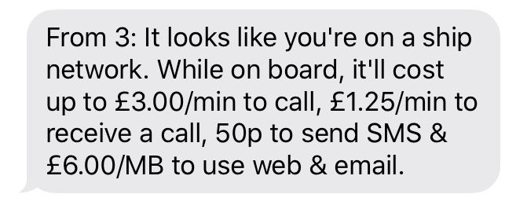

Ferries have been a crucial part of my European touring adventures this year, and it wasn't just me boat-packing around. Every ferry I got to was fully of bike packers, we'd share stories, and trade tubes for zip-ties. The ease of cycling to a port, riding up the ramp, and going for a pint and a nap whilst the boat crosses you over to the next country is amazing.

Flying is a nightmare without a hardshell case. Sure, I managed to scrape by with a single broken spoke [using a "Not a Bikebag"](/colombia-not-a-bike-bag/) one time, but carrying any sort of bike bag is either impossible or a giant pain in the ass. Also [fuck flying](https://www.flightfreeusa.org/). I want to ride my bike as much as possible, and when there is water in the way I want a boat.

Here are some ferries I took this year:

- Tenerife, Canary Islands to Huelva, Spain ([Fred Olsen](https://www.fredolsen.es/))
- Durres, Albania to Bari, Italy ([Adria](https://www.adriaferries.com/))
- Nynäshamn, Sweden to Gdansk, Poland ([Polferries](https://polferries.pl/))
- Hook of Holland to Harwich, England ([Stena Line](https://www.stenaline.co.uk/))
- Pembroke, Wales to Rosslare, Ireland ([Irish Ferries](https://www.irishferries.com/))
- Dublin, Ireland to Holyhead, Wales ([Stena Line](https://www.stenaline.co.uk/))

Right now I'm sat on the Portsmouth, UK to Le Havre, France, with [Britannia Ferries](https://www.brittanyferries.com).

All of these ferries have been incredibly simple. Two of them I turned up late and 50-100% drunk, and another time I rode on with no brakes after a canti-config-in-the-queue went wrong. Mainly I just crack a few jokes with the person in the booth who has more questions about bike-life than about border related matters.

## Ride-On

The most common approach is the ride on. You cycle along the car passenger lanes, get to a booth, give them your passport and maybe also mention a booking reference number, then you go sit in the queue with the cars. Most places suggest you skip the queue and go right to the front (oh do the drivers hate that). 

There was one slight variation at the Rosslare port. They directed me to the foot-passenger terminal to get a printed ticket, then they sent me back to the car booth entrance as normal. I hung out in the "Motorist Lounge" for a while seeing as it was raining, which was handy. This motorist lounge was fairly unique, they generally don't have those, so I try to time my entrance close to boarding time - hence the previous close calls.

Anyhow, most of the time you just get pointed at a certain lane, then at some point some random person waves their arms around and shouts something at you, which is whatever language they speak and doesn't matter too much. Just look for signs to go. 

Once you're on, if you're lucky maybe they've got a rack.

No rack? No problem. They quite often say "Just leave that here and one of the crew will secure it.", which has always worked out fine. They might point you at a pole and some rope, and you just do your best boy/girl-scout impression. 

Or just granny knot that shit and go to the bar. Simple as.

## Luggage Bike + Shuttle Boarding

[Stena Line](https://www.stenaline.com/) are generally ride-on, but they have [a few variations in Ireland alone](https://www.stenaline.ie/faqs/at-the-port/how-do-i-get-on-to-the-ferry-with-my-bicycle) and I can only imagine there are a few other surprises in other countries. Many of them are "Passengers with bicycles should check-in as a vehicle then cycle on and off the ship with other vehicle traffic", but I experienced some medium level nonsense on their Dublin to Holyhead route.

Basically the bike goes on a luggage truck, and you go on a bus. 

This concept is so fucking weird to me, especially because the truck and bus are just there to drive you over 200 meters of concrete. Once on the ship they _stay on it to the other side_, increasing the weight, fuel expenditure, and CO2 emissions of the whole trip for no reason. 

It's _right there_. We could walk. Anyone needing assistance could have one of those airport things grab em, or a bus could drop the walkers off and fuck off after. This is all pointless extravagance.

## Direct Ferries Says "No Bicycles"

A website you will bump into trying to book a ferry is [DirectFerries](https://directferries.com). This website is ok. They will put you on a mailing list and bug you for ages and unsubscribe seems to not work until you do it at least three times, but they can help you find ferries you didn't know about, and even highlight alternative routes.

Sometimes they will tell you bicycles are not allowed on the route, when they absolutely are. It's always worth trying the ferry company directly on their website if Direct Ferries say no bikes, because the company might actually take bikes.

## Actually No Bicycles

Some companies legit do not take bikes. I ran into this with [P&O Ferries](http://www.poferries.com/), and their reasoning is mind boggling.

Their website says [you can take a bicycle](http://www.poferries.com/en/travelling-with-bikes) if you slap it on a car, but a regular bicycle + human without a car is completely off limits. They consider a bicycle to be a foot passenger, and they do not take foot passengers...

Wut. 

I was confused, so I gave them a call to figure it out. It was a weird call.

> Support: "A bicycle is a foot passenger, we cant accept foot passengers. We have no way of getting them onboard."
>
> Me: "Your website says you allow motorbikes. Do they have to sit on the bike the whole trip?"
> 
> Support: "Motorbikes drive on board on the ramp, then they leave the motorbike and go to the passenger deck."
>
> Me: "Right yes, that is what I am asking to do with my bike. What is the difference?"
> 
> Support: "A motorcycle is powered."
>
> Me: "A bicycle is also powered!"
> 
> Support: "It's not mechanically propelled though."
> 
> Me: "What is the difference? What if I buy a motorbike ticket, drive up the ramp, and make BRUMMMM noises if it helps?"
>
> Support: "That would not be allowed."

This is the dumbest thing. I got a bit annoyed.

https://twitter.com/philsturgeon/status/1200049367920627713

I spoke to customer support who talked to me about the reason the rules existed. They mentioned a "regulation" on the phone, but when they wrote me an email it turns out there was no regulations. I wrote them back.

🤣

Anyway, be aware that not all ferries will take a bike, and they might not listen to any sort of voice of reason.

I took another ferry that went to the west coast of Wales instead of Liverpool. It added 100 miles to my trip, and set me back two days, but whatever I could have jumped on a train if there was a particular schedule. 

## Onboard

Some general ferry rules to watch out for. 

### Airplane Mode

**If you have roaming enabled on on your phone you could get a huge bill without even looking at your phone.** Turn roaming off before the boat has left port, basically when you can't see land anymore it's time to stop scrolling through Instagram. 

Why? Instead of your usual network provider, your phone will switch to "Cruise" or "Ferry" or some sort of ship network. 

Some companies like Britania are great, and offer free WiFi, but it might only work in certain areas like the bar or cafe. Others offer free wifi for 20 minutes at a time, but that low speed crap never works. You can throw down £10-20 for a "whole trip" pass which was good enough to video chat on Zoom with a bunch of people, but unless you've got work to it's usually not worth the money or hassle. 

### Take Both Types of Cash

The Albania to Italy overnight ferry would have been great if I had any money. I had plenty of Lek on my but they wanted Euros, and I hadn't picked any up before boarding. Normally there is an ATM on board, or restaurants/cafes take card, but their card machine was down and the ATM was broken. Meh I can go hungry so long as there is water... "Do not Drink" 🙇‍♂️

An overnight ferry with no water is not going to be fun, but I managed to sneak back onto the car deck and grab my water bottles, along with half a bag of peanuts for good measure. I made it through, but vowed to never repeat that mistake again.

## Getting Off

If you rode your bike on, you'll just ride your bike off. Usually before all the cars so you don't die from the fumes.

If they trucked it on, they'll probably truck it off, and it'll be sat about waiting to be reunited with you. 

