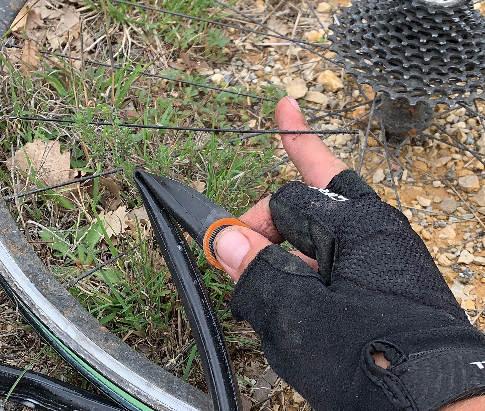
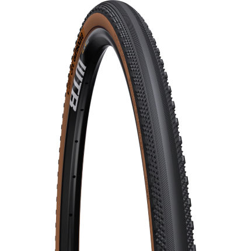

Things went to absolute shit between Montpelier and Nice, and got a bit silly getting over the Alps to Italy. Constant headwinds and cold rain aside, I was getting flats like nothing else.

The first flat was in the first mile and I think again I let the back wheel get a bit low, it unseated and I gave up, put a tube in.

The 2nd came with a broken spoke, so I taped that up and patched the original tube.

A _third_ flat came shortly after, I think the rain meant the glue wasn't drying properly and the patch came off, so I just tied the tube to get rolling.

I'd been checking the tyre each time for anything sharp, but was clearly missing something because eventually I got a fourth flat. At that point I roared and shouted at trees. I was 21km from the hotel and in the middle of nowhere. I walked a few miles in the rain, and eventually hitchhiked another 10km with a lovely man in a van (who also rode bikes). 

He was offering to take me to the door of my hotel, but I was too embarressed. He let me off in a town 8km from my hotel, and I found a nice dry, warm pub to repatching my tubes with a beer. Eventually I found the hole in the tyre that was chewing through my tubes, so I shoved a patch on the inside of the tyre just to stop it from causing problems, and got back to riding.

Got to the hotel, comfort ate my bodyweight in cheeseburgers and wine, and rolled to a town with a Decathlon store (kinda a French Halfords) and got more patches, more glue, more tubes, the whole damn thing. Rolled another 10km to a train, and took that to Nice. Fuck bikes.

The guy in bike shop in Nice was lovely and replaced the broken spoke, but trying to get tubeless sorted out we hit a language barrier or something.

> **Me:** Can you set this up tubeless please?
>
> **French Man:** I dont have any tubeless tyres.
>
> **Me:** This is a tubeless tyre.
>
> **French Man:** But how do I know it is tubeless.
>
> **Me:** It was already installed tubeless.
>
> **French Man:** But I don't have any tubeless tyres.
>
> _\*Repeat x5\*_
>
> **Me:** _This. This is tubeless. Just... can I borrow your air compressor?!_
>
> **French Man:** Oh, well I don't have time today.

Well no not after that. 🤦🏻‍♂️

Took it to another bike shop and they noticed the bead was torn, so it would be fine with a tube but would not run as tubeless anymore. Time for another new rear tyre. 🔥💵🔥

They had one tubeless ready 28C tyre. It was pretty slick, buuuut whatever close enough.

Rested and recuperated, 24 hours in Monaco, then off to the mountains!

https://www.instagram.com/p/BwxS7-SF8rm/

The crossing from France to Italy via Colle di Tende is another article, but let me just say it ain't smooth road. I am incredibly glad to have had both wheels set up tubeless, or I dunno if I would have got over it intact. Some of it is fine, just dust and gravel.

Others bits were mad scrabbles of shale and sharp rocks.

I got all the way to the top, pushed through some snow, and started descending before noticing both wheels were super squishy. The bike went on its side immediately to avoid unseating either wheel again, and I pumped the crap out of both of them. The front seemed fine, and the back pissed out a bunch of sealant from the sides suggesting it had indeed unseated.

https://www.instagram.com/p/BxDFO0Wl8eO/

I threw some more sealant in, popped the valve core back in and a CO2 reseated it nicely, which was lucky. Should have done it with the core out, but I had a spare anyway. This got me the whole way down to a Italian chocolate factory on the valley floor. Nom nom nom.

The rear tyre spent the next few hours with a slow leak, and I kept pumping it back up, hoping it would sort itself out sometime. It did not, and I discovered something was jammed in the sidewall and stopping it from sealing. Pliers could not get it out, and side of bacon didn't work either, so fuck it, tube again.

The problem with the 25/28 road tyre setup is that I'm throwing myself at whatever shit Strava is sending me down with very minimal planning. I'm fine with that, but the tyres are not. Tubeless is helping me get way fewer flats than I would otherwise, but they're not invincible, and if I'm gonna be hitting a mixture of tarmac, dirt and gravel,there are tyres designed for that.

Now I'm in Milan for a few days, and I'm getting this shit sorted out properly before I move anywhere. Wiggle is shipping me a pair of [WTB Exposure's](https://www.wiggle.co.uk/wtb-exposure-tcs-road-tyre-tan-sidewall/) at a chunkier 32C, and I'm hoping this will last a whole lot better. More multi-flat-then-hitchhike nonsense would not be ideal.
