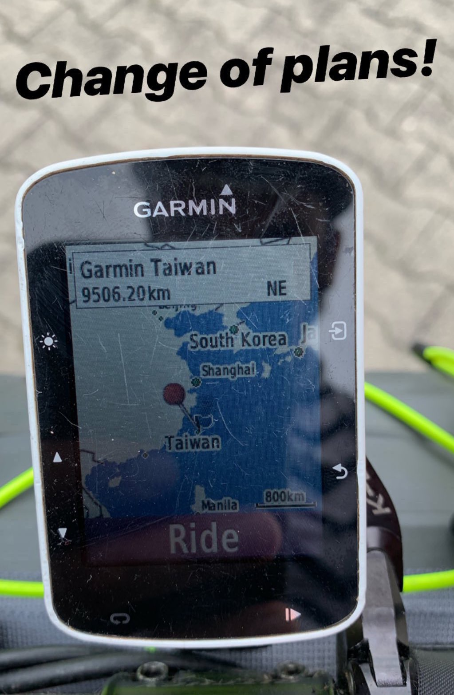

I took the Garmin Edge 530 for a little jaunt through Ireland, England, north Spain, then down the west coast of Portugal. It was my main navigation from October to February, and I took it through cities, mountains, dual carriage ways, dirt tracks, and hiking trails. 

We spent every day together for several months, and now I'd like to share what I think of it.

<iframe width="560" height="315" src="https://www.youtube.com/embed/g_8dgtguK7Q" frameborder="0" allowfullscreen></iframe>

Also, for some reason, the Edge kept trying to direct me to Taiwan.

I'd keep on using this if I wasn't traveling through unknown territory all the time. It's not great for full-time touring. There's just so many times you'll be stuck not having a clue where to go, whether it's down to bluetooth failing you, Strava/Komoot apps not syncing, turn guidance putting you under a bus after it's fatally confused by a roundabout, or being so busy showing off ClimbPro you miss a turn on a climb.

_If you're mostly riding near home/racing/training, this is great for you. I'll even sell you mine 50% off asking price - which only covers repairs! If you want it, it'll cost you £110, or preferably a equal-or-greater donation to my [Ecologi forest](https://ecologi.com/philsturgeon)._
