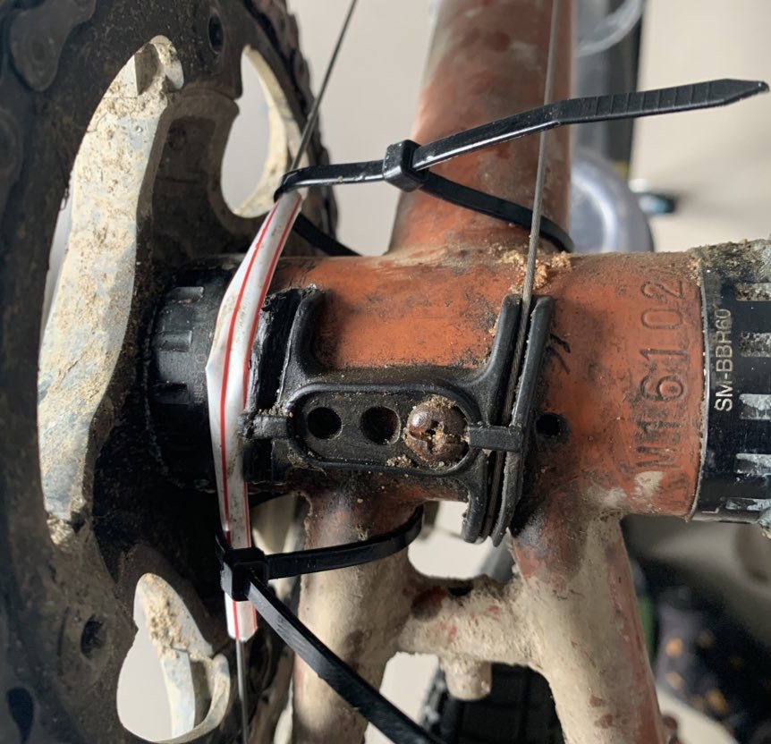
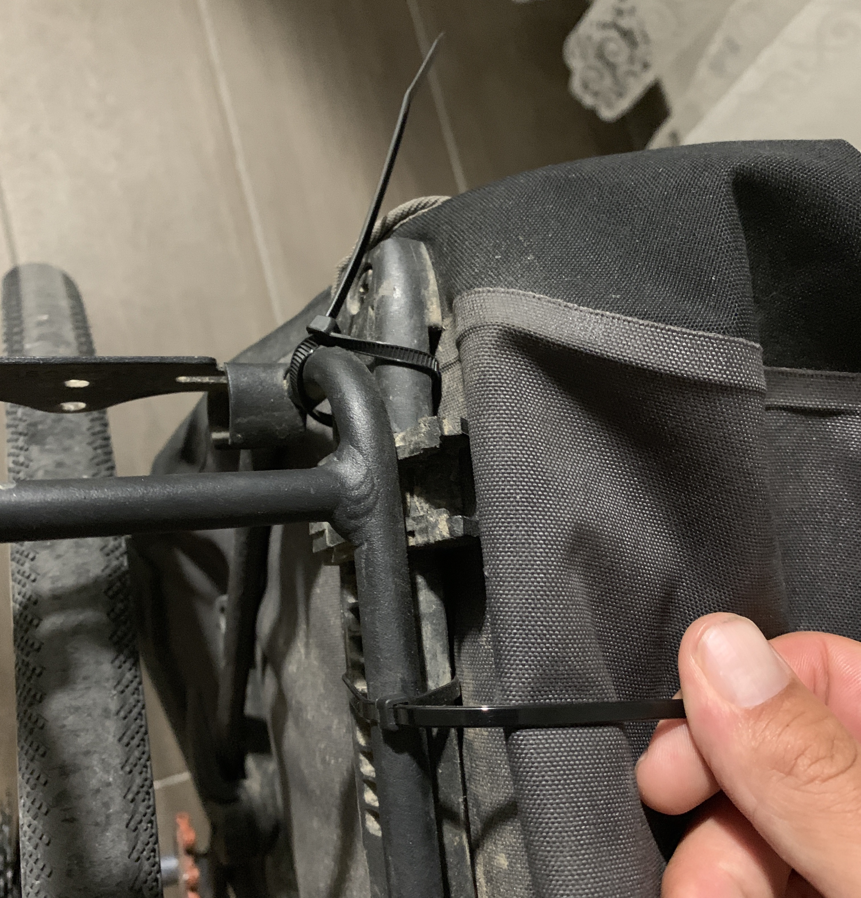
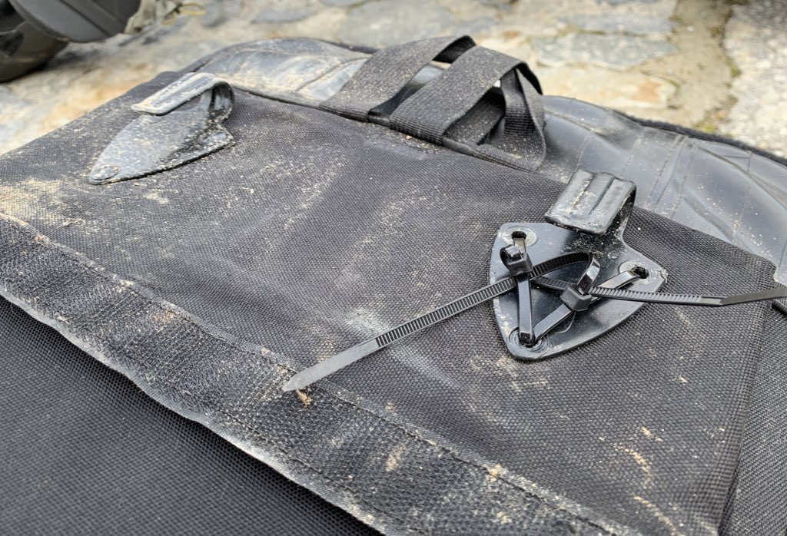
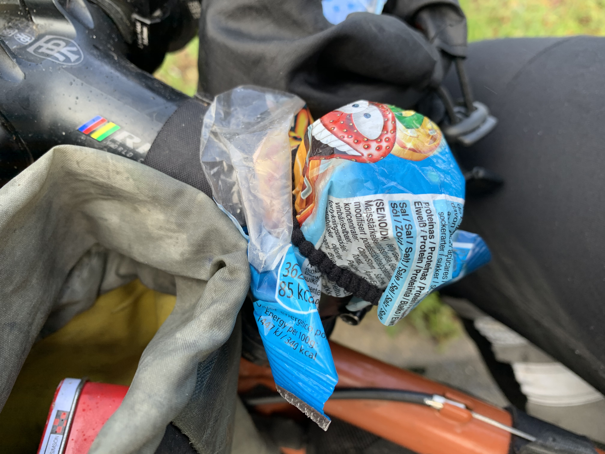
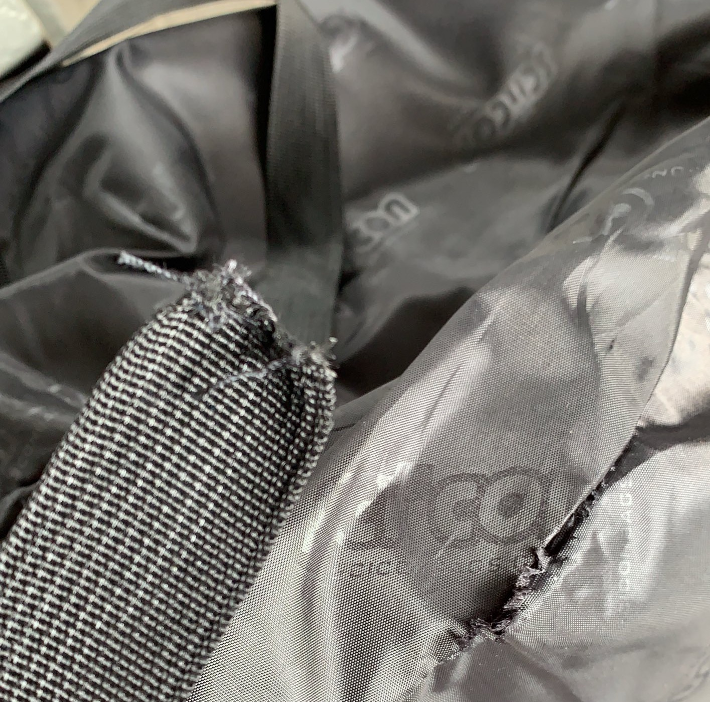
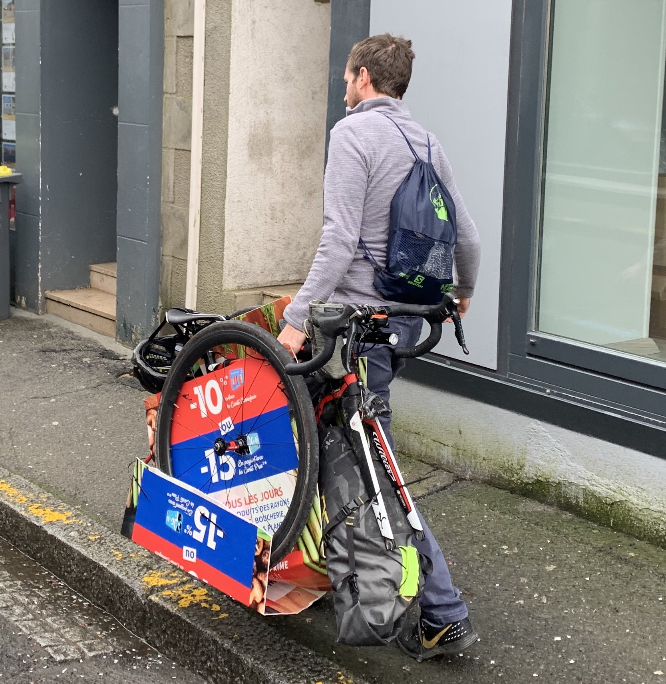
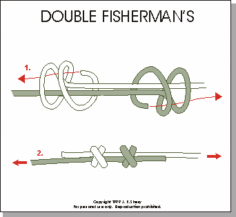
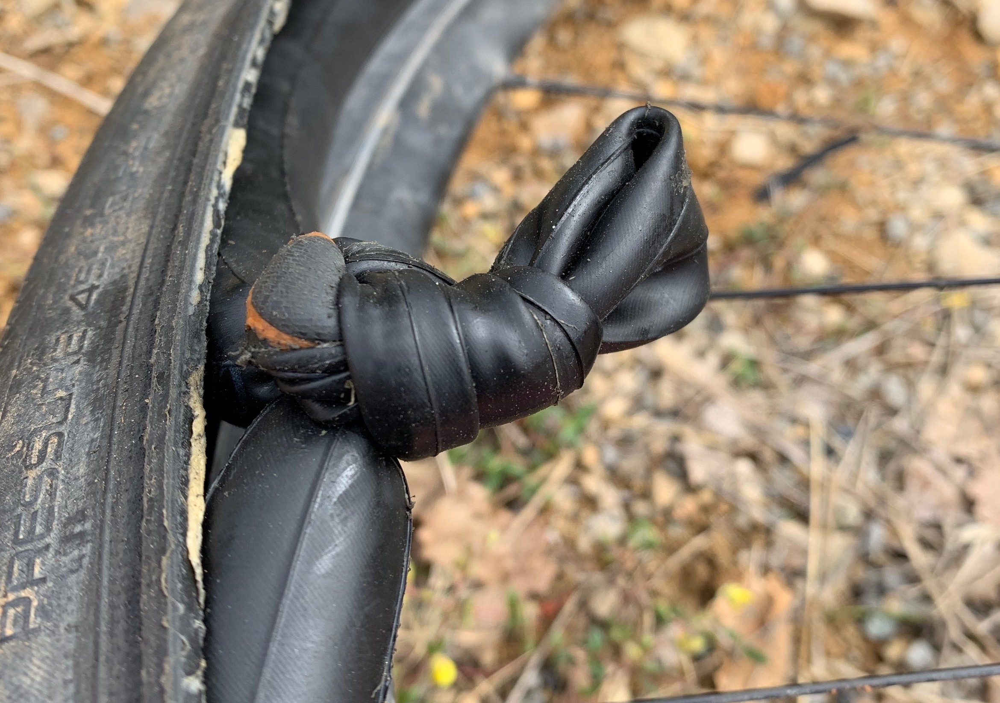
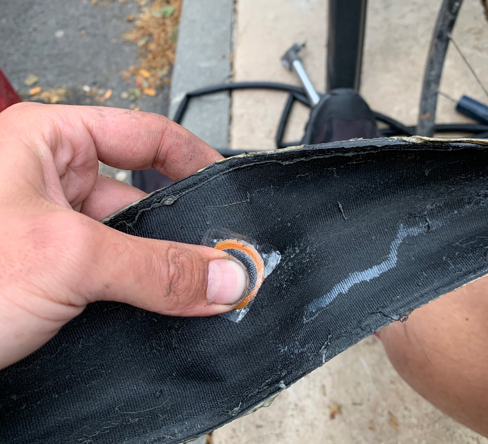
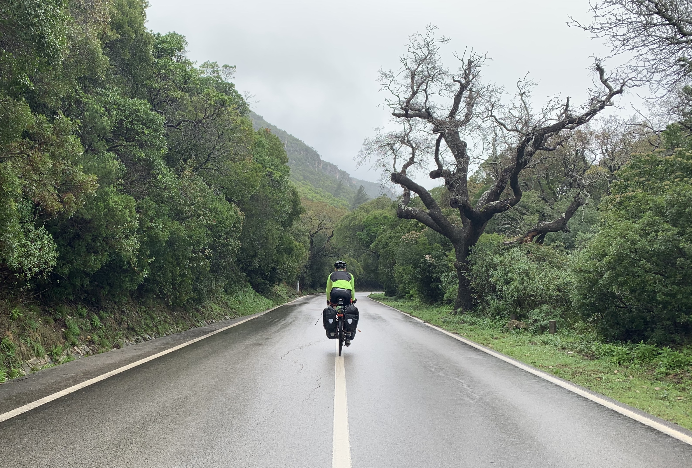

Are you a couple of miles (or days) from the nearest bike shop? If you're like me, and enjoy creative problem solving, then this is a fun opportunity to think outside the box! Here's some stunts I had to pull over the last year of bike touring/packing around Europe.

## Smashed Cable Guide

I lost the ability to shift in the hills near [Mertola, Portugal](https://www.google.com/maps/place/M%C3%A9rtola,+Portugal/@37.6415148,-7.6606665,3a,75y,90t/data=!3m8!1e2!3m6!1sAF1QipPMyWj1-pIn9CRikrSqbBpKNcmHnLZruyUOy0GK!2e10!3e12!6shttps:%2F%2Flh5.googleusercontent.com%2Fp%2FAF1QipPMyWj1-pIn9CRikrSqbBpKNcmHnLZruyUOy0GK%3Dw152-h86-k-no!7i2560!8i1440!4m8!1m2!2m1!1sportugal+ardene!3m4!1s0xd107dbb4664ccab:0x24c06972823ba698!8m2!3d37.6414903!4d-7.6606464?hl=en). It wasn't the shifter, the cable itself was refusing to move. There were only farms and hills for miles and miles, so I messed with the limit screws to pick the gear I was stuck in, but eventually my bike mechanic girlfriend gave me a hack-fix over the phone.

Seeing as the cable was struggling to move in the channel, we made a new channel with a straw! I took the shifter cable out entirely, ran it through the straw, then zip-tied it in place. This hack worked for about a month, and I even re-did it after a bike shop undid it without replacing the cable guide.

## Missing Axle Nut

Long story short, [I lost a quick-release axle nut at a petrol station](https://phil.bike/2019/euro-trip-losing-an-axel-nut/) and had to figure out how to get 8 miles to the nearest bike shop with no transportation options and four panniers.

https://www.instagram.com/p/BxmhfTBBEbO/

Tape and zip ties prevented the skewer from moving side to side. As for keeping the right-hand side in place? Gravity! Just don't lean too far.

## Missing Rack Bolt

Lost a screw? How about a GoPro? Those thumb screws will fit! 

https://www.instagram.com/p/Bvu2_aUFf9i/

Bottle cage bolts generally work too, as will a zip tie in a pinch.

## Zip Pannier 

Ortlieb makes excellent panniers, but they're not invincible. I crashed down a slippery Alp, cockily throwing too much weight into the turn, and the plastic hook snapped off. No problem, I've got zip ties!

Another time, I was trialing out a [Green Guru "High Roller" Backpack Pannier](https://www.greengurugear.com/products/high-roller-36l-backpack-pannier), which I may have overfilled. The hook ripped out on some bumpy terrain, but again, zip ties saved the day!

## USB-Candy

My [dynamo-powered USB-C charger](https://cinq.de/en/power-supplies/433/plug5-plus) is great until it gets wet, then it's broken forever. To protect it I've been using a random Spanish sweet wrapper with a hair tie around it. 

Not ideal, but... eh. I have [reviewed the Cinq Plug 5 Plus](https://phil.bike/2020/cinq-plug-5-plus-review/) if you're interested. 

## Bike Bag Hacks

Trains and bikes go together perfectly in many countries, but some train companies are still idiots about it and demand bikes be placed in a bag. I carried the lightest bike bag possible, the [SCICON Foldable Pocket Bag](https://sciconsports.com/ww_en/foldable-pocket-bicycle-transportation-bag). It lasted one train connection, and fell apart on the platform.

Crap design, but a ratchet strap under the down tube and wrapped around the handlebars sorted it out.

[Hannes, "The Belgian Bullet"](https://www.instagram.com/hannesvdvreken/), came to meet me in the south of France, then we smashed north through apocalyptic plagues and floods. Afterwards, he jumped on a train back to Belgium without a bike bag. Trains demanded bikes be foldable or in a bag, but his "bike bag" was some random cardboard he found at a supermarket and some zip ties with his frame bag providing protection for the fork. 

They let him on both ways! 🙌

## Double Fisherman

Lace up shoes are far easier to fix than a snapped plastic buckle or some other nonsense. Spare lace on your human shoes? Random bit of string? If you're any good at knots, a double-fisherman is ideal.

https://www.instagram.com/p/BxkgrbiBhSI/

In case you've forgotten your Scout training...

It's also known as an "adjustable necklace knot" if you're familiar with that.

## Tie A Knot In The Tube

Speaking of knots, shoving a knot in your inner tube can get you going when patches are not an option. My first ride through France, from Spain to Monaco, was [all flats all the time](https://phil.bike/2019/french-flats/). I got about 5 in a single day at one point and it was raining too much to patch. 

Thanks to [GCN for this idea](https://www.youtube.com/watch?v=dnAv5_r-qNQ). This won't work if the puncture is too close to the valve, and the ride can be a little bumpy, but this has gotten me out of more than a few jams. 

## Shoving Stuff in the Tyre

Small holes in the tyre aren't going to cause trouble but once it gets to more than 2mm it can become a mouth that likes to chomp through your inner tubes. To solve that you can put a patch on the inside of the tube.

When there's no patches to spare, the old "shove a dollar in it!" advice works well. US Dollar notes are cotton so they handle the friction pretty well, but if you're in the UK or Europe you might not want to shove a fiver in there. 

Anything can help. A leaflet, tag from your clothing, take-out menu, thin cardboard, even some thick leaves, can all provide something for the tyre to chomp on that's not the inner tube. I had some paper in there for about a month before I got inside that tyre to find confetti, but it kept my inner tube healthy!

## Grass Inner Tube

When sealant, patches, knots, etc. has all let you down, shove some grass in there.

https://www.instagram.com/p/B0bf1TSlf_R/

Thanks again GCN! Luckily I didn't have to go far. A lovely Italian wedding venue owner came out to collect me in a van. It was the closest thing around for about 30 miles in any direction, so... phew!

## Dental Floss Stitches

When the tube is behaving but the tyre itself is causing trouble, it's always handy to have some dental floss. This stuff was silk which is even stronger than the usual plastic crap.

I rode this for only 8km until I happened across a bike shop in a mountain village, which was wild. I could have gone for 100km and not found anything up there. I wasn't the only one in Morocco sowing his tyre up, one of the Atlas Mountain Racers mentioned having to do the same thing in the _"[Into the Rift](https://www.youtube.com/watch?v=e5k5ayE9iqU)"_ documentary. 

## Cleat Bottle Opener

Anything is a bottle opener if you try hard enough.

https://www.instagram.com/p/CB7rrmoFsV4/

## Selfie Tripod

I was riding solo most of the year, and all I had to show for it was lots of landscape shots and blurry selfies. Then I saw this photo.

https://www.instagram.com/p/ByxETQKo30p/

Etienne was touring around the Alps by himself (on a fixie... 🤯) so how was he getting these amazing photos? I asked if he had a secret mate, but nope, just a "selfie tripod". They've got bluetooth remotes and are not particularly expensive. 

Now I can finally live that Instagram influencer lifestyle! 

## Quick-link Removal And Chain Whip

I traded away all my heavy tools for more useful things in various bike shops, and when I finally did need to remove a quick link and get a casette off I was almost outta luck, until I got a bit creative.

<iframe width="1120" height="630" src="https://www.youtube.com/embed/jurxCai1UZk" frameborder="0" allow="accelerometer; autoplay; encrypted-media; gyroscope; picture-in-picture" allowfullscreen></iframe>

Shoe laces for quick links is well known, but the cassette removal took a bit of guesswork to figure out.

## Got More?

Let me know if you've got any ridiculous bike hacks: [@philsturgeon on Instagram](http://instagram.com/philsturgeon). 

I'd love to pool loads of ridiculous ideas so we can keep moving when we're out in the nothing.

_Support reforestation and keep these articles coming by [donating to my reforestation campaign on Ecologi](https://ecologi.com/philsturgeon)._
