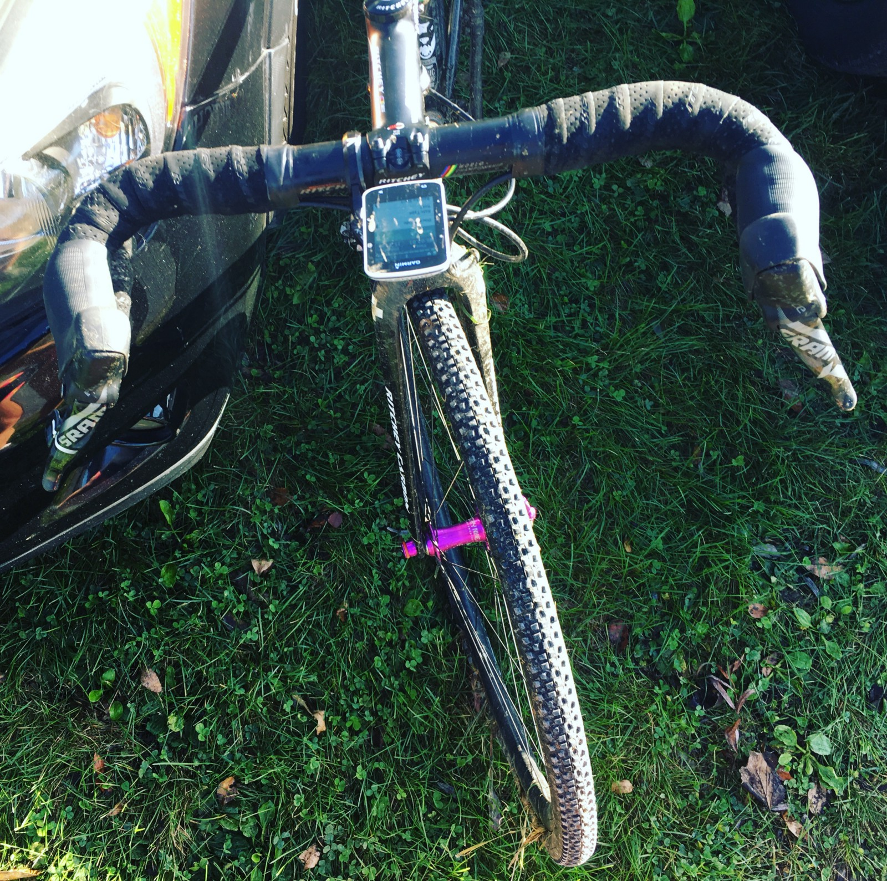

Kutztown CX is a grassy, turny crit. There’s nothing particularly technical other than a 6-ft pump track, and a set of barriers after a tight turn.

Today’s Cat 4/5 race was a bit of a mess. Thirty seconds into the race, a poorly marked crossing confused some folks who thought it was a split in the course.

Folks backed up, and the whole field came to a halt, other than two riders and myself who just luckily were in the right spot at the right time.

In third place, I jumped on the bigger dudes wheel, and drafted him for most of the first lap. In the second lap my team-mates bridge the substantial gap, flying past me and making a nice KruisCX convey in positions 3, 4 and 5.

That luck all fell apart rather quickly. Trying to keep pace with these Cat 4 dudes who’ve got more legs and more experience was hard, so I was flagging and dropped back to 6 by the second lap.

On the second lap I was getting a little wobbly, with my tubeless tyres feeling unstable around the turns. My track pump was confident I was at ~30psi, but based on advice from friends I’m gonna get myself a more accurate handheld pressure gauge to check what’s really in there.

The bike slid out from under me twice, leading to some fairly uninteresting tumbles. The real killer was an endo in the pump track.

Everything was tightened to spec, so even if I’d noticed this when I jumped back on, I’d have struggled to straighten it.

I was a little distracted getting back on due to failing to remount on the crest of the ramp. I gave up and tried running to flat ground, kicking some dude off his bike in the process.
> Don’t worry dude, it’s a race! Stop apologising.

Can’t stop being British.

Riding that last lap with bars at 45 degrees was hilarious. Falling back to 11th was sad, but I fended off an attacker on the last lap, and had a lot of fun.

https://www.instagram.com/p/BahgsqvDgM_/

The dude I kicked finished 10th! One teammate had a rough fall and DNF’ed, and another snagged 5th!

[Strava](https://www.strava.com/activities/1240348672)

I probably won’t be doing this one again, as it’s a long way for a race that’s not my jam. All flat, twisty, not much going on in the way of features, etc. It’s lovely if you’re a bit more local to the area.

Waffle House to fix the hunger.

Red Lantern to fix the bike.

Time for bed. Marty Cross tomorrow!
