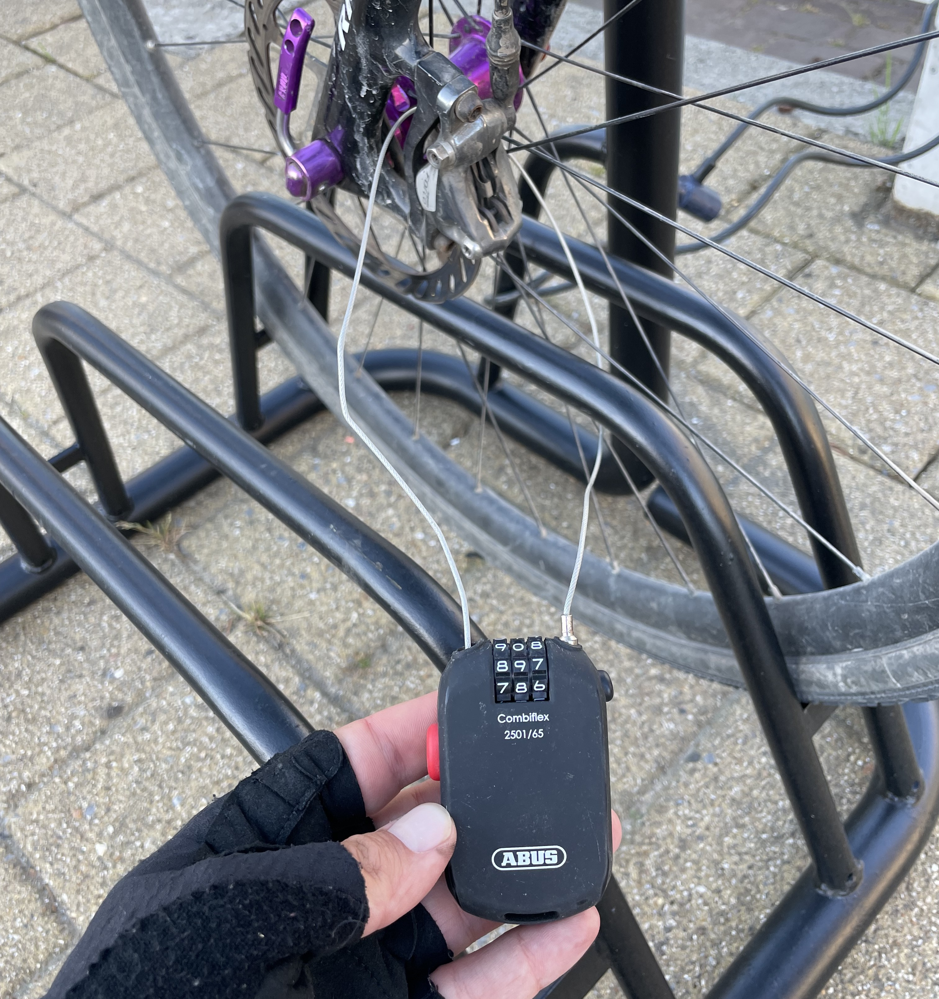

As a bike nomad who's been randomly cycling around for years, people wonder how I secure my bike when im on tour. Do I carry a giant chain, or go with a heavy Kryptonite? Neither!

I carry the smallest, weakest, most fallable lock out there: an Abus chain combo lock. 

This seems ridiculous, but as with everything in life its about use cases.

Firstly, you can lose a key real easy when you're tired, always go with a combo lock.

Surely this is too small and pathetic though?

Depends where you're riding. Major cities have hardened bike thieves who wander the streets with bolt cutters and angle grinders, so if I was spending a lot of time in major cities this would go very wrong very quickly, but I'm not. Usually I'm looking for places to camp, or wildcamp, and nobody is going to pester a stinky biker bivvying in the woods because they're more worried about you murdering them. 

When I am in a major cities it's after a long slog through the nothing, so I'll probably grab a hotel and shove the bike in there. If a hotel won't let me take a bike I just go somewhere else, and its incredibly rare that happens. They might say "it won't fit in the lift" and you say "challenge accepted!" They might say "It's not big enough" and you say "don't worry Surly can take the bed." Generally there's always a basement, meeting room, hallway, somewhere fairly safe, so the need for a big chain that'll keep it safe outside just doesn't exist.

Usually I find myself riding through remote areas, smaller villages, rural regions, woodland, generally the fuck out of the way of major cities. Where there's fewer people, there is generally less crime. There might be some chancers, and a tiny lock like this will stop an opportunist grabbing the bike and running off with it when you're popping in a shop or a cafe, then if its a restaurant I've always just sat outside or sit by a window. Sometimes on longer rides I'm so tired from being on the bike I just wander off and hope it get stolen so I have an excuse to quit, but nobody has ever called my bluff.

Nobody has ever stolen anything from me in four years of almost constant touring, riding through over 35 countries, from Spain to Albania, Norway or Morocco. I did have one rechargable rear bike light go missing which was worth about €5, but to be honest that might have just fallen off.

A lot of this comes down to the bike you're riding. I ride a Surly Crosscheck that looks incredibly old and uninteresting to the average person. The "mule mug" brown steel frame, lugged fork, etc. is not going to make people look close enough to see the dynamo hubs and fancy SRAM Force components. A bike that looks fancy might not cost all that much and get nicked, but a badass bike that looks meh will be ignored by everyone. 

Do whatever you like. Don't @ me if your bike gets stolen, but don't live in fear of it being nicked all the time. It does happen, but don't leave it unlocked, keep your valuables in one easy to remove bag that's never left on the bike, and you will probably be alright without needing to lug 7 pounds of steel around for months.
