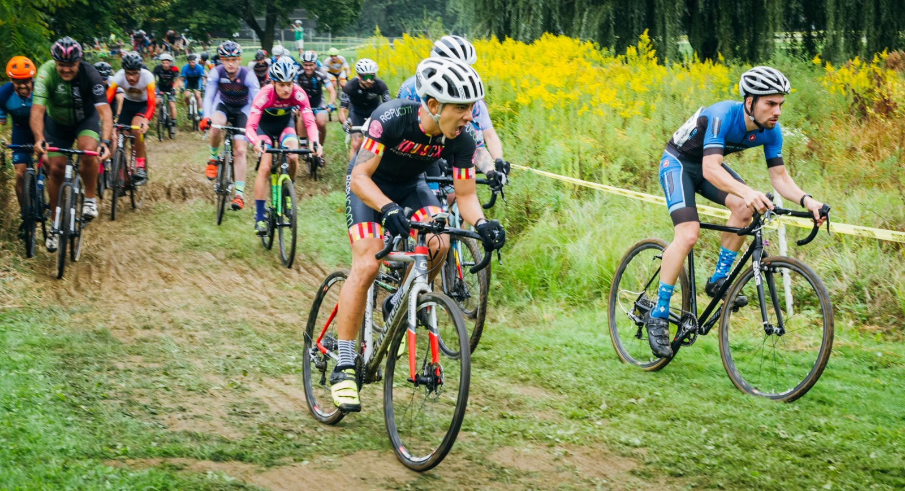
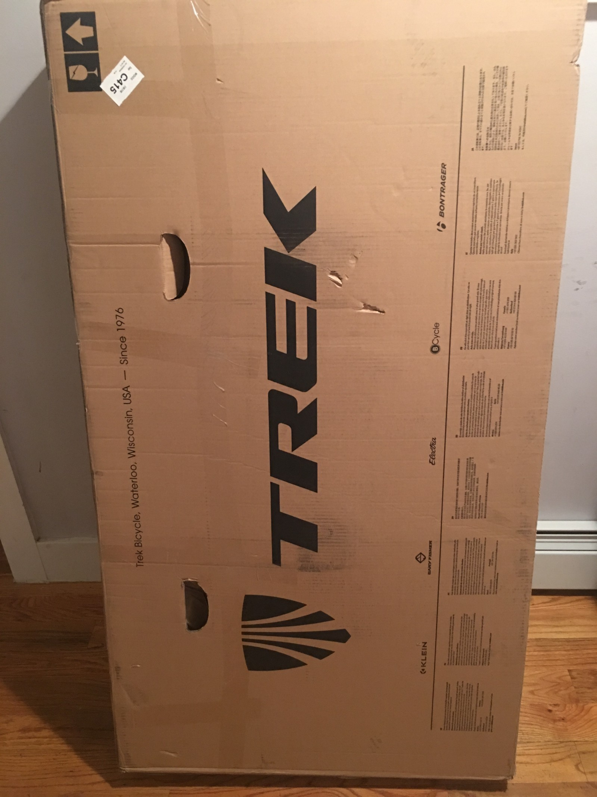

It’s cross season, and all my bones are working! Last season I was in a boot, but this time around I’m all good to go.With very little cross practice, and a bike barely back in one piece after [my little jaunt to Colombia](/colombia-not-bike-bag), it was challenge enough to get ready for the race. With a little help from my bike mechanic roommate, we got the rear derailleur working, cleaned out the crunchy bearings, and it’s off to the races.

## Day One

A 4am start for Kayla and I, we met some KruisCX folks and drove up to Allentown PA for this annual two-day race.

It was hotter than balls. We did two practice laps and I was already dying! The course was nice and fresh for us, and the juniors didn’t change that too much, so starting right after them in the Cat 4/5 field wasn’t bad.

I forgot how much of a mad crapshoot a cross start is. Road people seem to care less because the whole field is pretty dynamic and you’ll go front to back a bunch of times, but cross is a mad dash for the first lap, and just “oh dear god try and get to the end” after that.

Half way through the second lap I was completely broken, and folks were just flying past me. Due to leaving my Kask Mojito (fancy, light, ventilated road helmet) on one of the three planes back from Colombia, I was in a heavy-ass MTB helmet.

This thing was cooking my brain and I couldn’t handle it.

All in all I ended 95th/114, which I was pretty happy about for cross race #2!

Meanwhile, the rest of KruisCX had a much better go of things, and the amazing Barb took top place in women’s 4/5, and Kevin… well he looked like he was leading the Spartan cycling unit into battle!

## Day Two

With a quick pop to the shops the night before I managed to find a Specialized something or other, which was the only helmet in the Allentown area big enough to fit on my giant dome.

This quick change combined with the drastically cooler weather meant I wasn’t roasting brain first, and I had a lot more power. My poor choice of tyres (literally the only Ines I had available) meant I was stuck with file tread, and I couldn’t get around the corners.

Folks were flying past me on the turns, except for one longer stretch when I went full British and gave out a “Sorry for the holdup here lads!” Of course the nature of cross meant they replied “Don’t worry about it!”

The chill and hilarious nature of cross is what I love about the sport, but you definitely still get some dickheads. One chap on the first lap got pretty shirty due to a holdup at a steep bank with roots on top, and when the foot race slowed down shouted:

> Get the fuck out of my way, come on!

Luckily the field didn’t take it, and one hero replied:

> Really? All that attitude for 50th place?

I stuck around that ~50 mark until about lap three, at which point I promptly fell apart. Giving away places on the corners due to file tread, and giving them away on the straights due to being knackered.

One slide and roll on that third lap was captured perfectly in flip book format. Despite losing a few wheels there, I carried on feeling winded, giving the crowd a good laugh.

> You got some grass in your shifter!

That bike will forever be known as Grass Shifter.

[See that crash and way more](https://www.tobedetermined.cc/journal/2017/9/nittany-cyclocross-part-i-the-images).

I had a hilarious time and got to the finishing line 71st/104, a big win on yesterday’s performance.

## Lessons learned

1. Don’t wear a fucking mountain bike helmet why did you leave your helmet on a plane ffs

1. Take spare wheels, or at least spare tyres, and if you only take one set then file tread is a poor choice

1. Get out of the drops. I think I was in them due to being worried about the file thread, but I think it caused more crashes than it would have avoided

1. Cheer squad really help! Having Kayla there was amazing, especially for some sneaky hand ups. Having her cheer me on made me grab a few wheels back each time

It was a pretty silly start to cross season to be honest, but I’m excited for the next few months, especially as my new Ritchey Swiss Cross has arrived…

_Amazing cover photo from [Matt Story](https://www.instagram.com/mattrideshis.bike/)._
