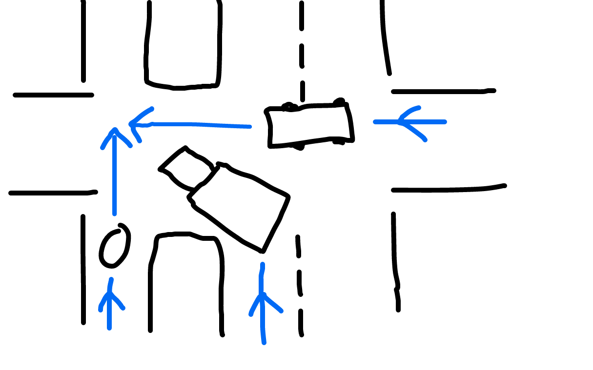
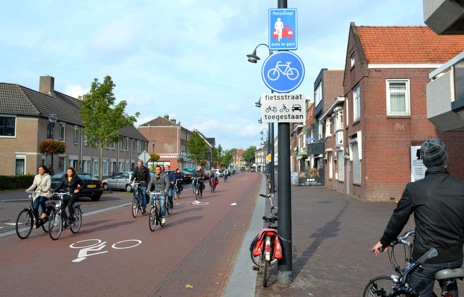

After a really strong season of riding, I'm having to take a break. On the commute to work, some daft bastard ran me off my bike, giving me a fractured heel.

I'm really happy to see how many bike lanes NYC is having put in, and their move to protected bike lanes is certainly helping keep the influx of new riders safe. Sixth Avenue is having its “side of the road” lane turned into a protected lane, and I hope to see more, but sadly they still have problems.

Protected lanes often have concrete islands at crosswalks, then space for parked cars between them. This can be helpful, but when you put the protected lanes on the left, that puts the drivers-side door right in the bike lane! Put them on the right, and you've got the passenger door to deal with, which is less often occupied. Argue that maybe the driver can be more responsible, but thats only if they're bothering to look.

Beyond that, pedestrians treat the island and the lane between that like an extension of the sidewalk, and happily just walk out into the road.

<iframe width="560" height="315" src="https://www.youtube.com/embed/5hbdVzoDZJ0" frameborder="0" allowfullscreen></iframe>

The biggest trouble though, is the weird traffic flows that end up happening. You always get vehicles wanting to turn through your protected lane, and even though you have right of way, they'll either creep into you, or just drive straight through without noticing you. It's a constant guessing game of “do they know I'm here”, and you don't always get it right. Shouting, blasting music, etc all helps, but I'm nearly smushed a few times a day, and I see it happening to other riders ahead of me every day.

Last week when I was hit off, this shit happened, somehow.

*Smashy smashy!*

The truck was starting to turn, and I shouted at them to let them know they were about to hit me. They jammed on the brakes, and out of nowhere was some other car, who was maybe stuck in the road after they'd shoved too far into the junction on a red. They were in a rush to get out of the way, so when they saw the truck stop, they floored it and knocked me a few meters sideways.

They couldn't have seen me because of the truck, and the truck couldn't see me because of the parked cars in the protected bike lane. I couldn't see the car because of the truck, and it was my bloody green light when I got knocked flying. Tough situation for everyone.

I'm not sure what the lesson here is. It's where most people chime in with victim blaming, but I think it's a fault that needs to be resolved with the concepts of protected bike lanes. Putting barriers between drivers and cyclists is absolutely going to help keep cars and bikes from meeting, but as soon as there are gaps in those barriers, cars and bikes are going to meet.

Maybe don't have lights set up so vehicles are turning through bike lanes, when those lanes have green lights also?

Maybe a few more signs about watch out for cyclists on turns?

Maybe drivers could just fucking look out before turning their vehicles through a bike lane, just like any other lane?

Heh. Of course not.

I'm not expecting NYC to go full on Dutch with special bike roads, where cars are considered “guests”, but… something between would be lovely.

_A *fietsstraat* (bike street) where bicycles are the main form of transport and cars are considered “guests”._

Look out for this sort of scenario friends. [Ride with a loudspeaker](/cycle-with-a-loudspeaker/) to keep some of the bastards off you, as I can say it's kept me out of trouble plenty the last few months. I'm lucky this has been my first major in NYC in four years of being here.

Anyway, I have four weeks in a boot before I can take my brand new Cannondale CAADX out, which should coincide with my first cyclocross race. Let's see how many bones I can break doing that with sod all practice! :D
