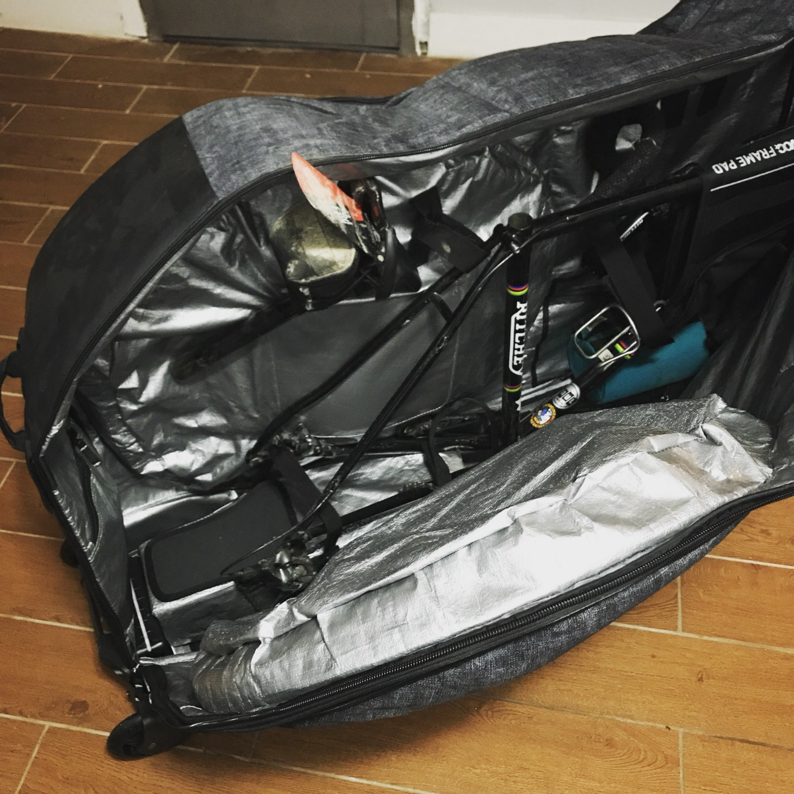
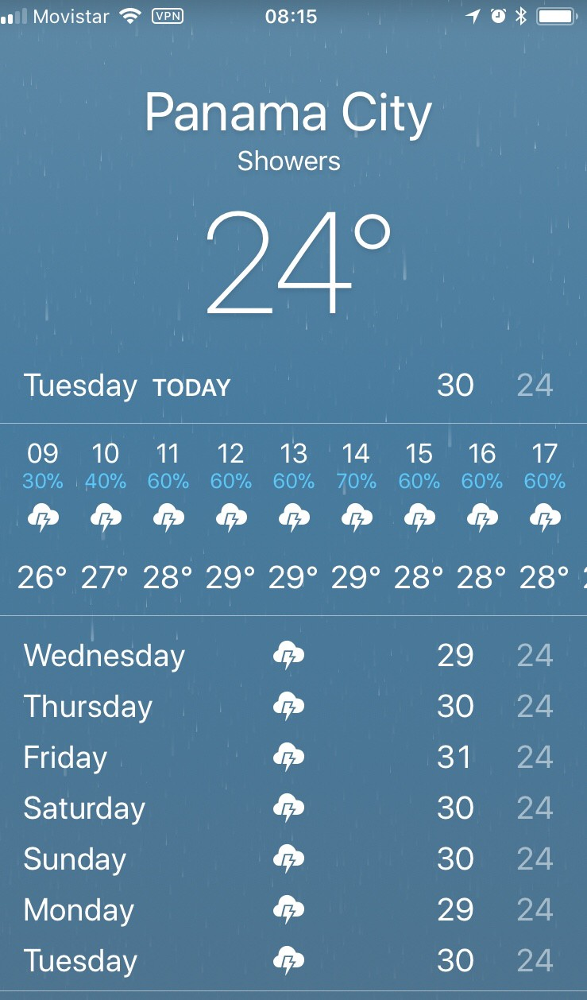
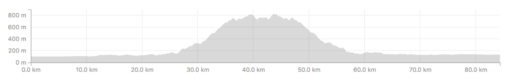

Some friends moved to Panama from Colombia and invited me down, so I grabbed my cross bike and went for an explore.

Unlike last years trip to [Medellin, Colombia](/colombia-not-a-bike-bag/) (a world renowned cycling destination) I didn’t know much about Panama, the bike scene, or anything else, but the Strava heatmap had plenty of red on it and I was overdue a vacation.

I packed Ritchey up in my new [EVOC Bike Travel Bag One Size](https://www.clevertraining.com/evoc-bike-travel-bag-one-size), and set off for a week of hanging out with my friends in Panama City, with a lot of bikes on the weekdays while they work.

First day, beach day, immediate sunburn, and regret. Next day, skipped bikes to do some writing, consistently applying aloe cream, desperately trying to avoid moving because I am king of the lobster people and everything is terrible.

Third day, time for some bikes!

# Cerro Jefe

I’ve learned my mistake of just turning up in a country and trying to crank like normal. Whenever I go anywhere my new policy is to try a little trip, then use that for context before planning a bigger trip. Of course if I was doing a point to point ride I’d have to plan it out, I’d just play it safe and plan low mileage days, giving me extra rest days if conditions were fantastic.

Anyhow, looking at the map the nearest point of interest outside of the city was Cerro Jefe, a 1007m mountain to the east of Panama City.

The weather forecast in Panama is rubbish. It says all thunder all the time, and to be fair there was a lightning storm every day, but they’re an hour or two long and between them the sun comes out to play **hard**.

Initially the plan was to get out early in the morning before the heat was too high, but the weather said rain all day so leaving seemed less urgent. I figured I’d wait for the rain to calm down a bit (it stings when it’s going full pelt) jumped on the bike at ~10:30. This fucked me over as the sun made its appearance almost immediately, and the whole day was brutal heat.

Strava’s “Use Popularity” settings suggesting I take Via Tocumen both ways, but that’s a big road and it didn’t look particularly fun. Tweaking for neighborhoods and bendier roads made some of it a little safer, but avoiding the big roads entirely is impossible.

It was rush hour so the usual mixture of trucks, buses, taxis, and commuters, all annoyed about being stuck behind a bike for the briefest of moments before they got bogged back in traffic. I was between the lanes and making more progress than everyone else 80% of the time, and the rest of the time there was shoulder.

Getting off the big road and into Aserrio, the roads immediately deteriorated. There was a flood so deep the water was sneaking into exhaust pipes, so being a smarts arse I swung onto the sidewalk at full speed, as the water looked shallow enough I could see most of the pavement. The puddles were hiding a pot hole big enough to burp and rim bounce my back wheel, making the ride pretty squishy for the next few miles until a decent rest spot appeared.

30km of flat riding, then 15km to climb 1000m seemed like a tall order, but despite the 32 degree heat and 99% humidity it was a beautiful climb.

https://www.instagram.com/p/Bjpr34LF8PR/

These signs aren’t really exaggerating. A lot of the climb was ~10%, with a few at 12.5% chucked in for giggles. My 1x11 with 42 and 36 wasn’t quite the magic combination for effortless climbing one could hope for, and progress was rather slow.

*I remembered half way up that “Jefe” means “Boss” in Spanish. 🤣*

At about 800m there was a guard checkpoint, and the presence of camouflageman reminded me I was entering a national park. I’d need to pay some cash (an actual $20 USD for foreigners) and show a passport, which I’d obviously left at my friends place. I revelled in the excuse to turn around and bomb the fuck down the whole mountain in ~20 minutes.

### Strava Doesn’t Know Shit

I followed the same route home for a bit, but my love for loops got me in trouble. Strava (through my own vague instruction and with no resistance) was all about trying to get me on the Autopista. **Do not go on the Autopista**. The Autopista has many names and they’re all cute aliases for Certain Death. After some creative spinning around through neighbourhoods I picked up my earlier trail and reversed it.

In Panama if you’re lucky enough to find a road that isn’t terrifying, just do an out-and-back. Trying to loop is doubling your chances of a bad time.

### Beware Hot Hot Heat

The aggressive heat destroyed me, the expected three hour trip took closer to six. I forgot how much slower I’d be climbing on my cross bike, in humidity, and in 32C heat.

I was carrying ~4l of water (the weight didn’t help but playing it safe seemed smart) and none of them had electrolytes in there. The amount of sweating I was doing over the six hours meant I was really low on salt, and I was hungry and dizzy. So much so that I found myself in a fucking McDonalds, eating a McWrap and extra salted fries, just to avoid falling off the bike.

This was only a [84km ride](https://www.strava.com/activities/1619634842), but it gave me a lot of education into riding in Panama, and it made me adjust my plans for the rest of the week.

Next up? I’ll be writing about the next day in Panama: Cycling the Pan-American highway (The Highway of Death!!) into a volcano!
