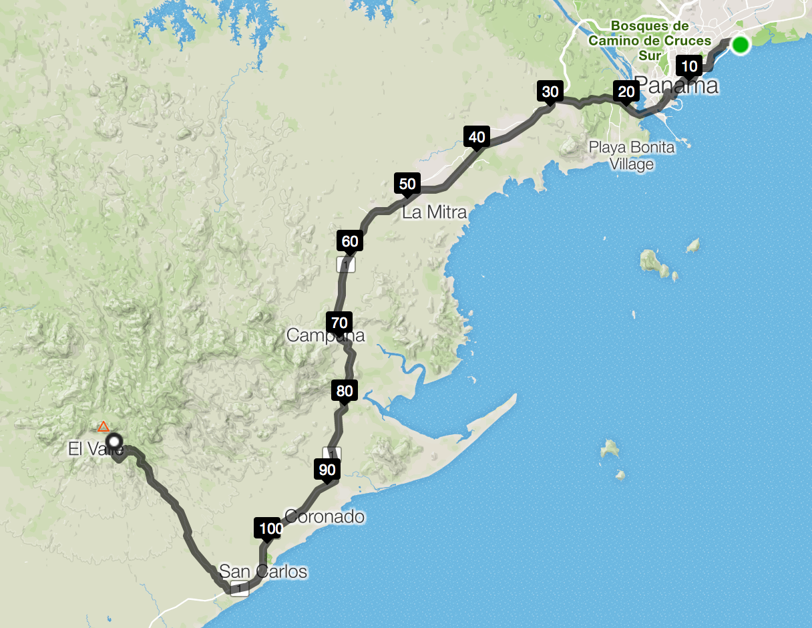
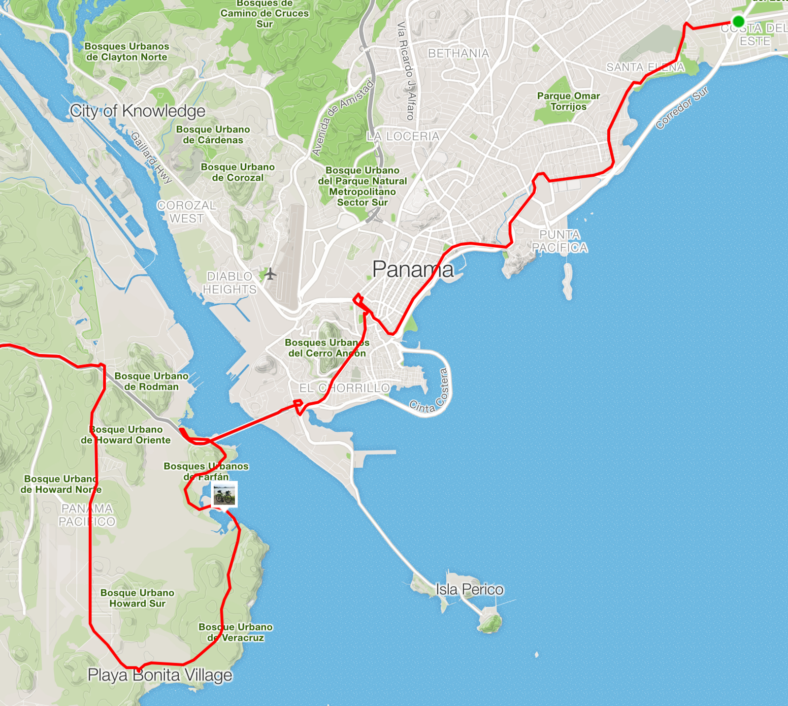
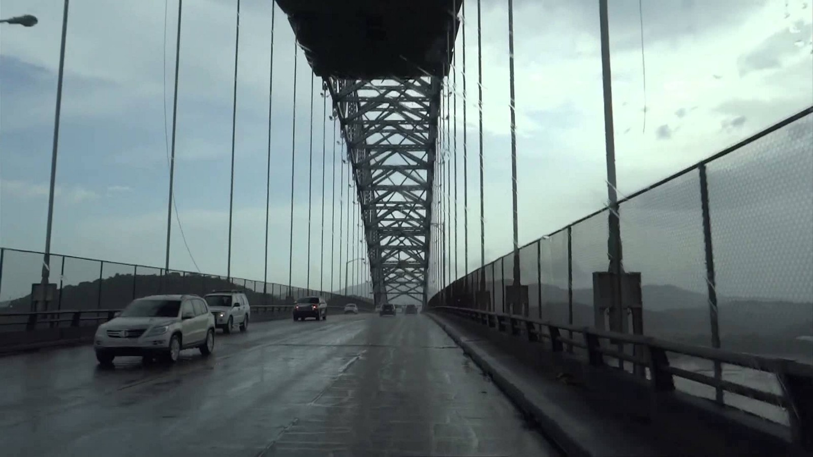
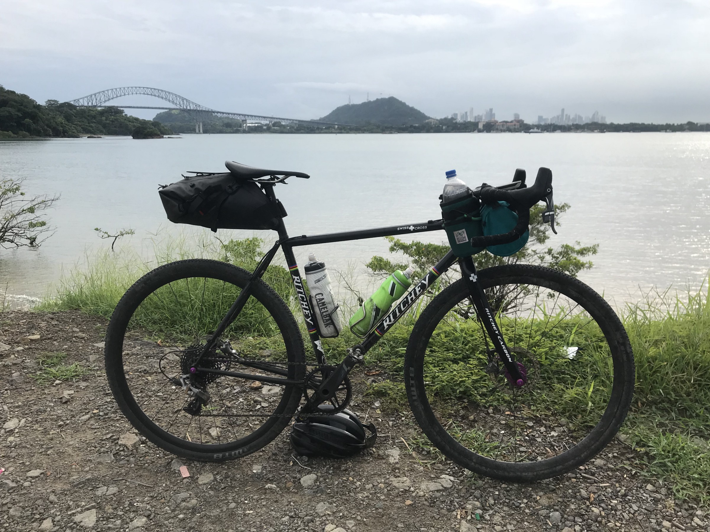
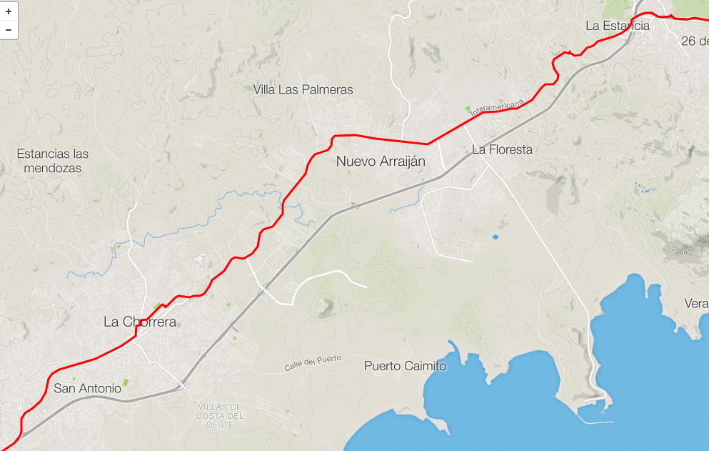
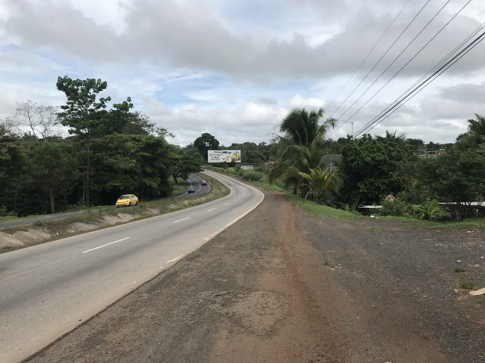
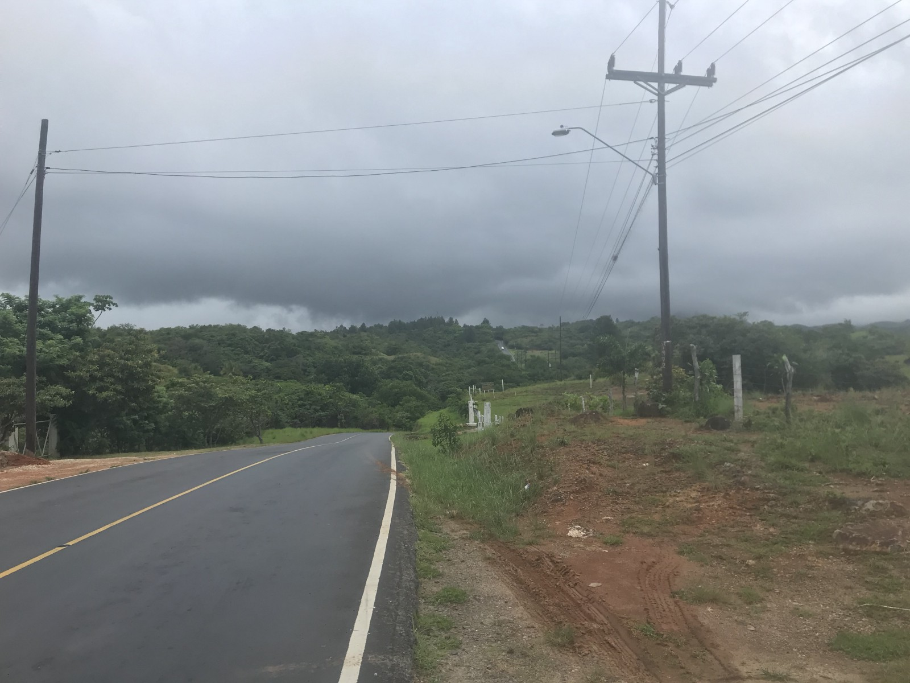
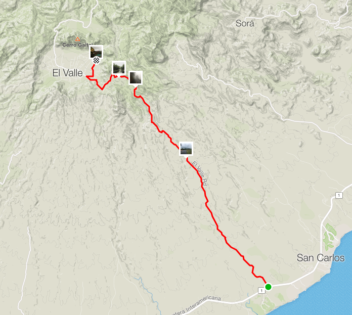

With my trial ride up Cere Jefe out of the way, Idiota Gringo set off for a bigger adventure: Panama City to El Valle de Antón. Anton Valley is an extinct volcano, and was the greenest funnest looking part of the map within a days ride.

The original plan had me ignoring the Pan-Am entirely after the half way point, but was a whopping 160km, with 3km of climb. Sneaking up an extra mountain on the way there was no beuno, especially with limited resupply points on that route. I tried for another “Get up into the mountains and stay up there” approach, but there is only one other road that goes through an area called Sora. Some extensive Googling made it clear it was a gated community with security on both ends — I wouldn’t make it through.

The trial ride up Cero Jefe made it clear I had to lower both the climbing and the distance somehow, so I tweaked the route down to 130km, with 2km of climbing. This forced me onto the Pan-American the whole way to the base of the volcano. It seemed a lot more reasonable by the numbers…

## Researching Riding Conditions on the Pan-American Highway

Searching for information on cycling the Pan-Am highway gets you an account from some chap called Dave, who rode the whole thing from Alaska to Argentina.

[**Cycling from Alaska to Argentina - Pan-American Highway**](https://www.davestravelpages.com/cycling-from-alaska-to-argentina-the-pan-american-highway)

Kudos to this guy, he’s a champ, but it was not very informative:
> Central America is quite a compact region, and during this month I managed to cycle through Honduras and carried on through Nicaragua, Costa Rica and into Panama. No, I did not buy a Panama hat!

[WorldBiking.info](http://WorldBiking.info) had some better information:
> Road conditions on the Panama section of the Pan-American highway vary greatly. Some sections are in perfect condition, with a wide shoulder for riding. Other sections are badly pot-holed with rough surfaces and almost no shoulder. Traffic is not too heavy until you draw nearer to Panama City, where the highway is clogged with trucks and buses.

Clogged = safe, you can ride past them

Potholes = fine, I’m on a steel, tubeless, 700x35, cyclocross bike

Almost no shoulder = A thin shoulder, ok sure.

[**Bike Touring in Panama >> Practical Information for Cyclists**](http://www.worldbiking.info/country_information/biking_panama_country_information.html)

This all sounded reasonable enough!

## Pan-American Highway in Panama City

I left the house at 6:30am, 30 minutes behind schedule, but still hoping to beat some of rush hour. The ambitious plan was to get most of the climb done before midday. Even on a cross bike, Doing most of 130km in 5.5 hours (24km/h or 15m/h) seemed reasonable enough, especially with the “extra climb” removed.

Riding through the city was pretty standard initially. I’d used street view (when available) to eyeball the conditions, and all the spots I saw looked ridable. Every time it looked like it was a huge road, there was really a service road. That was eventually not the case, and you can spot my first panic as I loop around trying to find another way.

Some of my fear was probably silly, but I’m conditioned to avoid cycling onto on-ramps. In the UK that is never ok, and in the USA it’s usually probably not a great idea. Eventually I plucked up some courage, and piled into the sunken two-lane highway with no shoulder. Following Garmin blindly seemed like one way to get out of the city, and I had seen plenty of Strava activity on the heatmap for this stretch. It got a little better after twenty minutes (above-surface instead of sunken) but there was another issue…

In the morning, Avedina de los Martires closes one of the two outbound lanes, to give incoming traffic priority. It said 5am–8am in the one area, but there were different times at various spots. The same is true of the reverse coming back to the city in evening.

I’d only just noticed this situation for a moment when a scooter-cop started honking and waving, probably very politely suggesting I should rethink my approach. Luckily by then a sidewalk had appeared on the other side of a barrier. It was covered in twigs and glass, but it was better than being on that road. A few minutes later I was on the Trans American bridge.

*That thin strip of unprotected raised curb is aaaaall yours. It’s only on the one side, so getting to it is fun if you’re trying to come into the city.*

## After the Bridge Doesn’t Get Better

As soon as I was off the bridge, the narrow sidewalk vanished, and more than just the one lane was cut off - the whole outbound road was diverted. I followed the waving cops and all the other traffic, mixed up in a speedy single lane of folks trying to get back to the next entrance.

*The detour wasn’t the worst thing. I got a lovely view of the bridge and the city.*

After my unexpected tour of the Panama coastline, the one and only road giving me a chance to eventually get west had giant gates and guards stationed at them. After reading so much about gated communities I wasn’t sure if I could get through, and it looked very close to an airport. I was stuck there for a minute thinking about a plan, but as they didn’t looked armed I just blasted through. 2km later and I heard the honks of two scooter-guards, but I ignored them and kept riding. After a while they must have realized I was just trying to ride some bikes, and they buzzed off.

## Bosque Urbano (Urban Forrest) is Ok

Back on the Pan-American Highway, I got to ride through the Urban Forrest, and honestly it was refreshing. There was shoulder for about 95% of it, with occasional construction work covering that shoulder with mud in a way that didn’t seem sendable.

The shoulder at this point looked just like in the “Street View” photographs, and if it was like this all day things would have been sweet. It seemed fair to assume it was crap near the city and I just hoped it would get better.

*Wibbling around on the Interamericana, taking a little strech of backround where there was one. Most of these towns are connected only by the main road.*

Avoiding the Autopista after “Sector 9”, I took the Interamericana which runs parallel to it. This winding road takes you through a series of little towns, through rolling hills and never-ending strip malls. There was no shoulder for most of this stretch, so it was mostly riding strip mall parking lots, and occasional stretches of sidewalk. This really slowed things down.

It felt a lot like trying to ride through central New Jersey anywhere near NYC, but the drivers were 1000% more surprised, confused and aggressive about a bike being on the road. There is no “3 foot minimum passing law”, no “Share the road” signs, nothing. Just a whole bunch of cars, trucks and busses, spewing clouds of black smoke.

If there is an obstruction, you don’t simply slow down, check over your shoulder, signal, check again, then maneuver as you would anywhere else. No. In Panama if a truck is 500 meters away with a clear line of sight, and you make it very clear you’re about to come around, and that truck has all the time and space in the world, that truck will not give you an inch, slow down one iota, or do anything other than try to kill you. That truck hates you with a vengance. Prepare to die.

## Cyclocross Practice

*La Herradura is the start of Cyclocross Practice!*

Once the Interamericana and the Autopista merge, it’s back to the Pan-Am highway. The road chills out a bit, and an amazing wide mud shoulder opened up. It was flat mud for a few miles, but it gets really damn fun after that - if you enjoy technical riding. At this point I was exceptionally glad to have my Ritchey Swisscross, which was definitely being put to the test.

Every type feature of a cyclocross race was here: dry mud, wet mud, sand, barriers, log-overs, steps, ramps, and a fucking *pump track* at one point. Happy to have shoulder, I was just riding whatever Panama threw at me.

At 70km I was forced to stop at a bus shelter with low pressure on the front tyre making it barely rideable. My first thought was that I’d burped it, so I chucked some CO2 in there. The tyre deflated again, and I noticed it was swiss cheese - the sealant had been completely used up plugging all the holes as they came in!

Throwing a tyre in meant I could get on with my “cross practice”, but shortly after the highway was back to no shoulder. My nerves got severely fried by a truck brushing past me, and I ended up riding in the grass just *hoping *some more shoulder would appear soon.

After 76km my back wheel got squishy too. I was not carrying spare sealant (a mistake I will not make again), had no spare tyres, and I could not risk killing my tubes. Beyond the concerns about keeping air in my tyres, quite simply the ride was no longer fun. Riding in knee high grass meant ticks, snakes, and god knows what else.

Luckily Panama is full of pickup-truck taxis! 😎

https://www.instagram.com/p/BjsNKjclGAC/

“For you? $20!” the taxi driver exclaimed, and off we set on a 60km ride to the base of the climb into El Valle. We got there bang on midday, and the heat and humidity was *bonkers*. Hiding from the sun in an gas station helped me pass an hour. I drank all the coffee, ate all the yoghurt, put away a few empanadas, but at 1pm Iran out of excuses to hang around. After covering the shady part of the courtyard in sealant getting the second tube in, I decided to get moving again, and just take it really really easy. I had all afternoon to get into this volcano, and it was only 30km and 700m up!

Within about two minutes on the bike, the heat was already winning, but mentally things were going much much better thanks to a road sign telling road users to respect cyclists!

https://www.instagram.com/p/BjsjTZOl1uI/

I soft pedalled for 10 minutes, and had to hide under a tree for 2 minutes. Got moving again for another 15 minutes, and guess what, hid in a bus shelter. This was going to be a long climb…

At that point something amazing happened. Panama was having at least one lightning storm a day while I was there, and I could see one heading right for me. I waited for it to get closer, hoping it would bring some cold air along with the rain. It kept heading towards me for 10 minutes, then I noticed it had turned… NOOOO COME BACK!

Chasing lightning into a volcano wasn’t what I thought I’d be doing in Panama, but it was a good rabbit to chase.

*So close to the storm, but it was getting away!*

The closer I got to the storm, the cooler it got, and the faster I could go. A full hour of chasing later and I was properly in it.

https://www.instagram.com/p/Bjsqsj_lQT7/

The temperature dropped from 39C to 20C, and I was the happiest a Brit could be: whooping, laughing, singing, and mashing through the winding roads taking me through the rim of the old volcano with no trouble.

Done!

Every bit of this ridiculous adventure was 100% worth it. I would never recommend riding the Panama Highway, or the Interamericana, or any of the crap I did along the way, but the ride up the mountain was amazing, El Valle is an amazing place to visit, and the [Golden Frog](http://goldenfroginn.com/) is the most beautiful hotel I’ve ever been to. It was really cheap, had a pool, and all the food was home grown, hand reared, organic, and fucking tasty.

https://www.instagram.com/p/Bjuckimlyzc/

Here are the rides on Strava if you’re interested.

- [Cyclocross Training on the Highway of Death](https://www.strava.com/activities/1621884868) - 76km
- [Chasing Lightning into a Volcano](https://www.strava.com/activities/1621886376) - 28km

Best of luck to anyone who has a go at this!
