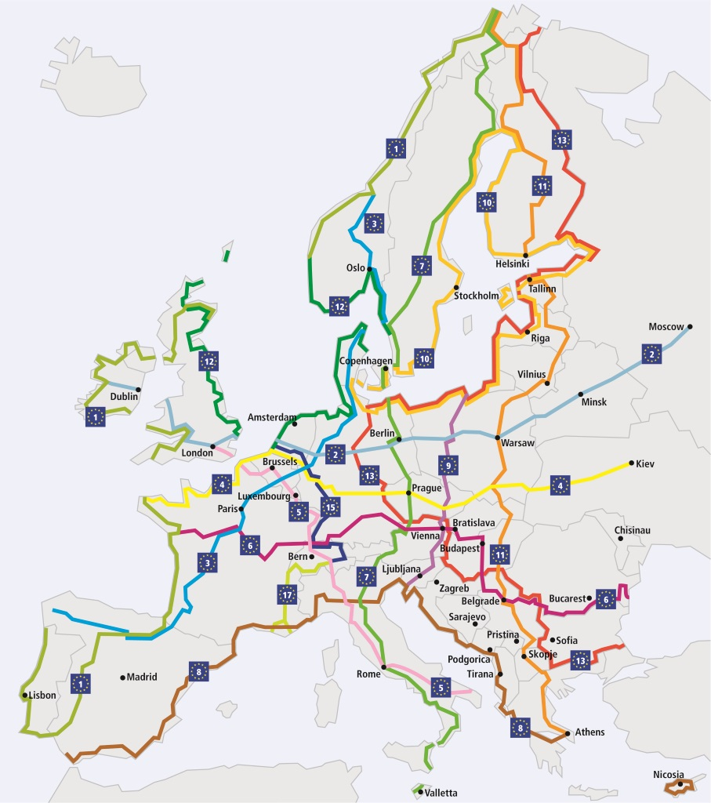
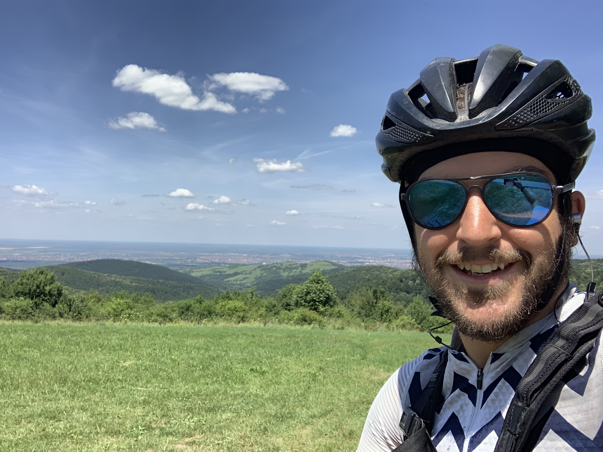
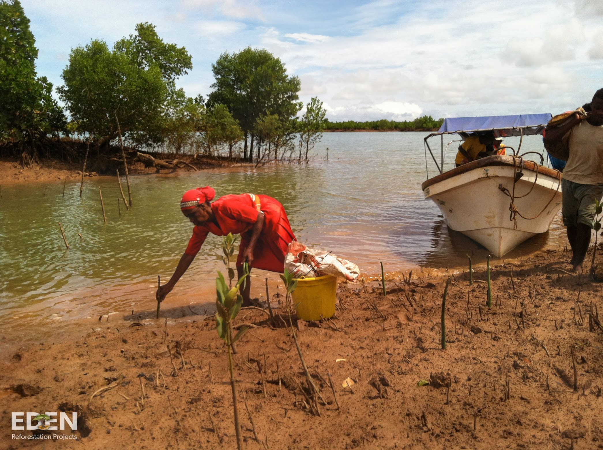

It's not my first time in Serbia, but this was a fantastic experience. I set off [from the Hungarian side](/austria-slovenia-hungary/) of the border after having breakfast with the other bikepackers at [Locomotiv Vendégház](https://www.booking.com/hotel/hu/locomotiv-vendeghaz.en-gb.html). 

This was the first non-EU (Shengan Area) border crossing, so I was a little worried about that. As always the worry was misplaced, and everything was awesome. The exit booth person on the Hungarian side took me to a water fountain to top up my bottles, and the Serbian booth lady spoke perfect English but didn't have any questions. Off I went!

One of the bike packers told me about [Euro Velo routes](http://www.eurovelo.org/routes/) as they were following route 6, which we were on. There's a bunch of routes, signposted, and hotels and everyone along the way is expecting bikers to come through. Worth keeping in mind if you plan a trip!

I was vaguely going along with route 8 in April/May, then kinda 5, but I'd never heard about these routes until now, and heading into Serbia was my first time following the actual route. It was jam packed with all sorts of people; young couples, groups of lads, and a fat old chap clipping along on an e-bike!

A pretty uneventful day other than I found a go-kart track which nobody seemed to be using.

https://www.instagram.com/p/BzSQMicFYMR/

Doing that with 40lb on the back is fucking hilarious. If I left the sound in that video it would have been me just cackling and screaming as I try to wrestle my loaded up Surly Crosscheck around the corners.

June 28th was another hot day down on the aero bars trying to cut through the wind. I got to Novi Sad and immediately went in search of a nice cold restaurant to work from. They were so confused when I ordered two meals and set up camp with a laptop. Four hours of working there and I was just plowing through courses. 

At one point I saw an ad for "Aperol Spritz", which I think was a fad which started after I started touring. I've not come across one so I gave it a try. Half way through it the bartender said "How is it?" I didn't want to offend him so I said "It's ok!" and he replied "Maybe you should try beer." 🤣 The sass!

I dropped the bike off at [Invicta Bikeshop](https://www.google.com/maps/place/Invicta+Bikeshop/@45.2398628,19.8160368,17z/data=!3m1!4b1!4m5!3m4!1s0x475b102599a42f97:0xbb556d53ed49a301!8m2!3d45.2398628!4d19.8182255?hl=en) to get my rear shifter cable replaced. They were a bit confused about my timescale, they wanted to know when I was leaving Novi Sad, and I just kept saying "whenever it's done!" Not trying to rush them, I even said "I don't mind how long it takes, I'm not going to Bosnia until I can shift!" hahaha. They laughed and ended up putting me at the top of the queue! 

That evening I went for dinner with a friend and drank a bunch of local wine, then by 10am the bike was ready. Not only did they replace the cable, but they cleaned the entire bike AND they refused to take any money for it!!! They said they wanted to follow my trip, so I write down "phil.bike" and hopefully you guys read this. THANK YOU! I would not have survived very long without you. Your kindness was converted into a donation to my [trees fundraiser](/trees).

They also gave me this fantastic read cable housing.

With that sorted out I headed off south west from Novi Sad towards Bosnia. Leaving the city I saw some pretty cool stuff. Firstly, they have these bike repair stations everywhere, not just with pumps but with tools!! You'll need your trusty schraeder to presta converter, but this is so cool!

They're also [planting a bunch of trees](/trees) in their parks, because having trees in your parks is way more useful than giant empty fields of grass! 🤷‍♂️

I didn't take the [easiest route out of Novi Sad](https://www.strava.com/activities/2491350922) admittedly, but I wanted to play in [Fruška Gora National Park](https://www.google.com/maps/place/Fru%C5%A1ka+Gora/@45.1759455,19.6933272,11.7z). It's a big climb into a long rough road that follows the ridge. It has a few cars which don't seem to be expecting bikes, and there were a few close calls with folks avoiding potholes while I was staring off at the view, but we all made it through unscathed. 

After that was a straight shot to the Bosnian border! I went to a town called Badovinci and stocked up on food and drink, aiming to go to a camp site in the mess of River Drina meanders. It didn't seem to exist, so I carried on through Bosnian border control to find a wild camping spot! 

That's another story. Bosnia was wild. Smash your email address in the subscribe box below, it's new! Please [support my fundraiser](/trees) too, need to get a few thousand more trees this month to hit the target!

