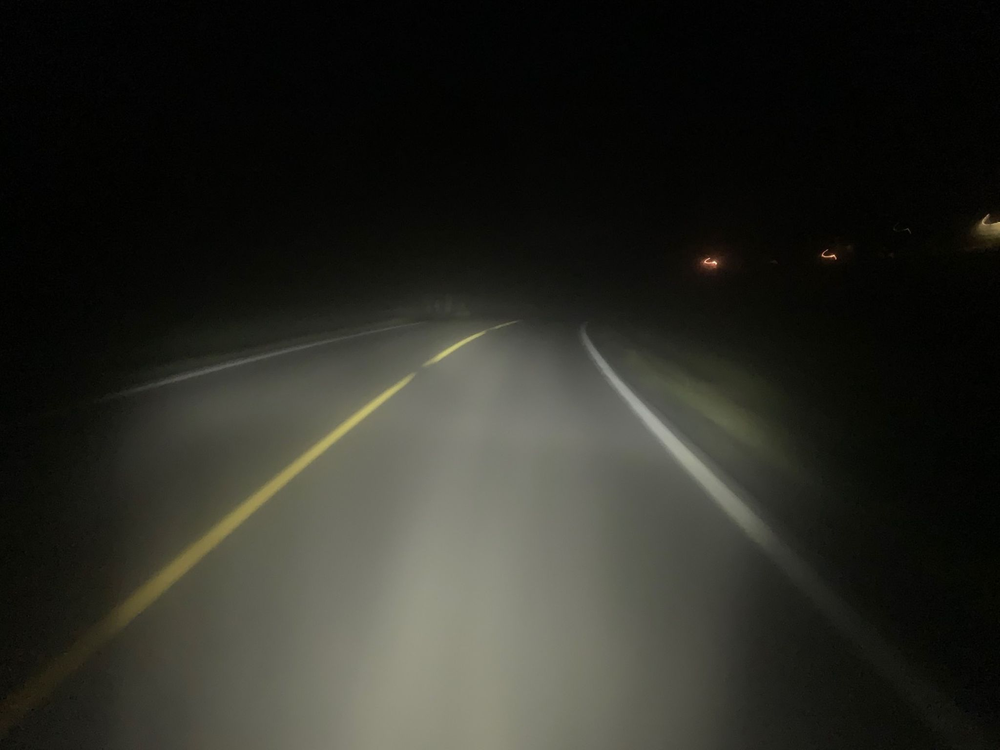

I think it's generally healthy to find and push your limits, but I kicked my limits in the face and hurt myself. Riding a loaded touring bike 400km in 24 hours, did another 750km in the next week, injured my achilles tendon, "recovered" like a moron, and extended the injury by weeks. I'd like to talk about it here so you folks never do anything like this.

Back in August I was [heading to Scandinavia with new wheels, a fancy dynamo, and upgraded aero bars](/balkan-bail-and-upgrades/).

<iframe width="1120" height="630" src="https://www.youtube.com/embed/4Lgpi0o0c1Y" frameborder="0" allow="accelerometer; autoplay; encrypted-media; gyroscope; picture-in-picture" allowfullscreen></iframe>

This leg of the tour was a speed-lap through Scandenavia and around the Baltic Sea, starting in Denmark, ferry to Norway, riding through Sweden, island hopping through the Aland Island, Finland, boat to Estonia and ride down through Lithuania and Latvia to grab a train in Poland to get back to Amsterdam. This all had to be done in three weeks, as I had a conference coming up in Amsterdam. I figured I could do it all, or at worst leave the bike with a mate in Latvia and come back for it later.

## Got Stupid

Anyhow, I started off on trains from Amsterdam heading to half-way up Denmark. The train stopped early in Germany, 40km south of the Danish border. A fire on the tracks meant the train became a bus, and I reassembled the bike to set off north. It was already 4pm on a Saturday when I set off, and it was 400km to the ferry. Doubting I could get all that done before the Monday morning ferry I figured I would see how far I could get, then finish up with a train to get back on track.

Sadly that did not happen. The [SON 28 dynamo hub](https://nabendynamo.de/en/products/hub-dynamos/for-standard-forks/) and [Edelux front light](https://nabendynamo.de/en/products/headlights/for-hub-dynamos/) was such a powerful pairing, that despite going dark two hours into the ride, I was perfectly happy smashing along - with a nice tailwind to boot. I got 160km before I decided to stop for a nap in a field at about 2am. 

<iframe height='600' width='1120' frameborder='0' allowtransparency='true' scrolling='no' src='https://www.strava.com/activities/2608276558/embed/c32b188a466906a4e169283fb345663c889f3c3c'></iframe>

Despite staring at the tent ceiling for ages I only really got about two hours sleep, then set off at 6am. 

https://www.instagram.com/p/B1Ar_crlLUA/

Sunday was another day of pretty decent tailwinds, and waking up with my fancy dynamo hub charging my phone, then loudspeaker, etc. I pretty much felt invincible. Thinking "There's no reason to stop anymore!" meant I just... kept fucking going. 240km more got me Frederikshaven 24 hours after starting in Germany. This is not a brag, this was dumb. The furthest I'd done in 24hrs before was [330km (205mi) on a carbon racer](/2018-nyc-montreal/) with just a saddle-bag. Stupid #1.

<iframe height='600' width='1120' frameborder='0' allowtransparency='true' scrolling='no' src='https://www.strava.com/activities/2610634348/embed/a0f033128b4aa381016cd25a1ef73436b2a5ea9e'></iframe>

I had just enough time to replace the 5,000 calories I burned getting there with an all you can eat Japanese buffet. I was limping there and back, but it seemed just like tight muscles, and I didn't bother stretching because I was so tried and hungry I just wanted to eat and sleep, and I hadn't noticed the elevation over the two halves of the ride totalled 3,000m, which is 2,000m more than I said I'd do in a day with a loaded touring bike... 🤦🏻‍ Stupid #2.

https://www.instagram.com/p/B1CQg3mgRBy/

Monday was an early boat over to Norway, and I had a chance to sit all day and work. Got to Oslo and met a mate for a few beers, then headed east into the dark. I made the mistake of calling mum on the ride and we ended up talking for about an hour. This slowed me down (nobody wants to hear your heavy breathing over the phone, especially not mum) and once again I was rushing through steep rolling hills trying to get to the hotel before check-in closed. 

This was supposed to be my rest day, but 60km in a rush is not a rest. Tuesday was 95km, Wednesday was 65km, Thursday was 94km, Friday was 100km, Saturday was 120km, Sunday was 110km... I just kept bloody going. All of these were hilly and a bit of a rush because I was trying to do a days work as well as get distance in. So that's 1,045km / 650mi in the space of 9 days. To compare again to the last longest distance, when I did the 330km I had to common sense to sit down for two days, eat poutine, and drive home after. So not only had I gone further in a day than ever before, but that's my biggest touring week too.

Towards the end of that mad week, my left heel so much I was resting it on the rack and riding with just the right foot clipped in. Pedaling hurt, walking hurt, clipping out was agony, so I avoided clipping in even when I was pedalling. The hope was to rest up for two days in Stockholm, but after three days there I was still in agony. It was clear at the time I'd need at least a week to recover, and already being on such a tight schedule it was clear I'd not be able to make the loop. 

Train to a ferry, ferry to Gdansk, Poland, left my bike with a mate, and jumped on a train to Amsterdam to recover on Heidi's houseboat again.

After a week of lying around feeling sorry for myself I was back on the bike riding gently with friends: Dutch bikes 4km at a time, then 15-20km rides on a unladen road bike. I got overly confident _again_ and thought I was out of the woods, so I went and did a mini tour to Belgium, and fucked my heel again in the hills. Stupid #3.

The heel was hurting badly again, so I took another two weeks off the bike. I had some travel to do and went to the States for a work trip (might as well do something useful while I'm messed up), and it also happened to the be the start of cyclocross season... 😈  I'd had a race weekend lined up, and I thought "Oh yeah, I can just race one of the days for giggles, place terribly but have a laugh, then just heckle day 2, this'll be fine!" 

Didn't even make it to the race. I swung by NYC Wednesday-night cross-practice to see my friends and shake off some cobwebs (I forgot how to turn a cross bike and nearly wiped a guy out practicing sprint starts), but ended up leaving practice early with the heel feeling a bit weird. Woke up in the morning for "chill park laps" with a mate that ended up not being so chill, and that was it, the heel was gone again. Stupid #4.

## Got Serious

I had to get serious about the injury and find out what I could do to solve it, or it would just reoccur forever. When I got back to Holland I went to see the doctors, who luckily are very cheap even without any sort of insurance. They did a sonogram of my heel/ankle, and told me the achilles tendon was strained.

Physical therapy used shock treatment (like tazer-lite), dry needling (kinda acupuncture), and a bunch of massage. I booked several massage appointments over the next few weeks as well, and went back for more needling and tazing now and then, and did everything the doctors said including daily heel stretches, squats, icing, heating, and just lots and lots of resting, and after a few weeks I started swimming (in the cleaner canals) again.

https://twitter.com/philsturgeon/status/1181519378707288064

The PT did say one thing:

> Riding a bike, gently, to get around the city might be a better idea than walking.

YES! Worth every Europenny! For the whole 7 week recovery period I didn't walk more than a few blocks in one go. I'd grab the wobbly Dutch tank and clank about to the pub.

By November 6th I was on a ferry, heading home to the UK, for the first time this year. Heidi joined me for a new tour, with the goal of exploring England, but also to try and stop me smashing off and buggering up the ankle again. We got across the UK, from Harwich to Bristol doing about 30-50km a day. Heidi left me to it in Bristol after a quick Wiltshire cider-tour, and I've continued on through Wales, over to Ireland and up the east coast from Rosslare to Dublin. 

The heel has felt a little tight now and then, especially though the Brecon Beacons and Wicklow Mountains, but on the whole with more stretching and two goes in the pool, it's actually staying in check. The fact that it's been utterly pissing it down non-stop for the entire way through Wales and Ireland has helped me not go over the top.

I think it's going to be something I have to keep in mind for a while, but It does feel like its under control. In the past I've had knee trouble from over-active quads yanking on my knee caps pulling them up, and now I've got overactive calf muscles giving the tendon shit. So long as I always stretch the right bits, and rest after insanely long days, I think everything is going to be ok. 🤞
