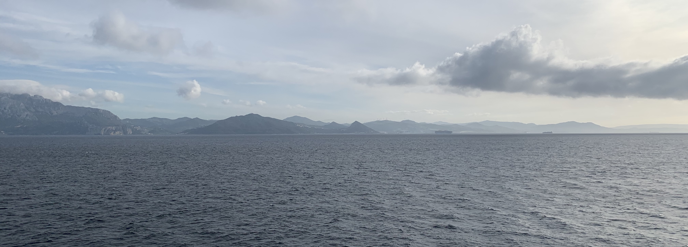
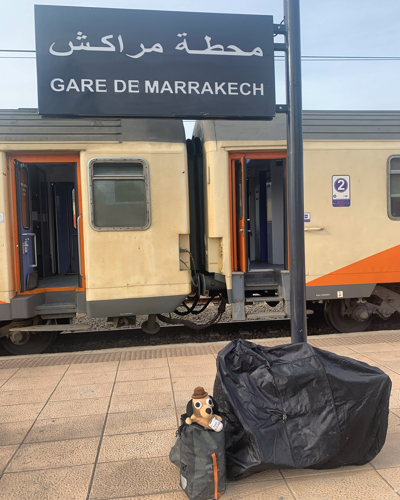
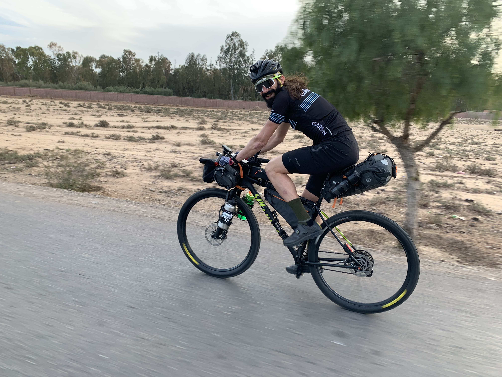
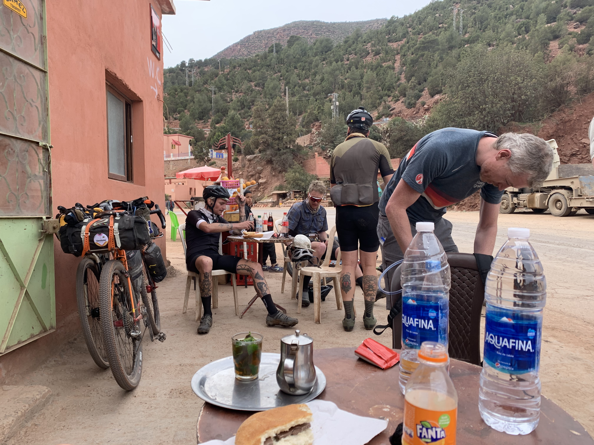
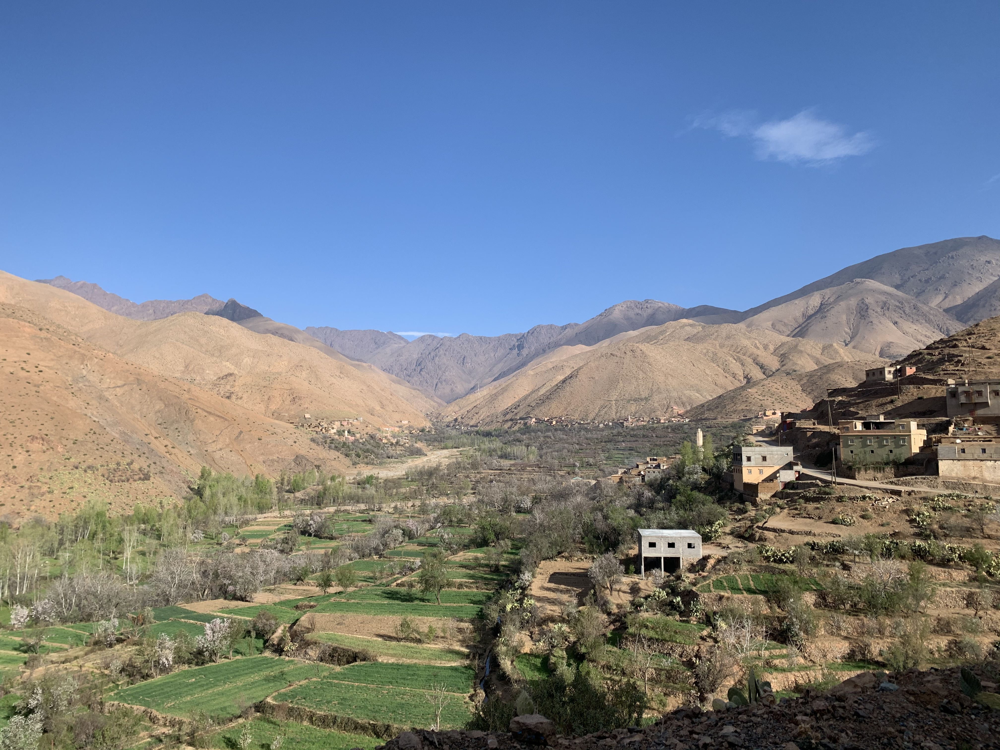
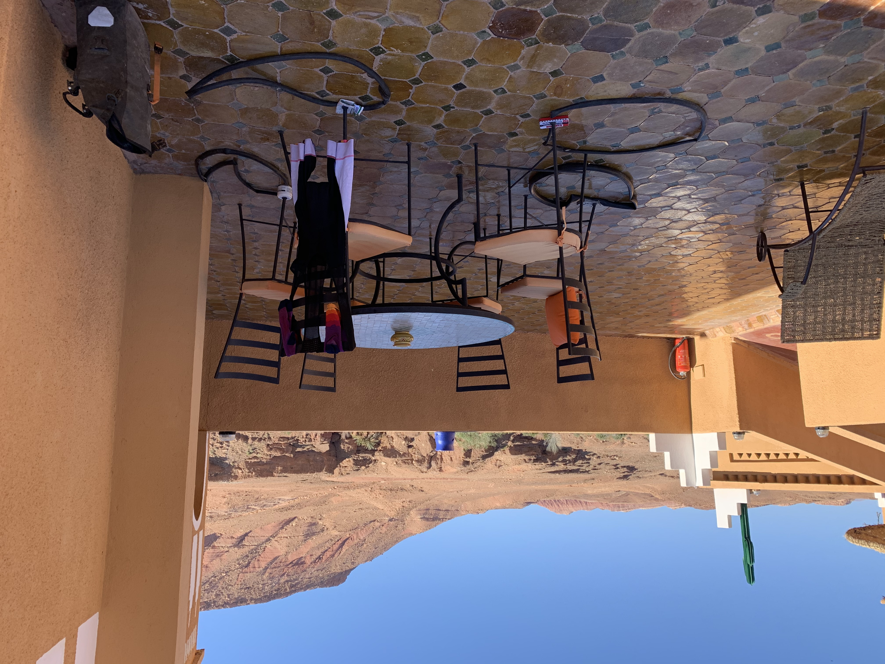
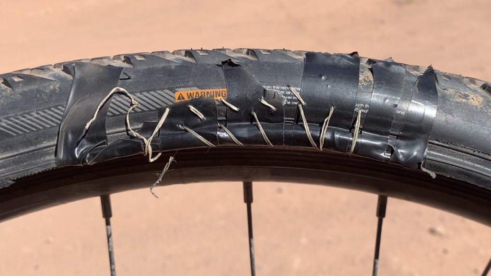
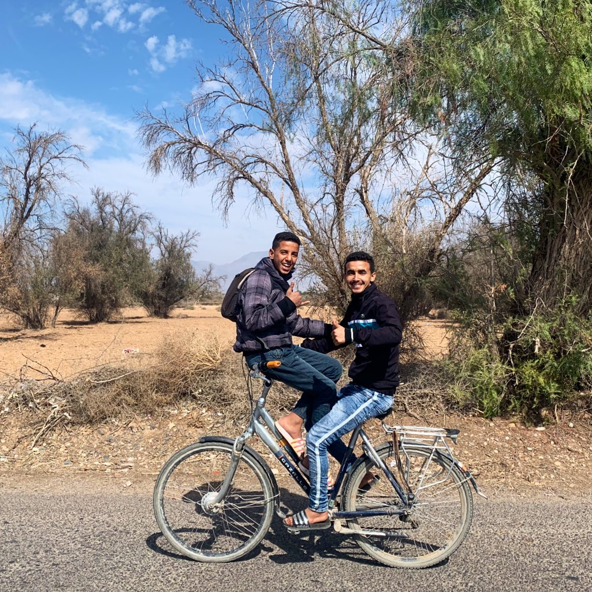

I cycled from Bristol to Morocco, and back at the end of 2019 and early 2020. Why? 

After my [stupid achilles injury](/2019/stupid-achilles-injury/) that took up most of autumn 2019, I did a few little trips, like [taking a bike I'd auctioned](/2020/charity-bike-delivery-paris/) for the reforestation fundraiser from Bristol to Paris. Then I snuck off for a ride through south Wales, up the east coast of Ireland, through north Wales, and back down to Bristol in time for Christmas. 

<!-- https://www.instagram.com/p/B5iYy_qFnin -->

Wales is stunning and ridiculous, and it was amazing to be exploring Ireland for the first time, but it wasn't the best time of year to be doing it. I'd been rained on every single day since crossing the Severn Bridge. I would dry my socks off on open fires in lovely countryside pubs at lunch, only to have them soak through before I was back on the bike. 

<!-- https://www.instagram.com/p/B5NXoiPlLoS -->

I needed a change of scenery, and a change of weather, so as soon as Christmas was over I set off south, wondering if I could get to Morocco. I jumped on a ferry from Portsmouth to Le Havre, France, took a few electric trains to the Spanish border, cycled through north Spain (accompanied with [Heidi](https://www.instagram.com/heidiridesbikes/) for a bit!) to the north east corner of North Portugal, wound my way down the coast, and got to Gibraltar. I bought the only big-tread tires in the country, cycled down a motorway to get to Alicante just in time for another ferry, and BAM, we're in Africa! 

I'd had some sort of vague plan of what to do when I got there that involved cycling along the north coast, but I'd been talked out of that by a few folks saying it wasn't where the best scenery is. I knew the Atlas Mountain's were good, I'd heard about the race, but somebody pointed out the race was starting IN A FEW DAYS and they thought I was there for it? Bahaha! 

So, what to do? Ride around somewhere a bit crap, or jump on another train, get down to Marakkesh, see if I can meet any of these heros, then go womble around the mountains with my overly loaded 4-pannier setup solo? Why not! 

I got to Marakkesh the day before the race. It was amazing to be in such a weird and wonderful place, but see folks on amazing bike-packing rigs ride by. I cheered and heckled every rider I saw go by, including one pair in Lederhosen! One chap, [Adrien Liechti](https://www.instagram.com/adrien__liechti/) even came over to find out what the noise was all about, and joined me and a local friend for dinner. I had 32957501748 questions for him and he was super chill about answering them all.

On my way home to Riad (hotel type thing) in the Medina, I was followed and cornered by some teenagers. I had to shove them and run, because I was carrying enough money for the week in the mountains. I got away fine, but it meant I didn't focus on prepping the bike as much as I should have. This is pretty rare, but does happen in the Medina. I'd recommend visiting it in the day, but sleeping elsewhere.

The next morning I was up a little late, but I'd been told where the start line is (thanks [Chas](https://www.instagram.com/notchas/)!) so I went to wave folks off. As I got to the area I heard a claxon and saw riders HAULING ASS! 

I jumped on the back for a natter and figured I'd follow along until it got climby and everyone left my pannier-hauling idiot ass in the dust. Seeing as I wasn't pacing myself for a 5-7 day race through rough terrain, I was able to keep up with folks until lunch. I kept riding, and kept chatting to awesome people. 

The route was some of the most amazing terrain. Fun, flowy, mixtures of gravel, dirt, scree, going through little villages, and past a lot of hamlets with excited kids rushing out to the road to high five as many of the strangers as they could. 

I heard one _ass-hole_ rider say "I'm not touching those kids, they're dirty." and at that point I made it my life goal to high-five not just _lots_ of them, but _every single kid_ got a high-five. Even if I was knackered. Even if I could barely keep my bike straight on the rocks. Even if they were stood on a 12% climb. I high-fived the shit out of some kids, including one who stood on a big downhill section; we both almost cried after making contact at 30mph. 🤣

It was all giggles, nattering, heckling, high fiving, rock dodging, hard climbing, chocolate & bread eating, tea drinking good times until one particular rough descent, that came after a slogfest of a climb. I was running tubes after months of [trouble with tubeless](/2019/touring-tubeless/), and that's just not right for this trip. I went too hard, got a puncture, and then everything went to shit.

## How Many Tyre Levers You Got

I was hanging in the middle of the race with the folks going quick but not trying to compete, but this puncture put me riiiight at the back. Big whoop baby got a wittle puncture. So what? 

I replaced the tube, wrestled some with the tyre because these ones I got in Gibraltar had been sat in storage for god knows how long, and they were a dick to get on and off. The tube I eventually put in _already had a hole in it_, which is the sort of shit you get when you've been touring for two months in nonsense terrain _before_ you tag along on the Atlas Mountain Race.

Ok, get that one off, let's put another tube in. Got that in, putting the tyre back on using the lever and... OH FUCK the plastic lever breaks, putting a hole in the inner tube. I know have 3 dead tubes. Great. The whole time I'm sticking patches on these tubes, hoping they'll dry quick enough for me to use, and some of them just aren't taking the patch. Dunno if too hot, or glue is bad, or what, but none of them were working.

Anyway, I put one of my remaining two fresh tubes in, and the valve snaps. I am not a ham fisted oaf I don't know how the fuck that happened, but I scrabble around the bike for a while looking for my valve core remover and I swap the valve with another tyre, and eventually, after snapping a few more tyre levers, I get back going again. 

The whole time I was doing this I was five meters from a shepard girl, sat up in the mountains a mile from the nearest little village. At first was watching me intently, thinking the whole thing was hilarious, but when I started getting angry and shouting at the bike, she whipped out her iPhone and started streaming music videos instead.

Anyway, one spare tube means I should probably call this a day, pootle off to the nearest accommodation, and sort my life out a bit. Thanks for having me guys, bye.

<blockquote class="instagram-media" data-instgrm-permalink="https://www.instagram.com/p/B-9sk3LloVg/?utm_source=ig_embed&amp;utm_campaign=loading" data-instgrm-version="12" style=" background:#FFF; border:0; border-radius:3px; box-shadow:0 0 1px 0 rgba(0,0,0,0.5),0 1px 10px 0 rgba(0,0,0,0.15); margin: 1px; max-width:540px; min-width:326px; padding:0; width:99.375%; width:-webkit-calc(100% - 2px); width:calc(100% - 2px);">
 <a href="https://www.instagram.com/p/B-9sk3LloVg/?utm_source=ig_embed&amp;utm_campaign=loading" style=" background:#FFFFFF; line-height:0; padding:0 0; text-align:center; text-decoration:none; width:100%;" target="_blank"> 
 

 
 

 

 
<svg width="50px" height="50px" viewBox="0 0 60 60" version="1.1" xmlns="https://www.w3.org/2000/svg" xmlns:xlink="https://www.w3.org/1999/xlink"><g stroke="none" stroke-width="1" fill="none" fill-rule="evenodd"><g transform="translate(-511.000000, -20.000000)" fill="#000000"><g><path d="M556.869,30.41 C554.814,30.41 553.148,32.076 553.148,34.131 C553.148,36.186 554.814,37.852 556.869,37.852 C558.924,37.852 560.59,36.186 560.59,34.131 C560.59,32.076 558.924,30.41 556.869,30.41 M541,60.657 C535.114,60.657 530.342,55.887 530.342,50 C530.342,44.114 535.114,39.342 541,39.342 C546.887,39.342 551.658,44.114 551.658,50 C551.658,55.887 546.887,60.657 541,60.657 M541,33.886 C532.1,33.886 524.886,41.1 524.886,50 C524.886,58.899 532.1,66.113 541,66.113 C549.9,66.113 557.115,58.899 557.115,50 C557.115,41.1 549.9,33.886 541,33.886 M565.378,62.101 C565.244,65.022 564.756,66.606 564.346,67.663 C563.803,69.06 563.154,70.057 562.106,71.106 C561.058,72.155 560.06,72.803 558.662,73.347 C557.607,73.757 556.021,74.244 553.102,74.378 C549.944,74.521 548.997,74.552 541,74.552 C533.003,74.552 532.056,74.521 528.898,74.378 C525.979,74.244 524.393,73.757 523.338,73.347 C521.94,72.803 520.942,72.155 519.894,71.106 C518.846,70.057 518.197,69.06 517.654,67.663 C517.244,66.606 516.755,65.022 516.623,62.101 C516.479,58.943 516.448,57.996 516.448,50 C516.448,42.003 516.479,41.056 516.623,37.899 C516.755,34.978 517.244,33.391 517.654,32.338 C518.197,30.938 518.846,29.942 519.894,28.894 C520.942,27.846 521.94,27.196 523.338,26.654 C524.393,26.244 525.979,25.756 528.898,25.623 C532.057,25.479 533.004,25.448 541,25.448 C548.997,25.448 549.943,25.479 553.102,25.623 C556.021,25.756 557.607,26.244 558.662,26.654 C560.06,27.196 561.058,27.846 562.106,28.894 C563.154,29.942 563.803,30.938 564.346,32.338 C564.756,33.391 565.244,34.978 565.378,37.899 C565.522,41.056 565.552,42.003 565.552,50 C565.552,57.996 565.522,58.943 565.378,62.101 M570.82,37.631 C570.674,34.438 570.167,32.258 569.425,30.349 C568.659,28.377 567.633,26.702 565.965,25.035 C564.297,23.368 562.623,22.342 560.652,21.575 C558.743,20.834 556.562,20.326 553.369,20.18 C550.169,20.033 549.148,20 541,20 C532.853,20 531.831,20.033 528.631,20.18 C525.438,20.326 523.257,20.834 521.349,21.575 C519.376,22.342 517.703,23.368 516.035,25.035 C514.368,26.702 513.342,28.377 512.574,30.349 C511.834,32.258 511.326,34.438 511.181,37.631 C511.035,40.831 511,41.851 511,50 C511,58.147 511.035,59.17 511.181,62.369 C511.326,65.562 511.834,67.743 512.574,69.651 C513.342,71.625 514.368,73.296 516.035,74.965 C517.703,76.634 519.376,77.658 521.349,78.425 C523.257,79.167 525.438,79.673 528.631,79.82 C531.831,79.965 532.853,80.001 541,80.001 C549.148,80.001 550.169,79.965 553.369,79.82 C556.562,79.673 558.743,79.167 560.652,78.425 C562.623,77.658 564.297,76.634 565.965,74.965 C567.633,73.296 568.659,71.625 569.425,69.651 C570.167,67.743 570.674,65.562 570.82,62.369 C570.966,59.17 571,58.147 571,50 C571,41.851 570.966,40.831 570.82,37.631"></path></g></g></g></svg>

 
 View this post on Instagram

 

 

 

 

 

 

 

 

 

 
 

 

</a>
<a href="https://www.instagram.com/p/B-9sk3LloVg/?utm_source=ig_embed&amp;utm_campaign=loading" style=" color:#c9c8cd; font-family:Arial,sans-serif; font-size:14px; font-style:normal; font-weight:normal; line-height:17px; text-decoration:none;" target="_blank">A post shared by PEdALED Atlas Mountain Race (@atlasmountainrace)</a> on <time style=" font-family:Arial,sans-serif; font-size:14px; line-height:17px;" datetime="2020-04-14T14:05:52+00:00">Apr 14, 2020 at 7:05am PDT</time>

</blockquote>

The nearest hotel was, unfortunately, over the biggest climb on the Atlas Mountain Race. This [Strava activity](https://www.strava.com/activities/3106344649) shows how far I made it before my electronics died (dynamo hub is no good when you're pushing up a hill for hours). With four panniers I try and keep below 1,500 meters climbing in a day, but we were on ~3,000 meters and there was more to go.

<iframe height='405' width='590' frameborder='0' allowtransparency='true' scrolling='no' src='https://www.strava.com/activities/3106344649/embed/86e3cecf7cc3be2d00b2eccdf71e5052efcfeb6a'></iframe>

It was dark, cold, I'd run out of water after passing several streams and thinking "I'll filter at the next one." but there was no next one... I met another Brit, and older chap, who was also on the struggle bus, but keeping his shit together better than me. He said "Initially I was focused on completing the race, but now I'm just trying to stay alive!" I said "Let's try and stay alive together." 🤣  I gave him some food, he gave me some water, and our British jokecomplaints kept each other going through it all.

The gravel was so loose and steep that we had no choice put to push often. We'd get on our bikes, ride the flat part of the switchback, then push the corners, and repeat. 

In all it took about 4-5 hours, and I have never been so physically drained. I kept wanting to sit down for a while, then I thought about scorpions, so I'd get back up, draped over the bike, and dig a little more reserve energy out of nowhere. All I could think of was getting to the top, and enjoying the roll down from the 2,600m peak...

<blockquote class="instagram-media" data-instgrm-captioned data-instgrm-permalink="https://www.instagram.com/p/B8nQN0yIpty/?utm_source=ig_embed&amp;utm_campaign=loading" data-instgrm-version="12" style=" background:#FFF; border:0; border-radius:3px; box-shadow:0 0 1px 0 rgba(0,0,0,0.5),0 1px 10px 0 rgba(0,0,0,0.15); margin: 1px; max-width:540px; min-width:326px; padding:0; width:99.375%; width:-webkit-calc(100% - 2px); width:calc(100% - 2px);">
 <a href="https://www.instagram.com/p/B8nQN0yIpty/?utm_source=ig_embed&amp;utm_campaign=loading" style=" background:#FFFFFF; line-height:0; padding:0 0; text-align:center; text-decoration:none; width:100%;" target="_blank"> 
 

 
 

 

 
<svg width="50px" height="50px" viewBox="0 0 60 60" version="1.1" xmlns="https://www.w3.org/2000/svg" xmlns:xlink="https://www.w3.org/1999/xlink"><g stroke="none" stroke-width="1" fill="none" fill-rule="evenodd"><g transform="translate(-511.000000, -20.000000)" fill="#000000"><g><path d="M556.869,30.41 C554.814,30.41 553.148,32.076 553.148,34.131 C553.148,36.186 554.814,37.852 556.869,37.852 C558.924,37.852 560.59,36.186 560.59,34.131 C560.59,32.076 558.924,30.41 556.869,30.41 M541,60.657 C535.114,60.657 530.342,55.887 530.342,50 C530.342,44.114 535.114,39.342 541,39.342 C546.887,39.342 551.658,44.114 551.658,50 C551.658,55.887 546.887,60.657 541,60.657 M541,33.886 C532.1,33.886 524.886,41.1 524.886,50 C524.886,58.899 532.1,66.113 541,66.113 C549.9,66.113 557.115,58.899 557.115,50 C557.115,41.1 549.9,33.886 541,33.886 M565.378,62.101 C565.244,65.022 564.756,66.606 564.346,67.663 C563.803,69.06 563.154,70.057 562.106,71.106 C561.058,72.155 560.06,72.803 558.662,73.347 C557.607,73.757 556.021,74.244 553.102,74.378 C549.944,74.521 548.997,74.552 541,74.552 C533.003,74.552 532.056,74.521 528.898,74.378 C525.979,74.244 524.393,73.757 523.338,73.347 C521.94,72.803 520.942,72.155 519.894,71.106 C518.846,70.057 518.197,69.06 517.654,67.663 C517.244,66.606 516.755,65.022 516.623,62.101 C516.479,58.943 516.448,57.996 516.448,50 C516.448,42.003 516.479,41.056 516.623,37.899 C516.755,34.978 517.244,33.391 517.654,32.338 C518.197,30.938 518.846,29.942 519.894,28.894 C520.942,27.846 521.94,27.196 523.338,26.654 C524.393,26.244 525.979,25.756 528.898,25.623 C532.057,25.479 533.004,25.448 541,25.448 C548.997,25.448 549.943,25.479 553.102,25.623 C556.021,25.756 557.607,26.244 558.662,26.654 C560.06,27.196 561.058,27.846 562.106,28.894 C563.154,29.942 563.803,30.938 564.346,32.338 C564.756,33.391 565.244,34.978 565.378,37.899 C565.522,41.056 565.552,42.003 565.552,50 C565.552,57.996 565.522,58.943 565.378,62.101 M570.82,37.631 C570.674,34.438 570.167,32.258 569.425,30.349 C568.659,28.377 567.633,26.702 565.965,25.035 C564.297,23.368 562.623,22.342 560.652,21.575 C558.743,20.834 556.562,20.326 553.369,20.18 C550.169,20.033 549.148,20 541,20 C532.853,20 531.831,20.033 528.631,20.18 C525.438,20.326 523.257,20.834 521.349,21.575 C519.376,22.342 517.703,23.368 516.035,25.035 C514.368,26.702 513.342,28.377 512.574,30.349 C511.834,32.258 511.326,34.438 511.181,37.631 C511.035,40.831 511,41.851 511,50 C511,58.147 511.035,59.17 511.181,62.369 C511.326,65.562 511.834,67.743 512.574,69.651 C513.342,71.625 514.368,73.296 516.035,74.965 C517.703,76.634 519.376,77.658 521.349,78.425 C523.257,79.167 525.438,79.673 528.631,79.82 C531.831,79.965 532.853,80.001 541,80.001 C549.148,80.001 550.169,79.965 553.369,79.82 C556.562,79.673 558.743,79.167 560.652,78.425 C562.623,77.658 564.297,76.634 565.965,74.965 C567.633,73.296 568.659,71.625 569.425,69.651 C570.167,67.743 570.674,65.562 570.82,62.369 C570.966,59.17 571,58.147 571,50 C571,41.851 570.966,40.831 570.82,37.631"></path></g></g></g></svg>

 
 View this post on Instagram

 

 

 

 

 

 

 

 

 

</a> 
 <a href="https://www.instagram.com/p/B8nQN0yIpty/?utm_source=ig_embed&amp;utm_campaign=loading" style=" color:#000; font-family:Arial,sans-serif; font-size:14px; font-style:normal; font-weight:normal; line-height:17px; text-decoration:none; word-wrap:break-word;" target="_blank">Some miles are tougher than others. While many riders aready had to dismount their bikes on the ascent of Telouet Pass, the other side delivered some pretty gnarly hike-a-bike - - - 📷 @saltlake_lian @pedaledjapan @canyon @komoot @fizikofficial - #AMR2020 #bikeracemorroco #cyclingadventure #bikepacking #atlasmountainrace #trailslikethese #cyclingmorroco #adventurebybike #mountainbiking #ultracycling #cyclinglife</a>
 
A post shared by <a href="https://www.instagram.com/atlasmountainrace/?utm_source=ig_embed&amp;utm_campaign=loading" style=" color:#c9c8cd; font-family:Arial,sans-serif; font-size:14px; font-style:normal; font-weight:normal; line-height:17px;" target="_blank"> PEdALED Atlas Mountain Race</a> (@atlasmountainrace) on <time style=" font-family:Arial,sans-serif; font-size:14px; line-height:17px;" datetime="2020-02-16T03:51:58+00:00">Feb 15, 2020 at 7:51pm PST</time>

</blockquote>

NOPE! This shit was hike-a-bike all the way down. It was basically a donkey trail, which would have only been ridable by 1% of cyclists in the day, but at night? It was 10pm when we got to the top, but it took maybe 3 hours to get down that mess in the dark.

We pushed, carried, lowered, and heaved our bikes up and down steep rocks, through dry river beds, amongst cacti... I fell over 100 times, and spent the whole time wishing I didn't have panniers on the bike. They caught every rock, cactus, and made tricky passes even tricker. There's a reason my bike was the only bike that looked like this. It made me remember "Oh yeah, I was going to find somewhere to stash half my shit so the mountains would be easier!" but of course that can go on the list with all the other things I didn't do. Turning up the night before and getting jumped really threw a spanner in the works.

Eventually, after god knows how long, we made it to Checkpoint One. We were greeted by amazing friendly volunteers. They all laughed when I told them I'd tagged along and wasn't part of the race, but said I was very welcome to stay with them. I had an amazing dinner at a restaurant that was staying open late for the race, and got into the hut to sleep, whipping out the sleeping bag & pad to sleep on the floor next to maybe 30 other racers. It was heaven and I never slept that well.

## Escaping the Atlas Mountains

The next day I wanted to get to the nearest hotel, drink wine for two days straight, and recover from my stupid bike, stupid gear, unfit useless ass, tagalong misadventure. I found a hotel with a bar in it (not always a thing in Morocco as it is supposed to be a dry country), and after saying my thank yous and goodbyes at CP1 I tried to turn off the route.

The Police appeared from nowhere and tried sending off the nice downhill road, and up a gravel mountain pass. I almost cried. "No, I would like to go this way!" They didn't understand, they pointing me up the scary ass mountain. I explained "I am quitting the race. Je suis fatigue. Je suis malade!" and the French helped it happen. "If there's just one person, you may go..." There's no restrictions on cycling up there, they probably just didn't want anyone getting lost, but the last thing I wanted was to go back into the nothing with only one spare and low on food.

I cycled for a whole two minutes until I saw a cafe. I talked to the guy in French a while until he noticed I was English, and he was so excited! The cafe guy lived in Brighton for a while, and didn't get to practice his English often. We talked about life and the world for about an hour whilst he made me several cheese omelettes, and I couldn't be happier that life was returning to normal, and I could just ride through beautiful valleys.

Staring off at the mud homes, intricate permiculture directing what little water they had left into fields, and stunning rock formations, meant I hit a pothole and popped another tube... Hiding under a rock in the midday sun I swapped it out, wrestled with the shit tyres some more, and eventually snapped my 4th and final lever, meaning, you guessed it, I popped that final remaining tube, and now I am fucked.

I sat under that rock for about 30 minutes holding patches on two tubes, trying to get them to stick, and eventually a truck with two lovely local chaps stopped, and they heaved my bike into the back for me.

<blockquote class="instagram-media" data-instgrm-permalink="https://www.instagram.com/p/B8oavv5FMY3/?utm_source=ig_embed&amp;utm_campaign=loading" data-instgrm-version="12" style=" background:#FFF; border:0; border-radius:3px; box-shadow:0 0 1px 0 rgba(0,0,0,0.5),0 1px 10px 0 rgba(0,0,0,0.15); margin: 1px; max-width:540px; min-width:326px; padding:0; width:99.375%; width:-webkit-calc(100% - 2px); width:calc(100% - 2px);">
 <a href="https://www.instagram.com/p/B8oavv5FMY3/?utm_source=ig_embed&amp;utm_campaign=loading" style=" background:#FFFFFF; line-height:0; padding:0 0; text-align:center; text-decoration:none; width:100%;" target="_blank"> 
 

 
 

 

 
<svg width="50px" height="50px" viewBox="0 0 60 60" version="1.1" xmlns="https://www.w3.org/2000/svg" xmlns:xlink="https://www.w3.org/1999/xlink"><g stroke="none" stroke-width="1" fill="none" fill-rule="evenodd"><g transform="translate(-511.000000, -20.000000)" fill="#000000"><g><path d="M556.869,30.41 C554.814,30.41 553.148,32.076 553.148,34.131 C553.148,36.186 554.814,37.852 556.869,37.852 C558.924,37.852 560.59,36.186 560.59,34.131 C560.59,32.076 558.924,30.41 556.869,30.41 M541,60.657 C535.114,60.657 530.342,55.887 530.342,50 C530.342,44.114 535.114,39.342 541,39.342 C546.887,39.342 551.658,44.114 551.658,50 C551.658,55.887 546.887,60.657 541,60.657 M541,33.886 C532.1,33.886 524.886,41.1 524.886,50 C524.886,58.899 532.1,66.113 541,66.113 C549.9,66.113 557.115,58.899 557.115,50 C557.115,41.1 549.9,33.886 541,33.886 M565.378,62.101 C565.244,65.022 564.756,66.606 564.346,67.663 C563.803,69.06 563.154,70.057 562.106,71.106 C561.058,72.155 560.06,72.803 558.662,73.347 C557.607,73.757 556.021,74.244 553.102,74.378 C549.944,74.521 548.997,74.552 541,74.552 C533.003,74.552 532.056,74.521 528.898,74.378 C525.979,74.244 524.393,73.757 523.338,73.347 C521.94,72.803 520.942,72.155 519.894,71.106 C518.846,70.057 518.197,69.06 517.654,67.663 C517.244,66.606 516.755,65.022 516.623,62.101 C516.479,58.943 516.448,57.996 516.448,50 C516.448,42.003 516.479,41.056 516.623,37.899 C516.755,34.978 517.244,33.391 517.654,32.338 C518.197,30.938 518.846,29.942 519.894,28.894 C520.942,27.846 521.94,27.196 523.338,26.654 C524.393,26.244 525.979,25.756 528.898,25.623 C532.057,25.479 533.004,25.448 541,25.448 C548.997,25.448 549.943,25.479 553.102,25.623 C556.021,25.756 557.607,26.244 558.662,26.654 C560.06,27.196 561.058,27.846 562.106,28.894 C563.154,29.942 563.803,30.938 564.346,32.338 C564.756,33.391 565.244,34.978 565.378,37.899 C565.522,41.056 565.552,42.003 565.552,50 C565.552,57.996 565.522,58.943 565.378,62.101 M570.82,37.631 C570.674,34.438 570.167,32.258 569.425,30.349 C568.659,28.377 567.633,26.702 565.965,25.035 C564.297,23.368 562.623,22.342 560.652,21.575 C558.743,20.834 556.562,20.326 553.369,20.18 C550.169,20.033 549.148,20 541,20 C532.853,20 531.831,20.033 528.631,20.18 C525.438,20.326 523.257,20.834 521.349,21.575 C519.376,22.342 517.703,23.368 516.035,25.035 C514.368,26.702 513.342,28.377 512.574,30.349 C511.834,32.258 511.326,34.438 511.181,37.631 C511.035,40.831 511,41.851 511,50 C511,58.147 511.035,59.17 511.181,62.369 C511.326,65.562 511.834,67.743 512.574,69.651 C513.342,71.625 514.368,73.296 516.035,74.965 C517.703,76.634 519.376,77.658 521.349,78.425 C523.257,79.167 525.438,79.673 528.631,79.82 C531.831,79.965 532.853,80.001 541,80.001 C549.148,80.001 550.169,79.965 553.369,79.82 C556.562,79.673 558.743,79.167 560.652,78.425 C562.623,77.658 564.297,76.634 565.965,74.965 C567.633,73.296 568.659,71.625 569.425,69.651 C570.167,67.743 570.674,65.562 570.82,62.369 C570.966,59.17 571,58.147 571,50 C571,41.851 570.966,40.831 570.82,37.631"></path></g></g></g></svg>

 
 View this post on Instagram

 

 

 

 

 

 

 

 

 

 
 

 

</a>
<a href="https://www.instagram.com/p/B8oavv5FMY3/?utm_source=ig_embed&amp;utm_campaign=loading" style=" color:#c9c8cd; font-family:Arial,sans-serif; font-size:14px; font-style:normal; font-weight:normal; line-height:17px; text-decoration:none;" target="_blank">A post shared by Phil Sturgeon (@philsturgeon)</a> on <time style=" font-family:Arial,sans-serif; font-size:14px; line-height:17px;" datetime="2020-02-16T16:21:37+00:00">Feb 16, 2020 at 8:21am PST</time>

</blockquote>

They dropped me off at my hotel, I had a great two days doing fuck all, hiking along a dry river bed, and turned the whole roof terrace into a tube-patch party!

Finally I got my shit together, and decided to head to the coast. Lots more big climbs and fun valleys, but mostly sticking to roads so I could survive.

## Dental Floss Stitches

Of course nothing is ever that simple. After a few days of riding, with only one more day until I hit Agadir, the tyre I'd been wrestling with the most started to disintegrate. The wire that makes the bead and the rubber that holds it on started to separate, chomping through my freshly fixed tubes. It was supposed to be a 2,000m descent to the coast but instead I was stopping every few kilometers to try various hacks, and eventually this one did the trick.

Dental floss for the win! I rode this for only 8km until I happened across a bike shop in a mountain village, which was wild. I could have gone for 100km and not found anything up there. 

I wasn't the only one in Morocco sowing his tyre up, one of the Atlas Mountain Racers mentioned having to do the same thing in the _"[Into the Rift](https://www.youtube.com/watch?v=e5k5ayE9iqU)"_ documentary. 

It was mad, but I got some new tyres, road to the coast, got a connection back to Marakkesh, a train to Tangier, a boat to Barcelona, and cycled back to England through a vicious storm just in time for COVID-19 lock-down, where I spent the next 3 months living on a farm as bike nomad Phil had nowhere else to go. Life is weird!

<blockquote class="instagram-media" data-instgrm-captioned data-instgrm-permalink="https://www.instagram.com/p/CANTkGLARgG/?utm_source=ig_embed&amp;utm_campaign=loading" data-instgrm-version="12" style=" background:#FFF; border:0; border-radius:3px; box-shadow:0 0 1px 0 rgba(0,0,0,0.5),0 1px 10px 0 rgba(0,0,0,0.15); margin: 1px; max-width:540px; min-width:326px; padding:0; width:99.375%; width:-webkit-calc(100% - 2px); width:calc(100% - 2px);">
 <a href="https://www.instagram.com/p/CANTkGLARgG/?utm_source=ig_embed&amp;utm_campaign=loading" style=" background:#FFFFFF; line-height:0; padding:0 0; text-align:center; text-decoration:none; width:100%;" target="_blank"> 
 

 
 

 

 
<svg width="50px" height="50px" viewBox="0 0 60 60" version="1.1" xmlns="https://www.w3.org/2000/svg" xmlns:xlink="https://www.w3.org/1999/xlink"><g stroke="none" stroke-width="1" fill="none" fill-rule="evenodd"><g transform="translate(-511.000000, -20.000000)" fill="#000000"><g><path d="M556.869,30.41 C554.814,30.41 553.148,32.076 553.148,34.131 C553.148,36.186 554.814,37.852 556.869,37.852 C558.924,37.852 560.59,36.186 560.59,34.131 C560.59,32.076 558.924,30.41 556.869,30.41 M541,60.657 C535.114,60.657 530.342,55.887 530.342,50 C530.342,44.114 535.114,39.342 541,39.342 C546.887,39.342 551.658,44.114 551.658,50 C551.658,55.887 546.887,60.657 541,60.657 M541,33.886 C532.1,33.886 524.886,41.1 524.886,50 C524.886,58.899 532.1,66.113 541,66.113 C549.9,66.113 557.115,58.899 557.115,50 C557.115,41.1 549.9,33.886 541,33.886 M565.378,62.101 C565.244,65.022 564.756,66.606 564.346,67.663 C563.803,69.06 563.154,70.057 562.106,71.106 C561.058,72.155 560.06,72.803 558.662,73.347 C557.607,73.757 556.021,74.244 553.102,74.378 C549.944,74.521 548.997,74.552 541,74.552 C533.003,74.552 532.056,74.521 528.898,74.378 C525.979,74.244 524.393,73.757 523.338,73.347 C521.94,72.803 520.942,72.155 519.894,71.106 C518.846,70.057 518.197,69.06 517.654,67.663 C517.244,66.606 516.755,65.022 516.623,62.101 C516.479,58.943 516.448,57.996 516.448,50 C516.448,42.003 516.479,41.056 516.623,37.899 C516.755,34.978 517.244,33.391 517.654,32.338 C518.197,30.938 518.846,29.942 519.894,28.894 C520.942,27.846 521.94,27.196 523.338,26.654 C524.393,26.244 525.979,25.756 528.898,25.623 C532.057,25.479 533.004,25.448 541,25.448 C548.997,25.448 549.943,25.479 553.102,25.623 C556.021,25.756 557.607,26.244 558.662,26.654 C560.06,27.196 561.058,27.846 562.106,28.894 C563.154,29.942 563.803,30.938 564.346,32.338 C564.756,33.391 565.244,34.978 565.378,37.899 C565.522,41.056 565.552,42.003 565.552,50 C565.552,57.996 565.522,58.943 565.378,62.101 M570.82,37.631 C570.674,34.438 570.167,32.258 569.425,30.349 C568.659,28.377 567.633,26.702 565.965,25.035 C564.297,23.368 562.623,22.342 560.652,21.575 C558.743,20.834 556.562,20.326 553.369,20.18 C550.169,20.033 549.148,20 541,20 C532.853,20 531.831,20.033 528.631,20.18 C525.438,20.326 523.257,20.834 521.349,21.575 C519.376,22.342 517.703,23.368 516.035,25.035 C514.368,26.702 513.342,28.377 512.574,30.349 C511.834,32.258 511.326,34.438 511.181,37.631 C511.035,40.831 511,41.851 511,50 C511,58.147 511.035,59.17 511.181,62.369 C511.326,65.562 511.834,67.743 512.574,69.651 C513.342,71.625 514.368,73.296 516.035,74.965 C517.703,76.634 519.376,77.658 521.349,78.425 C523.257,79.167 525.438,79.673 528.631,79.82 C531.831,79.965 532.853,80.001 541,80.001 C549.148,80.001 550.169,79.965 553.369,79.82 C556.562,79.673 558.743,79.167 560.652,78.425 C562.623,77.658 564.297,76.634 565.965,74.965 C567.633,73.296 568.659,71.625 569.425,69.651 C570.167,67.743 570.674,65.562 570.82,62.369 C570.966,59.17 571,58.147 571,50 C571,41.851 570.966,40.831 570.82,37.631"></path></g></g></g></svg>

 
 View this post on Instagram

 

 

 

 

 

 

 

 

 

</a> 
 <a href="https://www.instagram.com/p/CANTkGLARgG/?utm_source=ig_embed&amp;utm_campaign=loading" style=" color:#000; font-family:Arial,sans-serif; font-size:14px; font-style:normal; font-weight:normal; line-height:17px; text-decoration:none; word-wrap:break-word;" target="_blank">If you work hard, focus, and practice practice practice, you too can achieve you dreams! 🤣 #justgonnasendit #bikelife p.s before and after this I smashed myself in. 📹 @batesyboy2008</a>
 
A post shared by <a href="https://www.instagram.com/philsturgeon/?utm_source=ig_embed&amp;utm_campaign=loading" style=" color:#c9c8cd; font-family:Arial,sans-serif; font-size:14px; font-style:normal; font-weight:normal; line-height:17px;" target="_blank"> Phil Sturgeon</a> (@philsturgeon) on <time style=" font-family:Arial,sans-serif; font-size:14px; line-height:17px;" datetime="2020-05-15T12:08:54+00:00">May 15, 2020 at 5:08am PDT</time>

</blockquote>

I've spent the last six months really missing that trip. It was short but sweet. The people there are full of joy and kindness. If they aren't inviting you to come drink tea and chat, they're doing something awesome like this.

I want to go back, and... it just so happens

## Let's Race in 2021

Registration for AMR 2021 opened TODAY, October 2nd 2020, and [the next Atlas Mountain Race is February 6th, 2021](https://silkroad.advntr.cc/event/amr). If you read through all of this, the race manual, and decide you're up for the task, you should sign up and see if you get approved. I have, and I hope I get selected! 

If you'd like more insight into the Atlas Mountain Race than this wonky rambling blog post, there is a [brilliant podcast](https://atlasmountainrace.cc/podcast-2020/) made by [Stefano aka "Calamaro"](https://www.instagram.com/calamarocc/) who was recording the podcast, popping up to crack jokes and make tired people smile.

For years I've thought that ultra-distance racing in extreme locations like this is for _other people_, but I met so many folks of all ages, shapes, and sizes, that I now know I was wrong. AMR is for anyone. It's for you, me, a 68 year old, a couple that only recently got into bike-packing, everyone who can think logically through extreme situations.

If you're in the UK maybe we can head down there together, taking trains and [bike-friendly ferries](/2019/ferries/) instead of [kicking the planet in the face with flights](https://ecologi.com/articles/climate-emergency/flight-free-holidays-a-practical-guide). 
