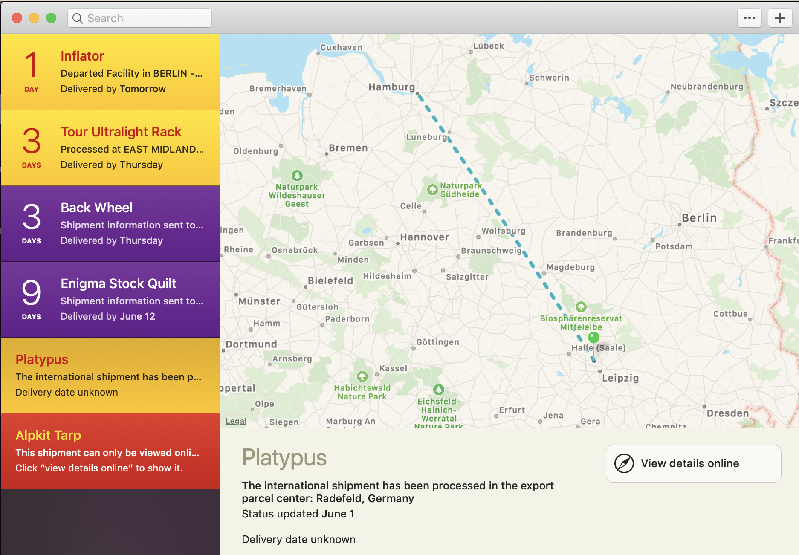

When I started out in Spain there was just one shop in town which had a rack: a
big heavy steel bastard, and just the one panier which was junk, it would come
flying off at the slightest bump. Worse than that, the mechanic at that bike
shop was truing my wheel and let me know why wheels "will not last much longer",
due to substantial braking surface wear. Thanks a bunch Canary Islands! 😅

At first I hoped to find what I needed along the way, but not many bike shops
have bike-packing kit, dynos, batteries, or other niche items, due to other
priorities for stocking.

Ordering online is usually how you solve that problem, but how do you get things
delivered when you are on the move 6 or 7 days out of the week? I gave up booking
hotels more than 24 hours out, it's usually booked on the day based on how far I got
in the morning, so... what to do?

## Friends

I'm pretty lucky to have some friends spread about Europe. A few folks who
offered me a place to crash got roped into helping out.

I was invited to speak at a computers meetup in Barcelona, so I shipped my bike
packing bags to the organizers office and he brought them to the meetup!
Bahahaha. It's cheeky but he understood, he'd done a similar trip in the past.

A friend came to Nice and we traded frame water-bottles, her small bottle which
fit under my frame bag for my giant heavy insulated CamelPak, and I even gave
her some bike parts and electronics I didn't need. My bags felt noticeably
lighter!

## Bike Shops

I had a dyno front wheel built up in the UK and it was heading to my mate in
Zürich, but it got really delayed due to the rims being out of stock. I could
have stayed put for a week, but that seemed a bit excessive. Instead I picked a
random town that was about a week away, emailed a few bike shops, and asked them
if they would be ok accepting the delivery.

A few folks said yes so I picked [der
fahrradladen](https://www.fahrrad-saar.de/), and they were awesome. Not only did
they not charge me anything, they looked confused when I tried to give them
money as a thank you.

> I don't understand. We did not to any work, we just signed for the package.
>
> \- Nice German Bike Shop Man

Got them to setup the wheel tubeless and gave them a big tip, job done!

## Mailbox

In the States I pay $20 a month for an address with [Traveling
Mailbox](https://travelingmailbox.com), which gives me a NYC address that
accepts letters and packages, and can scan, shred, or forward anything for me.

This was really helpful replacing the entire fucking wallet I lost somewhere in
Spain, because some US credit card companies - and the Department of Motor
Vehicles 🤦🏻‍♂️ - refuse to mail things outside of the country.

That covers getting things out of the US, but I needed somewhere to send things
in Europe, preferably somewhere I could physically get the items! For that I use
[Clevver](https://clevver.io/). First I had a mailbox in Madrid, then Milan, and
more recently one in Prague.

The first batch of stuff was a replacement credit cards so I didn't have to just
relying on my [Monzo card](https://monzo.com/) ([referral
link](https://join.monzo.com/r/k9vinqw)). I also got the exact [tubeless
tyres](/touring-tubeless/) I wanted, and some other stuff.

While I've been riding around Germany and Czech Republic, it dawned on me I
should be camping on the weekends to save money, so I ordered a cheap tarp/bivy
setup and told it all to go to Prague, along with a replacement back wheel, [air
pad](https://www.amazon.de/gp/product/B07KX2WPXM/), [waaaaay lighter
rack](https://www.wiggle.nl/tortec-ultralite-ultralichte-bagagedrager/), and
another new tyre after needing to put _two_ plugs in it in a **month**.

Picking up from this company can be a crapshoot, because they seem to just use
random offices. The one in Milan was a shipping store, but in Prague it was a
non-descript multi-purpose building with no sign of anything to do with
ClevverMail or shipping, or anything else.

Two lovely Czech guys saw me loitering out front and let me inside. One of them
found a mailbox saying ClevverMail and then they both were intrigued, and helped me
hunt the place down. We wandered around a large multi-office converted warehouse knocking
on doors and asking people if they had heard of ClevverMail, until we found
somebody with a big "Sigma Sports" box. 🙋‍♂️

Picking up can have other problems too. Just because something arrived on Friday
doesn't mean you'll be able to get it on Friday. They require "At least one
working day" to sort out the pickup, and that might mean two days, and depends
what time you clicked things. I also set up "automatically scan" which fucked
things up further, because items that are scheduled for scanning cannot be
sorted for pickup... I had a lovely photo of my [AlpKit
bag](https://www.alpkit.com/products/gnaro) but it added a day to my pickup
time.

To avoid this, I just asked the back bike wheel FedEx guy to meet me at a cafe over
the road from the ClevverMail destination, and I got smashed on coffee for two
hours while I waited.

## Where to Buy

I've been trying to order stuff from as close to the destination as possible,
for sake of time, money, and environmental impact. Both Wiggle and Amazon really
help here. Wiggle have websites for UK, Germany, Netherlands, etc., so you can
order from them and have it quickly and easy get to wherever you are.

There might be a bit of translation involved, but that's ok as their checkout
experience is consistent across sites. If you've bought something from the UK
site before you can just fudge your way through the German checkout experience.

I was heading to Czech and it seemed like they didn't have an Amazon, so I used
the German one (which has an English language mode!) to order some things, and
they got it all on a van and sent it over pretty quick. Seeing as most stuff was
shipped within the EU there was no duty to pay, but shipping from the States (or
anywhere not EU) can get real expensive.

My back wheel came in from California (I'm sorry 🌎!) and FedEx asked for a
whole lotta money.

## Expect Delays

Everything has been held up for silly reasons. FedEx person wanted to know what
my wheel was made out of (brass nipples!) and sometimes shit just goes in
circles for a while.

My platypus (2L water storage plastic bag thing so I can ditch a heavy 1l
bottle) has been spinning around Germany for a week now, my headnet (keep bugs
eating my face off when bivy camping) randomly went to the depo, and my camping
quilt is a few hundred meters down the road but hasn't moved for days.

Keeping track of it all is mentally taxing, but there's an app for that.

[Deliveries](https://junecloud.com/software/mac/deliveries.html) does a great
job at aggregating everything, giving you an ETA, and even a map showing the
items journey. They support DHL, Fedex, and all the other big players,but Royal
Mail is not supported. It's probably Royal Mail's fault.

Right now I'm sitting in Prague waiting a few days for my new back wheel to get
tubelessed, for those remaining camping bits, hoping to get a e-bike store to
wire my dyno up, and shipping a bag of stuff home full of things I can do without,
to lighten the load and make space for the camping stuff.

Logistics is fun! 🤓
