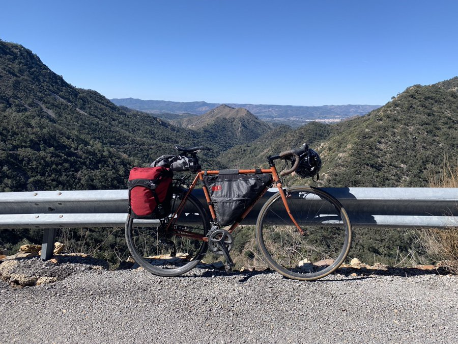
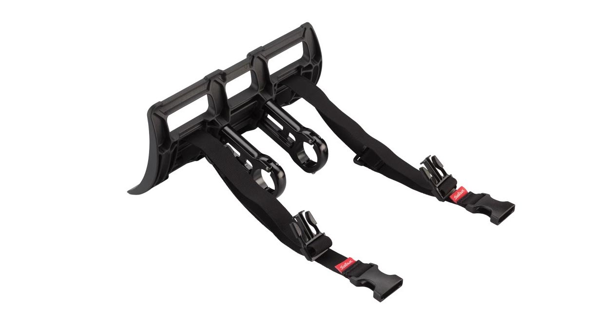
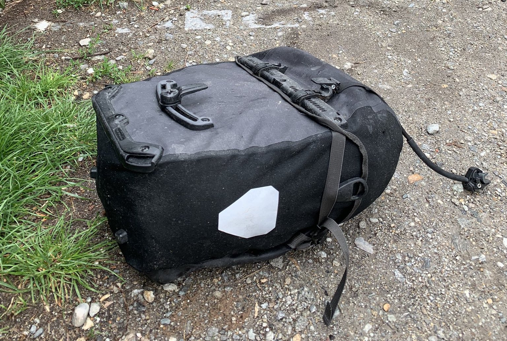
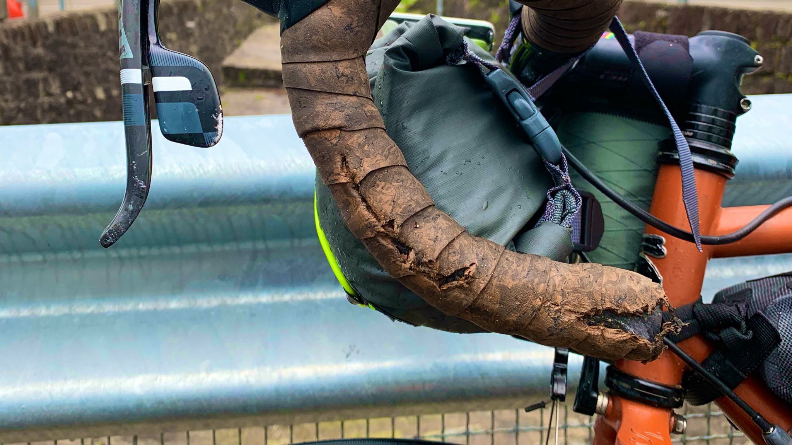
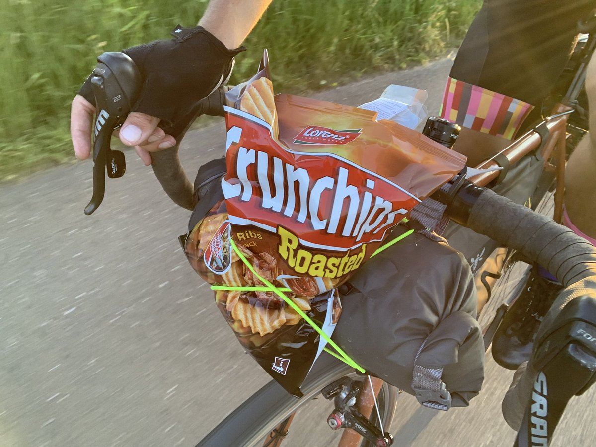
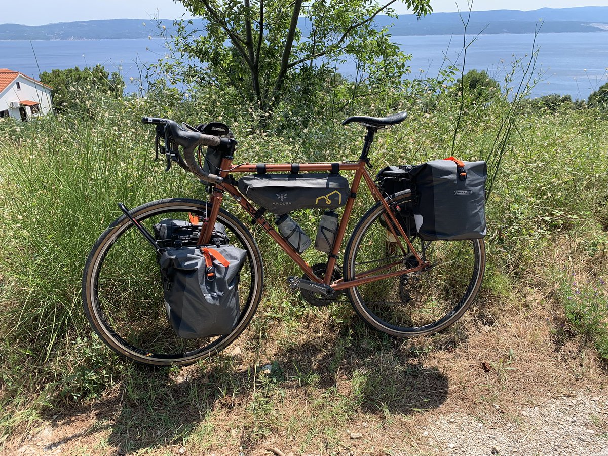
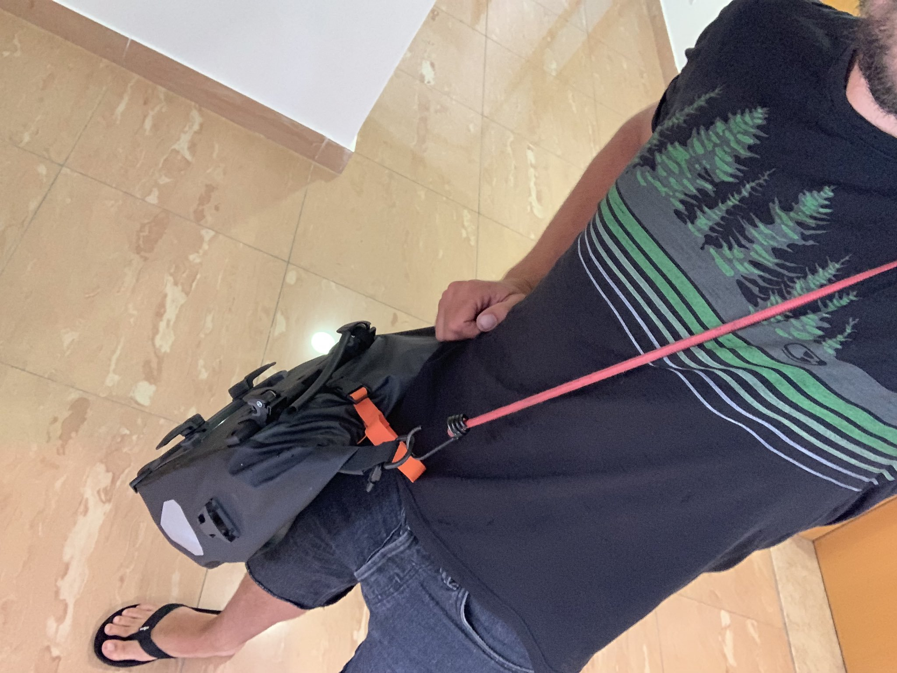
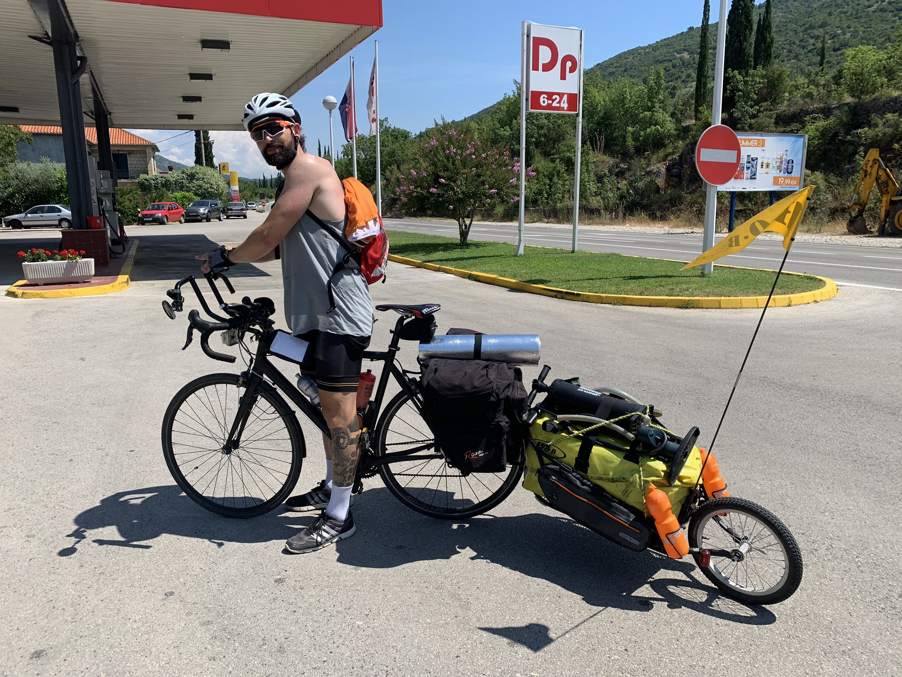

Figuring out exactly what bags to get for my tour was tough. There's loads of options and obsessing about it is hard to avoid. Should I try a "bike packing" setup - sticking to frame/seat/handlebar bags and avoiding racks. Or should I go full blown "touring" with a big old rack and panniers. Is there something in between? 

Throughout the four month tour from Spain to Albania I ended up with three different setups as I kept trying to get things right on my Surly Crosscheck, so I wanted to talk about the pros and cons of the different versions.

# Version 1.0: Rack, Single Panier, and Framebag

This wasn't really a plan. I was in Spain with my bike and some mates, and England was a shitshow, so I decided to ride around Europe for a while and ignore that whole mess before my EU passport was revoked. I had a [Surly Straggle-Check](https://surlybikes.com/parts/straggle_check_frame_bag) frame bag, and a WOHO anti-sway saddle bag, then the day before I set off on the tour I grabbed some random rack and nameless pannier from the only bike shop with anything that fit on the bike.

My gear was not optimized, it was whatever I had with me at the time, and I was hauling. Too many clothes, too many cables, and a whole travel-mechanic tool roll. The biggest offender: a Macbook Pro, because this was a remote working tour.

Initially I wanted to avoid using a rack, because "bike-packing is cool", but even with a 13" laptop it's hard to avoid. Yes, the laptop would fit in the Staggle-Check bag, but nothing else would. A frame bag of that size seems like it'll take a lot of stuff, but due to its internal design its just one big pocket. That means something solid and thin like a laptop is ok, it'll keep its form, but if you put any tools, clothes, etc in there everything falls to the bottom, and that causes rub against the crank arms. 

There is an internal flap with velcro on it, which I assume is to try and avoid this, but with a laptop that flap cant be used. I bought the rack entirely to solve this problem, and mostly just had my tool roll and a few smaller items in there after that.

The [XTouring Anti Sway Saddle Bag](http://wohobike.com/product/51) was press-released on [Bikepacking.com](https://bikepacking.com/news/woho-saddle-bag-stabilizer/) and it looked really smart. Riding [NYC to Montreal](/2018-nyc-montreal/) before I had a Salsa saddle bag that was wagging like an excited dogs tails the whole damn way, so I figured the "stabilizer system" would really help. The system basically is a bit of metal with threaded holes for bottle cages, so your water bottles help the bag avoid sway. 

It's advertised like its some clever "inertia of water" and counter-balance idea, but really the bag is just smushed between the two cages so it doesn't move that much, and that also means its really annoying to try and get anything in or out of the bag. It was mostly just clothes so I wasn't going in or out of there too often, but still, I do not recommend this bag. Having water back there was very annoying too, and whilst subtle my balance felt off.

If you're looking for a saddle bag with a lot of space, I hear a lot of good things about the [Apidura saddle bags](https://www.apidura.com/shop/backcountry-saddle-pack/).

The rando pannier was also terrible, it had a single hook which was fixed in place, so there was no way to make it fit well with my rack. This thing was jumping off on every curb, manhole cover, or pothole. It was bungee corded on which helped a bit, but having your laptop in a bag which just wants to be on the floor is less than ideal.

This all meant I was wearing my backpack with the laptop, and that also ended up holding spare shoes, and a few other arbitrary things. Backpacks are not good, but you probably know that already.

On the handlebars was a [Salsa EXP Series Anything Cradle](https://salsacycles.com/components/category/bags_frame_packs/exp_series_anything_cradle), which was a curved thick plastic base with a drybag strapped on. Unlike a lot of handlebar bags this thing is secured with two metal clamps which hold the base two inches out from the bars instead of strapping directly on. The idea here I think is to keep the bag forward so you have room on your bars for GPS, lights. 

This bar storage solution was really annoying. My SRAM shifters were always pushing into the bag. My out front mount for the GPS, even at a funny angle, was making me angle the bag down a little. Regardless of how tight I made the straps around the bag, they'd regularly loosen, and rub on the tyre, offroad or on.  Not having the chance to even try it out before leaving (it was a panic purchase the day I flew from NYC) meant when I set up in the [Canary Islands](/canary-islands-tenerife-gran-canaria/) I realized the aero bars had to go, and I missed them through Spain and France which was just _constant_ headwind.

## Version 2.0

v1.0 only lasted about 10 days because I ran the old credit card on Amazon and had some new stuff sent to a mate in Barcelona.

Out with all the old bags, in with the new. 

The [Apidura Expedition Frame Bag](https://www.condorcycles.com/collections/apidura/products/apidura-expedition-compact-frame-pack) is amazing. I got the 4.5L which fit just fine in my 56cm Cross Check, with enough room for two small bottles. The bag is split along the middle, with a larger pocket on the right, and a narrow one on the left. 

The right contains all my snack bars, phone, wallet/passport, small tools, pump, patch kit, and odds. The left has a thin Jackery Bolt battery pack, a USB cable to charge my Garmin, tweezers, scissors, and other useful human/repair items which I don't want to rummage around for. It gets a surprising amount in there, and thanks to the flaps above the zipper it's never let any water in even when I'm opening and shutting it, despite some fairly torrential days. 

The laptop certainly won't fit in there, but fits easily in one of the two new [Ortlieb Bike-packer Plus bags](https://www.amazon.co.uk/dp/B00SG40K2K/). These had a single hook too, but due to the quick release lock handle these bags were staying put on some hairy off-road stuff. The biggest complaint I had is that at 20L if the bags were not stuffed full they could flex. I found the bag poking into the spokes a few times (😳) and the plastic strip at the bottom got a bit bent.

Not the worst problem, as the whole pannier is made from replaceable bits. I crash landed on one of the bags and snapped the top hook clean off, but was able to order replacements from Ortlieb for $15 or something pretty reasonable. Until then, there's zip-ties.

On the top tube I had a [Zipp Speed Box Bag](https://www.amazon.co.uk/dp/B012VEWOOW/) for a minute, but this was a pain in the ass. Surly Cross-Check does not have internally routed cables like most modern bikes, so this "snack pack" was trapping cables on the top tube. I'm sure something could have been done, maybe added more cable housing to keep it off the wire, but this bag was messing with my ability to brake, and got donated to a very excited gentleman at a Cafe du Cycliste in Nice. 

I kept the awful bar bag for about a day, then realized the panniers had the space for everything. It felt a bit off moving all my weight to the back wheel, but I figured I'd find a lighter bar bag sometime, and the storage to storage-holding weight would be better balanced. My backpack came along for the ride too, sat on the rack empty other than a pair of shoes a few cables and bits, toothbrush and sometimes the laptop, making it a sort of "go bag" for when I jump off the bike and find somewhere to work.

The best addition by far was the [Apidura Backcountry Food Pouch](https://www.apidura.com/shop/backcountry-food-pouch/). Being able to quickly stash and access small items like snacks, sunglasses, earphones, even the phone in particularly photogenic sections, meant way less fishing around and reshuffling of jersey pockets. I'd have an extra water bottle or gatorade up there when it was extra hot, a bag of nuts when I was peckish, and sometimes a beer would find its way in there. My only regret is not grabbing the [Backcountry Food Pouch Plus](https://www.apidura.com/shop/backcountry-food-pouch-plus/), they come in the same 0.8L or 1.2L but have mesh pockets on the outside for wrappers, which would have helped me avoid a few sticky situations.

## Version 2.1

The rack got replaced with a [TorTech Ultralite rear rack](https://www.wiggle.co.uk/tortec-ultralite-rear-rack/) and I love it. It's got a lower max weight than some but 25kg (55lb) is more than enough for me, with my gear topping out at around 17kg (38lb) back then.

v2.1 lasted for about three months, and I eventually even found some stubby little aero bars: Profile Design ADL Aerobar! _(I think they're discontinued but [Bike24 seem to have some](https://www.bike24.com/p2112284.html).)_

I got a new bar bag too, an [Alp Kit Gnaro](https://www.alpkit.com/products/gnaro). It's tiny and lightweight, only offering 3L, but it was great for holding my cold/wet weather stuff. It meant I could quickly grab everything I needed to get warm without rummaging about in my giant 20L pannier, getting all my stuff wet, and the bungee cord is great for holding bigger light stuff on the go. 

At 3L of storage it's not going to be too useful help for anyone living on the bike, and I needed to find a way to get more weight forward. It did help as a base for lashing stuff to the bars, like when I shoved my tent up there. It was considerably more stable than it would have been on the bars by itself.

No shifter trouble either unlike the Salsa cage: plenty of space for levers to move. If you're riding with flat bars probably find something bigger. The weight was still 90% on the back wheel, which being a non-touring wheel (28 spokes and not having a re-enforced rim) meant spokes would pop and it didn't want to stay true.

## Version 3.0

v3 was all about weight reduction and balance, with the main change being a [Tubus Tara Lowrider Front Rack](https://www.cyclingabout.com/review-tubus-tara-front-rack/) and swapping 2x panniers on the back, to 4x panniers total. 

Adding another rack and two bags might seem like its going to weigh more, but these Ortlieb Gravel front-packs are half the weight, yet at 12L give yoy 60% of the size of the previous panniers. The simple roll-top keeps it more waterproof, and removes a lot of extra straps and buckles and flaps. There's no outside pocket which can be a bit of a pain in the ass, but there's a 1/5 chance that whatever goes in those pockets never gets seen again anyway. There is also less to fall apart, seeing as the top flap is replaced with a roll.

The benefit of having four slightly smaller panniers is it gave me a chance to do a full on shake down, and with a little help from my friends, I removed 10lb of gear, clothes, and stuff. The backpack went away, along with the shoes - flip flops are fine for the Balkans in July. I got rid of some warmer clothes, threw out a tatty jersey (one jersey and two merino wool tops is good for human mode and bikes), and lots of other tiny incremental gains. 

Anyway, let's look at the weights.

### v1.0 

- Rear Rack: 750 g
- Pannier: 1,360 g
- Bar Bag: 420 g
- Frame Bag: 500 g ?? (guessing)
- Backpack: 1,724 g
- Saddlebag: 259 g 
- Stabilizer: 25 g
- **Total:** 5,038 g

### v2.1

- Rear Rack: 560 g
- Panniers: 2,358 g (2 x 1179 g)
- Bar Bag: 220 g
- Frame Bag: 170 g
- Food Pouch: 55 g
- Backpack: 1,724 g
- Aero Bars: 400 g
- **Total:** 5,487 g

### v3.0

- Rear Rack: 560 g
- Front Rack: 358 g
- Panniers: 2,360 (4 x 590 g)
- Frame Bag: 170 g
- Food Pouch: 55 g
- Aero Bars: 400 g
- **Total:** 3,903 g

The difference between 2 and 3 was basically "I got rid of my heavy-ass Chrome backpack" so without that in the equation it was only an extra 0.79lb (360g) added from the front rack. Very worthwhile, because now the weight was spread throughout the bike: from 40lb on the back, to 10lb front and 20lb back.

"Minimalist touring" was really fun, I felt way better balanced, pushing or walking the bike was much easier as the back didnt want to get on the floor immediately the front wheel was unweighted, but I was noticeably more susceptible to side-winds. "Luckily" for me winds rarely come sideways, they come directly into my face whichever direction I cycle, and with my aero bars that aint so bad.

This setup got me from Croatia to Albania, where I had to call this tour quits and head north to prep for a Baltic Sea lap.

https://www.instagram.com/p/B0Wb6vslqn6/

## So Many Options

I [met a dude in Montenegro](https://www.instagram.com/fahrenheitcycling/) hauling a fully loaded trailer with a frame bag installed on the side for _even more_ storage. Options are infinite with touring, it just depends what you're up to.

🚴‍♂️💪
