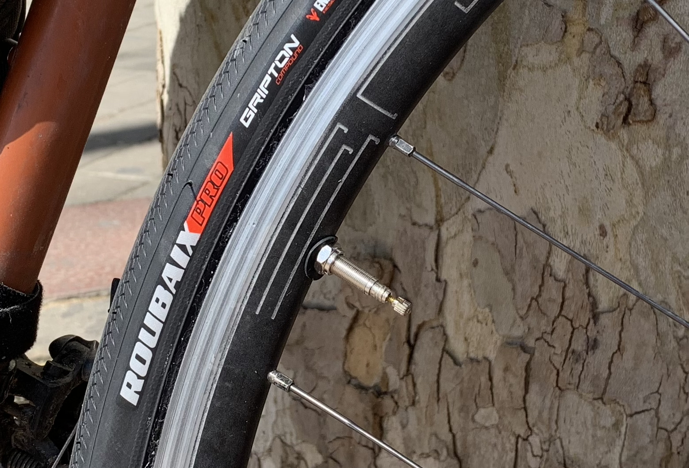
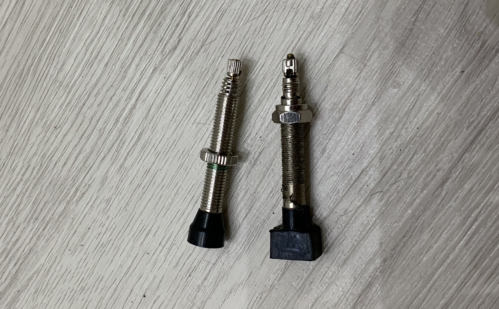

Tubeless in cyclocross and mountain biking these days is pretty much the default, but going tubeless for road is a long frustrating drive on the struggle bus for a couple of reasons. Finding the right parts in the first place is tough, and keeping them set up can be tricky on long tours, but I feel like I am starting to get the hang of things, learning about tyre plugs, re-seating them with CO2 cartridges on top of an Alp, replacing sealant on the side of a Bosnian highway, and some of the arbitrary confusing things my tyres have done.

The sales pitch of tubeless is fewer flats, lower rolling resistance, and weight savings from having a lighter "self-healing" tyre, instead of running bulletproof 2lb tyres. 

I normally only get 1 or 2 punctures get punctures but when I loaded my bike up and started touring, flats were coming in weekly, sometimes multiple flats in the same day. The front wheel had a [Panracer Pasela](https://panaracerusa.com/product/pasela-protite-urban-touring-tire-2/), and that didn't flat for four months. It was fine the whole time in the [Canary Islands](/canary-islands-tenerife-gran-canaria/), and got me from [Calpe to the Pyrenees](/euro-trip-spain/), but then it started being a jerk. Two flats in two different spots, and I was out of spare tubes in the middle of the mountains riding with my fingers crossed. Even my gatorskin on the back had two flats in a week.

https://www.instagram.com/p/BwPTIMMFVPS/

With tubeless you still carry tubes about as a backup, but the idea is to repair them, replace sealant, and keep them going for as long as you can. You don't want to be sat on the floor of a gas station shouting at inanimate objects, getting slimed while you retube. 

My worst run with a tubeless tyre was 2 days, but right now I'm up to a month without a tube. 🤞

## Compatibility

Tyres can have "Tubeless ready" and "Tubeless Compatible" stamped all over the rims, tape, and tyres, but things can be a few mm off and maybe that tubeless tyre wont seat on your specific wheel. There are a lot of tips and tricks to getting things working, and it can be hard to tell if you are just one trick away from getting it done, or if those items are not compatible. I once tried to get a top quality bike shop to seat [Schwalbe Pro One](https://www.schwalbe.com/en/road-reader/schwalbe-pro-one.html) tyres on HED Belgiums, and the next day they told me the items were incompatible despite a friend riding on that exact setup.

Go to your local bike shop, get them to make sure your wheels are tubeless ready, consult them on which brand and model of tyre you should use for the type of tour you're doing, and have them set things up for you. If that doesn't work you can sell them to a mate who wants to try their luck with their ever so slightly different wheels, or the LBS might keep hold of them and get you some other tyres that work. Or keep on going with Amazon or Wiggle or whatever until you find the right tyre combination and off you pop.

Don't do what I did and just fuck off into the world, trying to find things as you random around. Most bike shops don't have a huge range, and if you find any tubeless tyres at all, it will probably be 23-25. Maybe a 28, but for 32 or larger you probably won't find it just randoming into small-town-wherever LBS.

If you've got a really light bikepacker setup and you're all-road, you can probably get away with 28, but if you're 
getting a little more creative with your routes and/or you have a rack with a bit more weight on it, I strongly recommend larger volume tyres.

## Heavy Burping

I lost the tubeless setup a few times to what I'm calling heavy burping. Burping a tyre is 
a common problem in cross or MTB, where you might hit a rock, or land hard at a bit of an angle, causing the bead of the tyre to come away from the rim momentarily. In that brief moment some air will sneak out, and you've got a slightly lower pressure tyre now. Normally it's not the end of the world, but if it happens enough you might have to shove some more air in there. 

A few times I was riding and I'd feel like the pressure was a bit low, then hit a pot-hole or even a small bump, and it would immediately unseat. It was always the back that would get this problem, probably because of the weight being mostly on the rear rack. One time I noticed it was low before it unseated, then tried pumping it up and it unseated right in front of me. Now I flip the bike over or on its side immediately, so the weight of the bags should avoid unseating. 

This was a big problem with lower volume tyres: 25/28. Once I finally got a 32c on there I never had another heavy burp. I also took more care to keep the pressure up. I did go a little too far at first and pumped my tyres [so hard I crashed](/euro-trip-switzerland/), but after that I kept the front around 60 PSI, the back around 70 PSI, and everything has been peachy. I check em in the morning, when I stop for a break, and when I leave the bike at the end.

## Sealant and Reseating

Sadly when the tyre has unseated, you are in a tricky spot. The poxy little hand-pump I carry isn't going to force enough air in there fast enough to reseat it, and using a C02 will dry out the sealant prematurely. 

Recently after a particularly rough day smashing through back-country Bosnia mountain roads, my front tyre kept getting a bit squishy. I shoved a CO2 in just to get me enough pressure to get down, and replaced the sealant when I got to a hotel. It was a bit of a gamble but I was more scared of rimming out, than I was of getting more puncture.

The next day my rear tyre kept getting low, and I figured the sealant was due for some replacing anyway. I flipped the bike over in the first bit of shade I found, and a minute after the air had all escaped, the bead just jumped off with a terrifying POP. Luckily I still had some CO2, so I shoved that in and the bead reseated, then shoved in the sealant as quick as possible hoping it wouldn't happen again. 

It did not immediately work out, there was a slow leak even with all the new sealant in. Spinning the wheel around sometimes gets the hole plugged, but not this time. I pumped, rode a few minutes, pumped, rode a few minutes, pumped again, rode. Giving up and throwing a tube in felt like a smart idea after an hour of cocking about, but then a petrol station appeared and it had an air compressor. Using my [Presta to Schrader adapter](https://www.sheldonbrown.com/brandt/presta-schrader.html) I got it up to 80 PSI, cycled for another 10 minutes, then it got squishy again. Another petrol station air compressor up to 60 PSI, rode for 30 minutes, then hand pumped and it was fixed. It's been 4 days now no problems. This was the craziest save I've made so far. I think sometimes it just needs to spin for long enough that enough sealant can get there, so "walking it off" did the trick. 

## Tyre Plugs

Sometimes a hole is gonna be big enough where sealant alone isn't going  to close it. Tyre plugs (also called sides of bacon) are little wire strips with gunge all over them. The idea is you scrape off some of the gunge, cover it in vulcanizing glue (like the stuff you find in patch kits), then shove it through the hole on the end of a prong. 

https://www.youtube.com/watch?v=T-lruemFmqQ

The first one happened when a tyre sprung a leak arbitrarily after a day of unchallenging road riding and then a short ferry ride along a swiss lake. I sat down for a beer by the lake, and suddenly pssssstt! I shoved the plug in without glue, and rode it for an hour. Pulling it out, glueing it later, and shoving it back in seemed to work just fine. 

Apparently the tyre warranty is voided once you plug it, but I rode that plugged tyre for another month without any trouble. 

The second big hole I got was a bit tougher. It seemed like there was something stuck in the wheel, and my pliars couldn't get it out. I tried to shove a plug through where the bit was, and despite using glue and putting extr sealant in, it was just leaking out the sides. Maybe riding it would have helped but it was leaking shitloads of air the second I applied even a bit of pressure with my thumb, so full weight probably would not help. 

After an hour of getting heat exhaustion fighting with that, I just threw a tyre in and got on my way, which lead to me being screwed out of spare tubes the next day, and [taking a train to Prague](/euro-trip-czech-republic/).

Spending a bunch of time trying to save a tubeless setup is usually worth it, even if throwing a tube in would be quicker. Having a healthy tubeless tyre with enough sealant is going to protect you against flats a lot more than a tube will, so I am happy to spend an hour saving a tubeless setup when I can.  

## Bad Setups

A bike shop in Madrid replaced my swiss-cheese Panracer with a tubeless tyre,
but used a funny shaped vale stem that didn't sit flush with the inside of the rim. They shoved a
flimsy bit of rubber in there to try and create a seal. 

When I originally saw that in the shop I thought "heh, whatever works!" but that
cowboy shit *didn't* work. The tube was leaking for a week and I was constantly
pumping and replacing sealant thinking that I had just been hitting a lot of
sharp stuff. Whilst pumping I noticed some air escaping from the base of the
valve stem, and when I tightened the lock ring the bit of rubber tore aware like
wet paper and air was then flying out. 

Make sure your valve is a good fit with your rim. If its curved inside, find one which matches that curve. Many come with a washer, but don't and hack your own by jamming shitty rubber in there.

## Mountains

It seems like I lose a lot of pressure coming over mountain ranges. I had some pressure trouble in each of my Alp crossings, first [Colle De Tenne](/euro-trip-colle-di-tende/), then riding through [Switzerland](/euro-trip-switzerland/), I kept getting low tyres whenever I went up a mountain. That might just be physics: my one true foe, or it could be a coincidence, but keep an eye on them when you're up high.

## Overnight Vanishing Leak

The day after getting a [new wheel delivered and setup](/touring-logistics/), I rode through smooth roads, didn't seem to have any problems, left my bike in the hotel basement, and came back to it in the morning with a totally flat tyre. It didn't unseat, so I just hand pumped it back up. Weirdly it has held since, not going down even a bit for a week! Maybe there was a tiny hole and sealant wasn't getting to it (damn you gravity!) and riding in the morning got it sealed.

## High PSI = Leak?!

I popped into a bike shop to get some more sealant at one point, and used their air compressor to pump up. It had been fine riding for 10km that morning, but it was really low (maybe 40 PSI), and when I pumped it up to 60 PSI it sprung a loud and quick leak! Where better to happen than in a bike shop, so I grabbed the bottle of sealant which was right in front of my face, threw it in, paid the chap, and rode off. 

Even if the sealant is only a week or two old, I am trying to make sure I always have a spare bottle, because a failure 

## High and Dry

When temperatures get into the mid 30C's (95F-ish), sealant can start to dry in a matter of days instead of weeks. I've seen some forum posts that recommend adding coolant to your sealant, or a 50/50 mixture of water and coolant. I've not tried this yet, but I am going to need to. It's hot as balls down in the Balkans and I'm out of spare sealant.

## Kit

What you carry is going to depend on how long you're on tour and how often you see a bike shop. I've ridden with more and less, but this is what I am carrying as I head from Croatia down the Adriatic Coast to Greece and Turkey:

- 2x [Pedro's Tyre Levers](https://www.amazon.com/gp/product/B000IZGFCE/ref=as_li_tl?ie=UTF8&camp=1789&creative=9325&creativeASIN=B000IZGFCE&linkCode=as2&tag=philbike-20&linkId=17841df751a66c2d4659363025b4973c)
- 2x spare tubes
- 1x patch kit
- 1x Presta to Schrader adapter
- 1x dinky little hand pump
- 3x CO2's
- 1x [bottle of sealant](https://www.amazon.com/gp/product/B01GN5YTIE/ref=as_li_tl?ie=UTF8&camp=1789&creative=9325&creativeASIN=B01GN5YTIE&linkCode=as2&tag=philbike-20&linkId=35ec6cadc1a8749a506c5b61e8f69e60)
- 1x [side of bacon](https://www.amazon.com/gp/product/B01MCYSRCY/ref=as_li_tl?ie=UTF8&camp=1789&creative=9325&creativeASIN=B01MCYSRCY&linkCode=as2&tag=philbike-20&linkId=01e5977a5278ad4940bfe75566d442c8)
- 2x spare valve stems
- 2x valve cores
- 2x valve core removers (in different pockets its easy to lose the little things)

Sounds like a lot of gear but its all small, cheap, and light. Being able to smash around for weeks or months with a loaded bike over gravel and occasional rock without getting multiple daily flats is great, and again, bulletproof tyres are not infallible, and will weigh you down anyway. 
