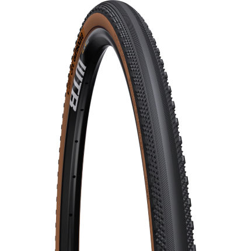

Tubeless in cyclocross is pretty much a given (unless you fancy and roll with tubular), and my mountain bike is tubeless, but going tubeless for road is a long frustrating drive on the struggle bus. The tl:dr here is that I see value in tubeless for touring, but plan it out and practice first. Maybe learn from my comical mistakes below. The worst that will happen is you need to throw a tube in, and the best that can happen is a lot fewer flats, or no flats if you keep on top of the sealant and have appropriate tyres for whatever you are doing.

The main problem is compatibility, as "Tubeless ready" and "Tubeless Compatible" can be stamped all over the rims, tape, and tyres, but things can be a few mm off and maybe that tubeless tyre wont seat on your specific wheel. There are a lot of tips and tricks to getting things working, and it can be hard to tell if you are just one trick away from getting it done, or if those items are not compatible. I once tried to get a top quality bike shop to seat [Schwalbe Pro One](https://www.schwalbe.com/en/road-reader/schwalbe-pro-one.html) tyres on HED Belgiums, and the next day they told me the items were incompatible despite a friend riding on that exact setup.

Despite all this I wanted to try again, because I didn't fancy spending my entire cross-Europe trip with a patch kit in hand. The way to sort this out is to do all the usual stuff like consulting the bike shop, getting them to make sure your wheels are tubeless ready, ordering in the exact tyres you want through them so they can set things up for you, and if that doesn't work you can sell them to a mate who wants to try their luck with their ever so slightly different wheels. Keep on going with Amazon or Wiggle or whatever until you find the right tyre combination and off you pop.

Don't do what I did and just fuck off into the world, trying to find things as you random around.

I was in Madrid picking up my repaired bike before I even started the actual tour, with one [Panracer Pasela](https://panaracerusa.com/product/pasela-protite-urban-touring-tire-2/) and a [Continental Gatorskin](https://www.continental-tires.com/bicycle/tires/race-tires/gatorskin) on the back, both tubed. Setting off on the 3-day ride to Calpe the Gatorskin flatted one bloody mile in. I'd had the idea of going tubeless in my head for a while, and this was a good reminder to get it sorted before the trip started proper, so I clacked off to the nearest decent looking shop.

Bike shops rarely carry many tubeless tyres, and when they do it's almost always 23C or 25C. I was bloody excited to find a [Specialized Roubaix Pro 28C](https://www.cyclingweekly.com/reviews/tyres/specialized-roubaix-pro-tyre) - a road tire with a bit of grip. Seeing as they only had the one, and were already squeezing me in as a favour, I accepted the partial upgrade and planned to get the front sorted later.

The Panracer was an absolute trooper with no punctures for four months. It was fine the whole time in the [Canary Islands](/canary-islands-tenerife-gran-canaria/), and got me from [Calpe to the Pyrenees](/euro-trip-spain/), but then it started being a fucking jerk. Two flats in two different spots, and I was out of spare tubes in the middle of the mountains riding with my fingers crossed.

https://www.instagram.com/p/BwPTIMMFVPS/

Two lucky days later I got to Andorra. The first bike shop I came across had a nice Vittorria 28C something or other, but despite handing him a stem he put the tyre on with the same tube in it... 🤦‍♀️

Another bike shop in Andorra had a go at it a day later, and they said the value stem was crap. They grabbed their own stem off the wall and had another go, and eventually (rather red in the face) the mechanic decided the tyre was incompatible. The only tubeless tyre he had was a [Contintental Grand Prix 5000 25C](https://www.continental-tires.com/bicycle/tires/race-tires/grand-prix-5000) and I didn't really want to argue with the man or go back to tubes, so I took the comically small slick road tyre and figured what they hell.

Double tubeless, yaaaay!

## Heavy Burping

That rear held up until the south of France - roughly a month after being installed - but then it started feeling squishy. It seems like I let the pressure get a bit low, then hit a pot-hole. The pot hole probably burped it, letting air squish out between the bead and rim, and with so much weight on the back by the time I noticed the problem the tyre had unseated a little.

My little poxy handpump wasn't going to force enough air in there to reseat it, and C02 didn't help either. I tried an emergency foam doofry and when I unscrewed the adapter it pulled the valve core with it, pissing foam everywhere. Those things are not meant for tubeless, that it’s for fixing holed up tubes, but I was a tad desperate.

I threw a 2nd CO2 in now the valve was out, and it reseated a bit, but then I noticed air was leaking out the around the valve stem. I tried tightening the stem, but there was a weird little square of rubber between the stem ring and the rim. When I originally saw that in the shop I thought "ha nice hack, whatever works" but that cowboy shit *didn't* work. The rubber tore away when I tightened the stem and that was that. Back to using a tube.

Tubing my way through some towns didn't seem to bad, I was heading to Montpelier for a rest day, but my timing sucked. Stuff is mostly shut on Sundays, and then it was Easter Monday, so I patched one spare tube and threw the other one out, wasn't fixable. I hoped for better luck between there and Nice, trying to rush 360km that week to meet a friend at the end. That lead to me taking the straightest line through remote areas instead of going through Marseille for a bike shop, which was a poor idea.

## Put a Knot in it

Things went to absolute shit between Montpelier and Nice. Constant headwinds and rain aside, I was getting flats like nothing else.

The first flat was in the first mile and I think again I let the back wheel get a bit low. It was fine, lovely view, spare tube goes in.

The 2nd came with a broken spoke, so I taped that up and patched the original tube.

A _third_ flat came shortly after, I think the rain meant the glue wasn't drying properly and the patch came off, so I just fucking tied the tube to get rolling.

I'd been checking the tyre all day but clearly was missing something, because eventually I got a fourth flat. At that point I roared and shouted at trees in the middle of nowhere, 21km from the hotel I was meant to be staying at. I walked a few miles in the rain, and eventually hitchhiked another 10km with a lovely man in a van (who also rode bikes). Sat in a nice dry, warm pub, repatching my goddam tubes with a beer, waiting for the rain to stop. Eventually I found the hole in the tyre that was chewing through my tubes, and got back to riding.

Got to the hotel, comfort ate my bodyweight in cheeseburgers and wine, and rolled to a town with a Decathlon store (kinda a French Halfords) and got more patches, more glue, more tubes, the whole damn thing. Rolled another 10km to a train, and took that to Nice. Fuck bikes.

## Nice Tubeless

The guy in bike shop in Nice was lovely and replaced the spoke, but trying to get tubeless sorted out we hit a language barrier or something.

> **Me:** Can you set this up tubeless please?
>
> **French Man:** I dont have any tubeless tyres.
>
> **Me:** This is a tubeless tyre.
>
> **French Man:** But how do I know it is tubeless.
>
> **Me:** It was already installed tubeless.
>
> **French Man:** But I don't have any tubeless tyres.
>
> _\*Repeat x5\*_
>
> **Me:** _This. This is tubeless. Just... can I borrow your air compressor?!_
>
> **French Man:** Oh, well I don't have time today.

Well no not after that. 🤦🏻‍♂️

Took it to another bike shop and they noticed the bead was torn, so it would be fine with a tube but could not go tubeless anymore. Time for another new rear tyre. 🔥💵🔥

Again it was a choice of whatever they had lying about. They had one tubeless ready 28C tyre but it was pretty slick. Never mind.

Rested and recuperated, 24 hours in Monaco, then off to the mountains!

https://www.instagram.com/p/BwxS7-SF8rm/

I wanna write about crossing from France to Italy via Colle di Tende later, but let me just say it aint smooth road. I am incredibly glad to have had both wheels set up tubeless, or I dunno if I would have got over it intact. Some of it is fine, just dust and gravel.

Others bits were mad scrabbles of shale and sharp rocks.

I got all the way to the top, pushed through some snow, and started descending before noticing both wheels were super squishy. The bike went on its side immediately to avoid unseating either wheel again, and I pumped the crap out of both of them. The front seemed fine, and the back pissed out a bunch of sealant from the sides suggesting it had indeed unseated.

https://www.instagram.com/p/BxDFO0Wl8eO/

I threw some more sealant in, popped the valve core back in and a CO2 reseated it nicely, which was lucky. Should have done it with the core out, but I had a spare anyway. This got me the whole way down to a Italian chocolate factory on the valley floor. Nom nom nom.

The rear tyre spent the next few hours with a slow leak, and I kept pumping it back up, hoping it would sort itself out sometime. It did not, and I discovered something was jammed in the sidewall and stopping it from sealing. Pliers could not get it out, and side of bacon didn't work either, so fuck it, tube again.

## Not Just Any Old Tubeless Tyre

The problem with the 25/28 road tyre setup is that I'm throwing myself at whatever shit Strava is sending me down with very minimal planning. I'm fine with that, but the tyres are not. Tubeless is helping me get way fewer flats than I would otherwise, but they're not invincible, and if I'm gonna be hitting a mixture of tarmac, dirt and gravel, there are tyres designed for that.

Now I'm in Milan for a few days, and I'm getting this shit sorted out properly before I move anywhere. Wiggle is shipping me a pair of [WTB Exposure's](https://www.wiggle.co.uk/wtb-exposure-tcs-road-tyre-tan-sidewall/) at a chunkier 32C, and I'm hoping this will last a whole lot better.

Gotta learn somehow ey? 😂