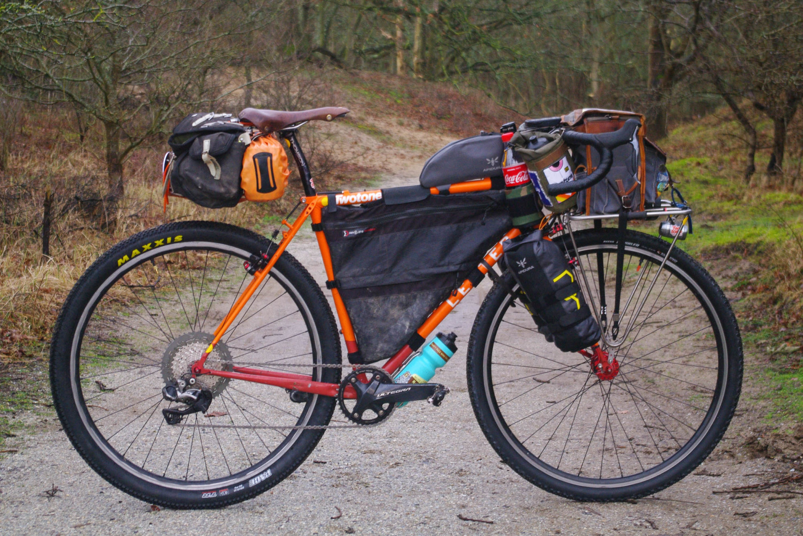

If you try searching for advice on bikepacking with a laptop, you're generally going to get a few responses:

1. **Backpack** - Gives you a sweaty back and aches like hell after a while.
2. **Panier** - A panier needs a rack, and racks can weigh 500g just to mount a single pannier.
3. **Framebag** - Every one I've tried bulges sideways and causes pedal strikes.

I wanted to try something a little different, and got the idea of basketpacking from [Jon Woodroof](https://www.instagram.com/jonwoodroof/), when I saw his awesome on my [misadventures in Morocco](/tagging-along-atlas-mountain-race/).

<figure>
  
  <figcaption>Jon has an amazing steel <a href="https://lestercycles.com/">Lester</a> bikepacking rig, dressed up to go for the Atlas Mountain Race 2020, with a basket on the front. Photo from <a href="https://bikepacking.com/bikes/2020-atlas-mountain-race-rigs/">Rigs of the 2020 Atlas Mountain Race", Bikepacking.com</a></figcaption>
</figure>

Here's my attempt at something half similar, with a twist: yes to riding fast through off-road mountain trails from Amsterdam to Croatia through all sorts of Slovakian back-country nonsense, but also yes to having enough gear to work full time.

https://www.youtube.com/watch?v=jN1LzExK3Y8

The DCF ("cuben fiber") dry-bag experiment didn't work out so well, but only because they weren't designed for bikepacking. To avoid abrasion, dry-bags need to have a re-enforced back and somewhere for a strap to pass through on the front. DCF is pretty durable in many ways, but cannot handle friction well at all. Most of the bags on this [BikePacking.com list](https://bikepacking.com/index/cargo-cages-anything-bags/) will work out just fine, and I'm sure over time more will show up that use DCF, with similar durability.

If I were to do this all again I'd pick [Apidura Expedition Fork Packs](https://www.apidura.com/shop/expedition-fork-pack-4-5l/) to go on the cargo cage, as their built in straps mean I don't have dangly rubber straps left over once I've taken the bags off. Moving the bike even a few meters after unloading is a PITA with straps trying to dangle into the wheel.

I'd also skip the Problem Solvers on the seat stay and go for these clever-ass [U-loop bags from Tim Tas](https://timtas.nl/product/u-loop-bag/). Those U-loops are amazingly sturdy, whether you hose clamp some on, or get the bolt on edition, they're all the benefit of a rack but they're 50g each instead of 500g for a rack. Then a bag can just slide on them, and there's no change of them flopping into the wheel just because you attached them at slightly the wrong angle.

The laptop survived 3,000km of bonkers terrain rather nicely, so all in all, a success! 
