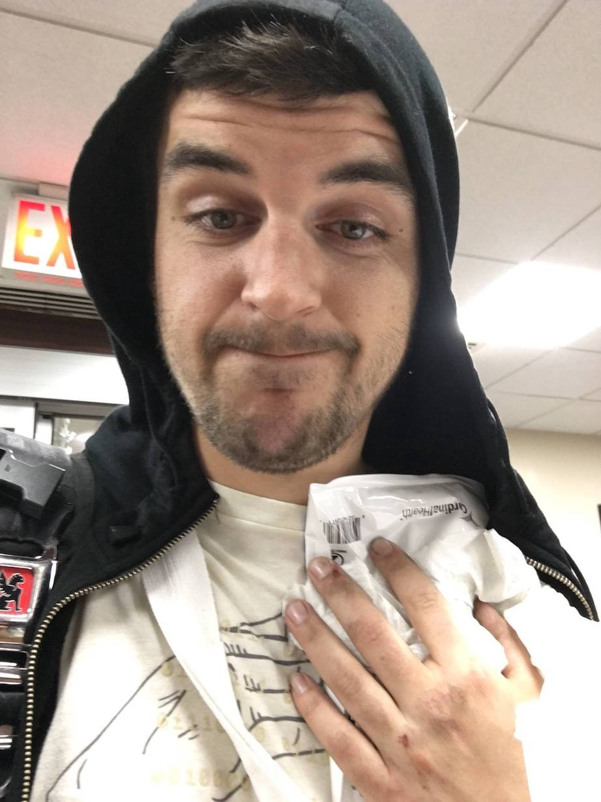

I’ve had a spot of bad luck over the last few months. First a fractured heel in
late October, all my bikes have had mechanical trouble, then March 1st I was
aced by some jackass, who pasted me out, smashed a clavicle, and drove off.

I don’t really remember anything about it happening due to a fairly heavy blow
to my unhelmeted head, and have a few flashes of talking to cops, and coming to
again in the ambulance.

Usually I wear a helmet for organized rides, club stuff, and anything upstate,
but for commuting I admit to often not bothering. I’ll probably rethink that
stance.

Cuts and ginormous bruises all down my side, collarbone bump jutting out (not
through the skin but man is it pointy), a filling is somehow loose, and the
Cannondale Synapse Carbon frameset died — despite my body taking most of the damage.

The poor thing already had that flesh wound from *before *getting knocked off in
October, and now it sounds like a maraca with two pea-size-sounding bits of
carbon floating around inside the frame.

18 days after the crash I finally felt up to getting on the indoor trainer, and
used the Synapse frame hoping it wouldn’t fall apart on me. It made some funny
noises, but I got a 12km ride in that day, 35km the day after, and another 35km
the following week.

That seemed to be about as much as it could handle, as the creaking got a lot
worse on the last ride.

Well, not to be held back, I used the downtime to replace the frameset. After a
weeks of shopping around on the Internet, trying to get a deal, I ended up with
a 2015 Cannondale SuperSix Evo frameset!

Yesterday I took the remains of the Synapse and the new frameset to [Red
Lantern](http://www.redlanternbicycles.com/) and handed it over to the
professionals, as like hell am I going to get through a full component swap
without cocking something up.

It sucks that the frame was the bit to go, as the stock wheels are crap and the
105 groupset is often a bit clunky and slow. Regardless, I’m happy to use this
excuse to switch to a more racy geometry.

The switch took a few hours with a few trips to Ride Brooklyn for bottom bracket
adapter cups, as the SuperSix is PF30a and the Synapse is BB30 (of course!), but
beyond that: the bike is good!

Took it out today and had a fucking blast. Comically I started off with the
team, noticed my back calipers were retracted so put them down, then had a
rubbing wheel. I thought I was just fucking out of breath and told them to go
on, then noticed the rubbing pad after they’d shot off like the clappers.

It had a few other problems, like a wobbly crank arm and inaccessible big ring,
but I powered through it to tool around Central Park with a fixie-friend,
dodging Citibikes and horse-shit. Covered about 80km without the collar-bone
getting *too *bad.

I’m happy to be back on two wheels, even if commuting is off the cards for now.
Another week of indoor trainer and back to it as normal I think!

**Update April 3rd 2017: **Just kidding I commuted today. Took about 45 minutes
(10 mins slower than usual), probably because I felt like every car was trying
to murder me specifically. My Chrome messenger bag was also upside-down as that
much weight on a single strap directly on the still-unhealed collarbone was
awful. I shouted at a few people and issued a few door checks, so back to normal
in that regard.
