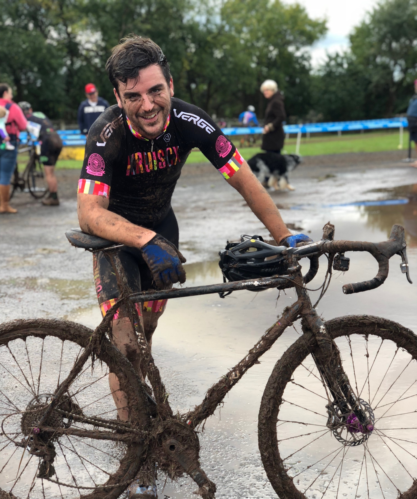

The last few weeks have been lighter on cyclocross than they should have been. I had planned a double weekend of Lucky Charm and Cooper River, but passed on Cooper River due to feeling really shitty.

Lucky Charm was fantastic, a last minute entry intended as a fuckabout, but it immediately became a favourite of mine! This was the first race I’ve had “after the night before”, so the only advice I have is “if you drink a bit and don’t sleep a lot, then looking through the turn makes you dizzy. Being forced to look where I am, instead of where I want to go, made it hard to follow any sort of useful line.” No need for further write-up, just don’t do that. 😅

I took a weekend off to ride bikes around the Cascade mountain range in Washington with a friend, and that was incredibly fun. We hit some gravel, watched a movie in a tiny theater that I think was just someones house, camped in a few spots we probably shouldn’t, then he got the poops so we came home before we got a chance to check out an abandoned town in the middle of nowhere. Win some you lose some!

Back to it: Hippo Cross. It lived up to it’s name. It was muddy as fuck! At a new venue from previous years, Hippo was a non-technical course split into two fields. It started with a half lap around the flat muddy field with a set of barriers, then shot off into the back field that was off camber loops through a muddy hill. There was nothing else technical around other than a “woods section” which was another lake of mud with roots and stumps in it. If you did a quirky ballerina leg (watching out to not hit the stake), you could stay high and all was fine, before turning into a vicious mud climb with a thin strip of grass on the left slowly being eroded on every lap.

It. Was. Bonkers.

Due to a late reg I started of at the back. I mashed past everyone aggressively and had a good few people moaning about it. It paid off and I got up to 6th wheel, then dropped a chain. Did another lap, overtook enough people to get to about 12th wheel, then promptly shifted into my wheel due to mud clogged rear mech. Sorted that out, destroyed myself getting to like 9th wheel, shifted into my wheel again and got passed by all the people.

Some other stuff happens, but its mostly running and joking with miserable friends. I lost track of where I am, and just keep trying to pass people between chain drops. At one point I face-plant going OTB in the biggest of all the mud lakes, so much so I cautiously ran it the next lap.

https://www.instagram.com/p/Bo9_J-cBBUF/

I finished the race by sneaking by a running friend with a mechanical on the last lap. Dropped my chain _again_ shortly after, and ran until the finish straight away and Flintstoned it over the line.

Everyone had a rough time, not just a handful of us. I think I was the only one laughing about it. The race had more DNFs than any race I’ve been to, and that wasn’t just us lowly Cat 4’s, the men and womens Cat 3 was struggling too. One friend snapped his rear mech off, a few folks crashed out, and everyone had to stop at least once to pull fistful's of mud out of their everything.

Somehow this muddy wreck of a human turned up in 11th in a field of about 30.

*A little dirty at the end there. -- instagram.com/etfudge*

## What Went Well

**Remounts:** I was happy with my remounts, they were fairly consistent in harsh stressful conditions. There was one close call, but it was recovered with no notable damage down there.

**Mud Handling:** Mud is something I felt inexperienced at, as last season went straight from baking hot into frozen ground. Luckily I felt more confident in the corners, responding to slides, and tripoding much better than in previous races or practices. This makes me confident for the future, especially as I will try harder to have mud tyres on for mud courses!

## What Could Have Gone Better

**“Move Aside!”:** On the last lap I was lapping somebody who was having a rough time in the mud, and on the wooded section they bobbled and started running. I ended up jumping off to avoid getting in the mudpit, and being sort of mentally resigned at that point I was just slowly running along behind him, waiting for him to sort it out. I could hear somebody coming up behind me, the fella I’d been trading places with for a whole lap, and he was still on the bike.

As soon as we were out of the woods he started powering off into the B line, and the runner was still running the A line. I politely shouted “Please don’t run the good line!” and he moved, allowing me to remount, and get back in front of the guy sneaking along the B line. I had to waste a lot of energy doing that, and I could have said something much sooner. No more polite Phil.

**Run More:** When I was on the bike I felt pretty good — despite the exercise-enduced asthma — but my running was a shit-show. More running in the week, and 30/30/30/30 training here in the local MTB trails should help with running under load.
